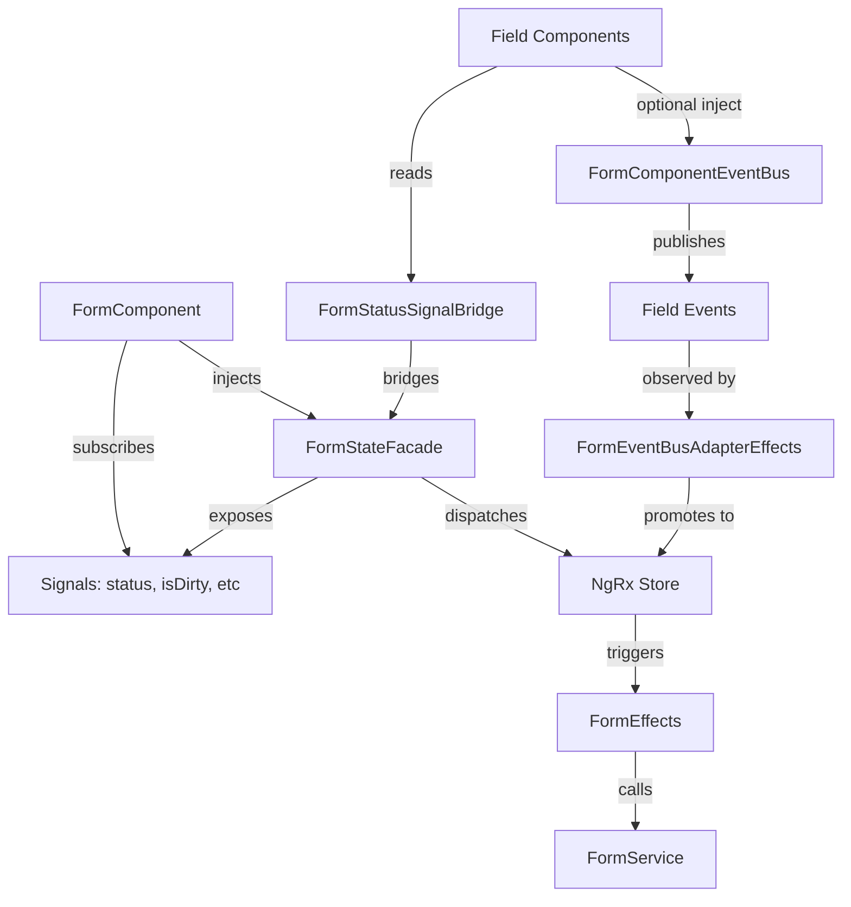

# Form State Management

This directory contains the NgRx-based state management for the ReDBox form system, providing centralized control of form lifecycle, status, validation, and inter-field communication.

## Architecture Overview

The form state management is built on three core pillars:

1. **NgRx Store** - Global state for form status, validation, and lifecycle
2. **FormStateFacade** - Developer-friendly API exposing reactive Signals
3. **FormComponentEventBus** - Lightweight event system for field-to-field communication



## Quick Start

### 1. Providing the Feature State

Register the form feature state at application bootstrap:

```typescript
import { provideFormFeature } from '@researchdatabox/form/form-state';

bootstrapApplication(AppComponent, {
  providers: [
    provideStore(),
    provideEffects(),
    provideFormFeature(), // Registers form state + effects
    // ... other providers
  ]
});
```

### 2. Using the Facade in FormComponent

The `FormStateFacade` provides a clean API for form lifecycle operations:

```typescript
import { FormStateFacade } from '@researchdatabox/form/form-state';
import { Component, inject, effect } from '@angular/core';

@Component({
  selector: 'redbox-form-example-component',
  template: `
    <div [class.saving]="facade.isSaving()">
      <button (click)="handleSave()" [disabled]="facade.isSaving()">
        {{ facade.isSaving() ? 'Saving...' : 'Save' }}
      </button>
      <button (click)="handleReset()" [disabled]="facade.isSaving()">
        Reset
      </button>
      <div *ngIf="facade.hasValidationError()" class="error">
        {{ facade.error() }}
      </div>
    </div>
  `
})
export class FormExampleComponent {
  facade = inject(FormStateFacade);

  constructor() {
    // React to status changes
    effect(() => {
      const status = this.facade.status();
      console.log('Form status changed:', status);
    });
  }

  ngOnInit() {
    // Load initial form data
    this.facade.load('record-oid-123', 'rdmp', 'default');
  }

  handleSave() {
    // Submit with optional parameters
    this.facade.submit({ 
      force: false, 
      targetStep: 'review',
      skipValidation: false 
    });
  }

  handleReset() {
    // Reset all fields (increments resetToken)
    this.facade.resetAllFields();
  }

  trackDirtyState() {
    // Monitor Angular FormGroup dirty state
    if (this.formGroup.dirty && !this.facade.isDirty()) {
      this.facade.markDirty();
    } else if (!this.formGroup.dirty && this.facade.isDirty()) {
      this.facade.markPristine();
    }
  }
}
```

### 3. Consuming Facade Signals in Field Components

Field components should use `FormStatusSignalBridge` to access status without tight coupling to NgRx:

```typescript
import { Component, inject, effect } from '@angular/core';
import { FormStatusSignalBridge } from '@researchdatabox/form/form-state';

@Component({
  selector: 'redbox-example-input',
  template: `
    <input 
      [formControl]="control"
      [disabled]="isDisabled()"
      [class.error]="hasError()"
    />
  `
})
export class ExampleInputComponent {
  // Optional injection - provides status signals
  private statusBridge = inject(FormStatusSignalBridge, { optional: true });

  isDisabled = computed(() => 
    this.statusBridge?.isSaving() || this.statusBridge?.isValidationPending()
  );

  hasError = computed(() => 
    this.statusBridge?.hasValidationError()
  );

  constructor() {
    // React to reset events
    effect(() => {
      const resetSeq = this.statusBridge?.resetToken();
      if (resetSeq !== undefined) {
        // Reset logic here
        this.control.reset(this.defaultValue);
      }
    });
  }
}
```

## Facade API Reference

### Signals (Read-Only)

All signals are reactive and automatically update when store state changes:

| Signal | Type | Description |
|--------|------|-------------|
| `status()` | `FormStatus` | Current form status (INIT, READY, SAVING, etc.) |
| `isDirty()` | `boolean` | Whether form has unsaved changes |
| `resetToken()` | `number` | Increments on reset (for propagation) |
| `error()` | `string \| null` | Current error message (if any) |
| `isSaving()` | `boolean` | True when form is being saved |
| `isInitializing()` | `boolean` | True when status is INIT |
| `isReady()` | `boolean` | True when status is READY |
| `isValidationPending()` | `boolean` | True during validation |
| `hasValidationError()` | `boolean` | True if validation failed |
| `hasLoadError()` | `boolean` | True if initial load failed |
| `lastSavedAt()` | `Date \| null` | Timestamp of last successful save |

### Methods (Actions)

Imperative methods that dispatch actions to the store:

```typescript
// Load initial form data
facade.load(oid: string, recordType: string, formName: string): void

// Reload current form (requires same parameters as load)
facade.reload(oid: string, recordType: string, formName: string): void

// Submit form with optional parameters
facade.submit(options?: { 
  force?: boolean, 
  targetStep?: string, 
  skipValidation?: boolean 
}): void

// Mark form as having unsaved changes
facade.markDirty(): void

// Mark form as pristine (no unsaved changes)
facade.markPristine(): void

// Reset all fields (increments resetToken)
facade.resetAllFields(): void

// Acknowledge and clear error state
facade.ackError(): void
```

## Form Component Event Bus

The `FormComponentEventBus` provides lightweight, typed event communication between field components without going through the global store.

### When to Use the Event Bus

Use the event bus for:
- ✅ Field-to-field interactions (e.g., dependency updates)
- ✅ UI-only coordination (e.g., focus requests)
- ✅ Transient events that don't need persistence

**Don't use** the event bus for:
- ❌ Global state changes (use actions instead)
- ❌ Side effects requiring API calls (use effects instead)
- ❌ Events that need to be replayed (use actions instead)

### Event Naming Convention

Events follow a **dot-delimited, lowercase** naming scheme:

```
namespace.domain.action
```

Examples:
- `field.value.changed`
- `field.meta.changed`
- `field.dependency.trigger`
- `field.request.focus`
- `form.validation.broadcast`

Note: In code, do not use raw string literals for event types. Always use the typed constants or helpers:
- Prefer `FormComponentEventType.FIELD_VALUE_CHANGED` over `'field.value.changed'`.
- Prefer helper factories like `createFieldValueChangedEvent(...)`, which set a strongly-typed `type` automatically.
- Advanced: you can also reference the interface literal type via `FieldValueChangedEvent['type']` where useful.

### Publishing Events

```typescript
import { Component, inject } from '@angular/core';
import { FormComponentEventBus, createFieldValueChangedEvent, createFieldFocusRequestEvent } from '@researchdatabox/form/form-state';

@Component({...})
export class PublisherExampleComponent {
  private eventBus = inject(FormComponentEventBus);

  onValueChange(newValue: any) {
    // Publish to all subscribers (typed event factory; not an arbitrary string)
    this.eventBus.publish(
      createFieldValueChangedEvent(this.name, newValue, undefined, this.name)
    );
  }

  requestFocusOnRelatedField() {
    // Publish with sourceId for targeted communication
    this.eventBus.publish(
      createFieldFocusRequestEvent('contributor_name', 'contributor-group')
    );
  }
}
```

### Subscribing to Events

#### Option 1: Observable (for effects or complex logic)

```typescript
import { Component, inject, OnInit } from '@angular/core';
import { FormComponentEventBus, FormComponentEventType } from '@researchdatabox/form/form-state';

@Component({...})
export class ReactiveFieldComponent implements OnInit {
  private eventBus = inject(FormComponentEventBus);

  ngOnInit() {
    // Subscribe to specific event type
    this.eventBus
      .select$(FormComponentEventType.FIELD_VALUE_CHANGED)
      .pipe(
        filter(event => event.fieldId === 'related_field'),
        debounceTime(300)
      )
      .subscribe(event => {
        console.log('Related field changed:', event.value);
        this.updateDependentValue(event.value);
      });
  }
}
```

#### Option 2: Signal (for reactive templates)

```typescript
import { Component, inject, effect } from '@angular/core';
import { FormComponentEventBus, FormComponentEventType } from '@researchdatabox/form/form-state';

@Component({...})
export class SignalBasedFieldComponent {
  private eventBus = inject(FormComponentEventBus);
  
  // Create a signal from event stream (typed constant)
  private focusEvents = this.eventBus.selectSignal(
    FormComponentEventType.FIELD_FOCUS_REQUEST
  );

  constructor() {
    // React to focus requests
    effect(() => {
      const event = this.focusEvents();
      if (event?.fieldId === this.name) {
        this.inputElement.nativeElement.focus();
      }
    });
  }
}
```

### Preventing Infinite Loops

⚠️ **Important**: When a field reacts to an event, it should **not** re-publish the same event type to avoid loops.

```typescript
import { FormComponentEventType, createFieldValueChangedEvent } from '@researchdatabox/form/form-state';

// ❌ BAD: Creates infinite loop
onValueChange(newValue: any) {
  this.eventBus.publish(
    createFieldValueChangedEvent(this.name, newValue, undefined, this.name)
  );
}

constructor() {
  // This will trigger onValueChange, which publishes again
  this.eventBus.select$(FormComponentEventType.FIELD_VALUE_CHANGED).subscribe(event => {
    this.onValueChange(event.value); // Loop!
  });
}

// ✅ GOOD: Guards against own events
onValueChange(newValue: any, source: 'user' | 'event' = 'user') {
  if (source === 'user') {
    this.eventBus.publish(
      createFieldValueChangedEvent(this.name, newValue, undefined, this.name)
    );
  }
}

constructor() {
  this.eventBus.select$(FormComponentEventType.FIELD_VALUE_CHANGED).subscribe(event => {
    if (event.fieldId !== this.name) {
      this.onValueChange(event.value, 'event'); // Won't loop
    }
  });
}
```

### Enabling Diagnostic Mode

Set `FORM_EVENT_BUS_DIAGNOSTICS` environment flag to see promotion decisions:

```typescript
// environment.ts
export const environment = {
  production: false,
  FORM_EVENT_BUS_DIAGNOSTICS: true // Logs each promotion decision
};
```

Console output:
```
[FormComponentEventBus] Promotion: field.dependency.trigger
  ✓ Criterion: Affects persistent global state
  → Dispatching: [Form] Dependency Evaluated
```

## Testing

### Testing Components Using the Facade

```typescript
import { TestBed } from '@angular/core/testing';
import { provideStore } from '@ngrx/store';
import { provideFormFeature, FormStateFacade } from '@researchdatabox/form/form-state';

describe('MyFormComponent', () => {
  beforeEach(() => {
    TestBed.configureTestingModule({
      imports: [MyFormComponent],
      providers: [
        provideStore(),
        provideFormFeature(),
        FormStateFacade
      ]
    });
  });

  it('should submit form when save button clicked', () => {
    const fixture = TestBed.createComponent(MyFormComponent);
    const facade = TestBed.inject(FormStateFacade);
    const submitSpy = spyOn(facade, 'submit');

    fixture.componentInstance.handleSave();

    expect(submitSpy).toHaveBeenCalledWith({ force: false });
  });
});
```

### Testing Event Bus Communication

```typescript
import { TestBed } from '@angular/core/testing';
import { FormComponentEventBus, FormComponentEventType, createFieldValueChangedEvent } from '@researchdatabox/form/form-state';

describe('Field Communication', () => {
  let eventBus: FormComponentEventBus;

  beforeEach(() => {
    TestBed.configureTestingModule({
      providers: [FormComponentEventBus]
    });
    eventBus = TestBed.inject(FormComponentEventBus);
  });

  it('should propagate value change events', (done) => {
    eventBus.select$(FormComponentEventType.FIELD_VALUE_CHANGED).subscribe(event => {
      expect(event.value).toBe('test-value');
      done();
    });

    eventBus.publish(
      createFieldValueChangedEvent('test-field', 'test-value', undefined, 'test-field')
    );
  });
});
```

## Migration Guide

### From Direct Status Mutation

**Before:**
```typescript
export class FormComponent {
  status = signal<FormStatus>(FormStatus.INIT);

  async saveForm() {
    this.status.set(FormStatus.SAVING);
    try {
      // Perform save...
      this.status.set(FormStatus.READY);
    } catch (error) {
      this.status.set(FormStatus.ERROR);
    }
  }
}
```

**After:**
```typescript
export class FormComponent {
  facade = inject(FormStateFacade);
  
  // Status is now read-only from facade
  status = this.facade.status;

  saveForm() {
    // Let effects handle the async logic
    this.facade.submit();
  }
}
```

### From Component-Level Event Handling

**Before:**
```typescript
@Component({...})
export class ChildExampleFieldComponent {
  @Output() valueChanged = new EventEmitter();

  onChange(value: any) {
    this.valueChanged.emit(value);
  }
}

@Component({...})
export class ParentExampleComponent {
  @ViewChildren(FieldComponent) fields!: QueryList<FieldComponent>;

  ngAfterViewInit() {
    this.fields.forEach(field => {
      field.valueChanged.subscribe(value => {
        // Handle field changes
      });
    });
  }
}
```

**After:**
```typescript
@Component({...})
export class ChildExampleFieldComponent {
  private eventBus = inject(FormComponentEventBus);

  onChange(value: any) {
    // Publish to event bus instead
    this.eventBus.publish(
      createFieldValueChangedEvent(this.name, value, undefined, this.name)
    );
  }
}

@Component({...})
export class AnotherFieldComponent {
  private eventBus = inject(FormComponentEventBus);

  constructor() {
    // Subscribe to relevant events
    this.eventBus.select$(FormComponentEventType.FIELD_VALUE_CHANGED)
      .pipe(
        filter(e => e.fieldId === 'country')
      )
      .subscribe(event => {
        // React to country field changes
        this.updateStateOptions(event.value);
      });
  }
}
```

## Performance Considerations

### Signal Batching

Facade signals use RxJS `toSignal()` with `requireSync: false` to avoid unnecessary change detection cycles:

```typescript
readonly status = toSignal(
  this.store.select(selectStatus),
  { requireSync: false }
);
```

### Event Bus Microtask Batching

Events are emitted in microtasks to batch multiple publications in the same tick:

```typescript
import { createFieldValueChangedEvent } from '@researchdatabox/form/form-state';

// Multiple publishes in same tick
eventBus.publish(createFieldValueChangedEvent('a', 1, undefined, 'a'));
eventBus.publish(createFieldValueChangedEvent('b', 2, undefined, 'b'));
eventBus.publish(createFieldValueChangedEvent('c', 3, undefined, 'c'));

// Subscribers receive all three events but change detection runs only once
```

### Throttling for Action Promotion

The adapter effect throttles event-to-action promotion to prevent duplicate dispatches:

```typescript
import { createFieldDependencyTriggerEvent } from '@researchdatabox/form/form-state';

// Default: 250ms throttle window
// Only first event in window is promoted
eventBus.publish(createFieldDependencyTriggerEvent('country', ['state'], 'reason', 'field-1')); // ✓ Promoted
eventBus.publish(createFieldDependencyTriggerEvent('country', ['state'], 'reason', 'field-1')); // ✗ Throttled (within 250ms)
eventBus.publish(createFieldDependencyTriggerEvent('country', ['state'], 'reason', 'field-1')); // ✓ Promoted (after 250ms)
```

## Troubleshooting

### "Cannot inject FormStateFacade"

**Problem**: Facade not provided at root level.

**Solution**: Ensure `provideFormFeature()` is called in app config:

```typescript
bootstrapApplication(AppComponent, {
  providers: [
    provideStore(),
    provideEffects(),
    provideFormFeature(), // ← Required
  ]
});
```

### "Status signal not updating"

**Problem**: Component not reading from facade.

**Solution**: Replace direct status signal with facade signal:

```typescript
// ❌ Wrong
status = signal(FormStatus.INIT);

// ✅ Correct
facade = inject(FormStateFacade);
status = this.facade.status;
```

### "Events not being received"

**Problem**: Event type mismatch or wrong channel.

**Solution**: Ensure exact event type match and use sourceId for scoping:

```typescript
import { FormComponentEventType, createFieldValueChangedEvent } from '@researchdatabox/form/form-state';

// Publisher
eventBus.publish(createFieldValueChangedEvent('country', newValue, undefined, 'my-group'));

// Subscriber (filter by sourceId if needed)
eventBus.select$(FormComponentEventType.FIELD_VALUE_CHANGED)
  .pipe(filter(event => event.sourceId === 'my-group'))
  .subscribe(...);
```

### "Too many change detection cycles"

**Problem**: Event loop or synchronous signal updates.

**Solution**: Use debounce/throttle and guard against re-publishing:

```typescript
eventBus.select$(FormComponentEventType.FIELD_VALUE_CHANGED)
  .pipe(
    filter(e => e.fieldId !== this.name), // Don't react to self
    debounceTime(100) // Batch rapid changes
  )
  .subscribe(...);
```

## API Reference

See individual files for detailed JSDoc annotations:

- `facade/form-state.facade.ts` - Main facade API
- `events/form-component-event-bus.service.ts` - Event bus API
- `state/form.actions.ts` - Available actions
- `state/form.selectors.ts` - Store selectors

## Further Reading

- [Design Document](../../../../support/specs/form-status-events-management/design.md)
- [Requirements](../../../../support/specs/form-status-events-management/requirements.md)
- [Tasks](../../../../support/specs/form-status-events-management/tasks.md)
