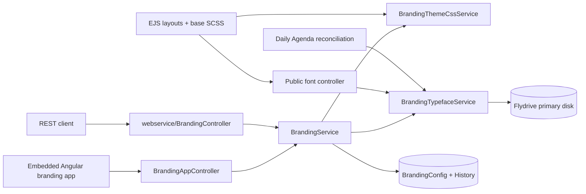
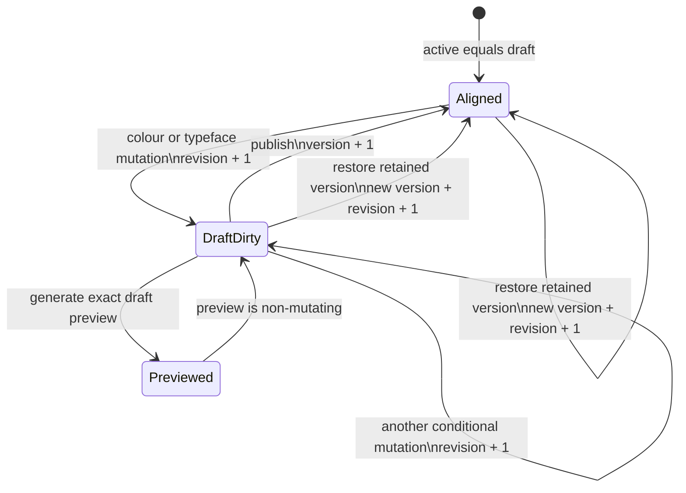

# Custom Brand Typeface Design

Status: implementation-ready design
Last updated: 2026-09-04

This document is the source of truth for adding administrator-supplied brand typefaces to ReDBox Portal. Implementation sequencing is in [implementation_plan.md](implementation_plan.md), and independently assignable work is in [tasklist.md](tasklist.md). Domain language is defined in [CONTEXT.md](CONTEXT.md), and the lifecycle decision is recorded in [ADR 0001](docs/adr/0001-version-brand-typefaces-with-colour-branding.md).

## 1. Goal

Allow an Administrator to upload one static WOFF2 Brand Typeface for a Branding Scope, preview it with draft colours, publish both atomically, view the three retained Branding Versions, and restore any retained version. The selected typeface must apply consistently to all browser-rendered branded portal interfaces while preserving the portal's current typography whenever no Brand Typeface is active.

The completed feature must provide:

- four explicit Typeface Face slots: Regular, Bold, Italic, and Bold Italic;
- a durable shared Branding Draft, with Regular required only when publishing a custom typeface;
- the same Admin authorisation boundary as existing logo and favicon management;
- browser and REST management surfaces with equivalent behaviour;
- public, same-origin, content-addressed WOFF2 delivery;
- atomic publication and restoration of colours plus typeface;
- optimistic concurrency for every draft and publication mutation;
- three retained complete Branding Versions, configurable through `sails.config.branding`;
- integrity checks before publish and restore, and daily orphan reconciliation;
- current portal typography and current Google font loading when Default Typography is active.

## 2. Non-goals

This change does not:

- version, draft, or otherwise alter the immediate lifecycle of logos or favicons;
- provide a typeface library, multiple active families, portal-specific typefaces, user-editable family names, or arbitrary CSS;
- accept TTF, OTF, WOFF1, variable WOFF2, remote font URLs, or cross-origin font hosting;
- subset, convert, repair, or rewrite uploaded fonts;
- require a licensing acknowledgement;
- mandate a glyph repertoire or reject fonts for missing glyphs;
- apply the typeface to emails, generated documents, server-side reports, or deliberately unbranded system pages;
- add a feature flag or a second expanded/decompressed-size limit;
- convert the branding Angular application to a single-page application or introduce Angular routing;
- redesign the existing branding persistence schema or add a separate font-asset database model.

## 3. Agreed product behaviour

### 3.1 Scope and authority

A Brand Typeface belongs to a Branding Scope and therefore applies to every portal resolved to that brand. The existing Admin branding permission protects all management endpoints. Uploads and actor attribution are always derived from the authenticated request; a request body cannot nominate an actor.

### 3.2 Face model

The slots and authoritative CSS descriptors are fixed by the server:

| Slot         | CSS weight | CSS style | Required                           |
| ------------ | ---------: | --------- | ---------------------------------- |
| `regular`    |        400 | normal    | Yes, for an active custom typeface |
| `bold`       |        700 | normal    | No                                 |
| `italic`     |        400 | italic    | No                                 |
| `boldItalic` |        700 | italic    | No                                 |

Missing optional faces use browser synthesis. Embedded family, subfamily, weight, or style metadata that differs from the selected slot produces a warning but does not reject the upload; the explicit slot remains authoritative. A structurally valid variable WOFF2 is rejected.

### 3.3 Lifecycle

Colour variables and typeface state share one persistent Branding Draft. Logo and favicon remain outside that draft.

- Editing an existing custom typeface begins from the active typeface state.
- A face can be replaced or removed independently.
- A custom draft may temporarily lack Regular so work can be saved, but cannot be published and cannot render as a custom preview until Regular is present.
- **Use Default Typography** changes the draft typeface to Default Typography. It does not change the live site until publication.
- **Revert Typeface Draft** copies only the active typeface into the draft and leaves draft colours untouched.
- Preview is encouraged but optional.
- Publish is idempotent when the generated colour CSS and all Typeface Face hashes are unchanged.
- Restore immediately publishes the selected retained snapshot as the next monotonically increasing Branding Version after confirmation. It never rewinds the version number or merely copies the version into the draft.
- After publish or restore, the active and draft states are aligned.

### 3.4 Rendering

When a Brand Typeface is active, it replaces the current Google-hosted text fonts throughout brand-resolved browser pages, including public, login, researcher, Admin, branded error, and browser-print views. Icon fonts and monospace/code content are excluded. Hook CSS is loaded later and can still override the generated theme.

When Default Typography is active, generated typeface CSS is absent and all existing typography and font requests remain unchanged.

## 4. Current system and design seam

The current feature is an embedded Angular application under `angular/projects/researchdatabox/branding`, mounted by `views/default/default/admin/branding.ejs`. It calls AJAX actions in `BrandingAppController`. Equivalent REST actions live in `controllers/webservice/BrandingController`. `BrandingService` owns colour draft, preview, publication, restoration, and the in-memory brand cache. `BrandingThemeCssService` validates colour tokens and generates published CSS. Images are handled separately by `BrandingLogoService` and `BrandingFaviconService` through the configured Flydrive primary disk.

The new design keeps `BrandingService` as lifecycle coordinator and adds one deep module, `BrandingTypefaceService`, around the font-specific complexity. It does not introduce a generic asset abstraction or a separate persistence model.



### 4.1 Module responsibilities

`BrandingService` owns:

- reading active, draft, history, health, and concurrency state;
- conditional draft updates and `draftRevision` increments;
- preview snapshot creation;
- publish and restore orchestration;
- monotonically increasing versions, history retention, and actor attribution;
- cache refresh after a committed active-state change.

`BrandingTypefaceService` owns:

- compressed byte-limit enforcement and WOFF2 structural inspection;
- rejection of variable fonts;
- SHA-256 calculation and content-addressed storage within one brand;
- canonical storage-key and public-URL derivation;
- reading a face and verifying its stored bytes against its hash;
- checking every face referenced by a candidate snapshot;
- warning extraction from embedded WOFF2 metadata;
- referenced-asset collection and safe orphan reconciliation.

Its public interface should remain small and typed. Exact names may follow repository conventions, but the intended boundary is:

```ts
inspectAndStoreFace(input): Promise<BrandingTypefaceFace>
readFace(brandingId, sha256): Promise<Buffer>
assertTypefaceAvailable(brandingId, typeface): Promise<void>
reconcileAssets(options?): Promise<BrandingTypefaceReconciliationResult>
```

Parser calls, metadata normalisation, key parsing, byte-limit checks, and pagination stay private. Do not add an exposed parser adapter until there is a demonstrated second implementation.

`BrandingThemeCssService` owns:

- colour validation and CSS generation as today;
- fixed `@font-face` declarations for a validated typeface snapshot;
- the internal brand font-family variable;
- the composite CSS hash used for publication idempotency.

It must never accept a user-provided CSS family string.

## 5. Typed data design

Shared types should live with the existing branding model/types rather than being duplicated by controllers and Angular services.

```ts
type BrandingTypefaceSlot = 'regular' | 'bold' | 'italic' | 'boldItalic';

interface BrandingTypefaceInspection {
  family?: string;
  subfamily?: string;
  embeddedWeight?: number;
  embeddedStyle?: string;
}

interface BrandingTypefaceFace {
  slot: BrandingTypefaceSlot;
  sha256: string;
  originalFilename: string;
  sizeBytes: number;
  uploadedAt: string;
  inspection: BrandingTypefaceInspection;
  warnings: string[];
}

interface BrandingTypefaceState {
  mode: 'default' | 'custom';
  faces: Partial<Record<BrandingTypefaceSlot, BrandingTypefaceFace>>;
}
```

Invariants:

- `mode: 'default'` has no faces.
- An active or historical `mode: 'custom'` state has a Regular face.
- A draft `mode: 'custom'` may omit Regular, but publication validation reports the precise missing requirement.
- `sha256` is a lowercase 64-character hexadecimal digest of the exact stored WOFF2 bytes.
- `originalFilename` is display metadata only. It is escaped by Angular and never used as a disk key, response filename, CSS token, or MIME authority.
- The server derives slot, CSS descriptors, storage key, URL, MIME type, and family alias.

For migration and compatibility, absent or `null` typeface data means Default Typography. API responses should normalise it to `{ mode: 'default', faces: {} }`.

### 5.1 `BrandingConfig`

Preserve the existing fields and add:

```ts
typeface?: BrandingTypefaceState | null;       // active published typeface
draftTypeface?: BrandingTypefaceState | null;  // persistent draft typeface
draftRevision: number;                         // defaults to 0
```

The existing `variables` field remains the colour draft; `css`, `hash`, and `version` remain the active published representation. The composite `hash` now covers generated colour and typeface CSS.

Update the compatibility `BrandingModel` class as well as the decorated Waterline type so services and cached objects expose the same shape.

### 5.2 `BrandingConfigHistory`

Each retained history row is a complete restorable colours-plus-typeface snapshot. Add:

```ts
typeface?: BrandingTypefaceState | null;
actorId?: string;
actorDisplayName?: string;
restoredFromVersion?: number;
```

`actorId` is the stable authenticated user identifier; `actorDisplayName` is a publication-time snapshot for durable display. `restoredFromVersion` is set only for a restoration-created version. Existing rows without typeface metadata represent Default Typography.

### 5.3 Public metadata and private data

Admin configuration responses expose active and draft typeface metadata, face slot, hash, escaped original filename, compressed byte count, inspection metadata, warnings, `draftRevision`, active version, retained versions, and active-asset health warnings. They never expose font bytes or internal storage keys. For a published version, active colour variables come from the complete history row matching the active version; the migration guarantees that a legacy non-zero active version has such a row. Version zero with no history represents generated default active colours.

The canonical response shape is:

```ts
interface BrandingAdminState {
  branding: { id: string; name: string }; // plus existing compatibility fields during transition
  active: {
    version: number;
    hash: string;
    variables: Record<string, string>;
    typeface: BrandingTypefaceState;
  };
  draft: {
    revision: number;
    variables: Record<string, string>;
    typeface: BrandingTypefaceState;
    dirty: { colours: boolean; typeface: boolean };
  };
  versions: Array<{
    id: string; // opaque BrandingConfigHistory row ID
    version: number;
    hash: string;
    dateCreated: string;
    actorId?: string;
    actorDisplayName?: string;
    restoredFromVersion?: number;
    variables: Record<string, string>;
    typeface: BrandingTypefaceState;
  }>;
  limits: { faceMaxBytes: number; familyMaxBytes: number; historyMaxVersions: number };
  healthWarnings: Array<{ code: string; slot?: BrandingTypefaceSlot; sha256?: string }>;
}
```

Draft mutation, publish, and restore responses return this complete state, plus `idempotent: true` on an unchanged publish where applicable. Existing root `version`, `hash`, and branding fields remain as compatibility projections; new code consumes the explicit sections above.

Public font responses expose only the immutable WOFF2 bytes for an exact brand and hash. No listing endpoint is public.

## 6. Persistence migration and rollout

Add an idempotent timestamped JavaScript migration under `api/migrations/`. It exports one `RedboxMigration`-shaped object (`name`, `up`, no destructive `down`) for the loader-generated migration config. Migrations run before bootstrap and cannot rely on a cross-instance application lock.

For every brand:

1. Backfill `typeface: null`, `draftTypeface: null`, and `draftRevision: 0` where absent.
2. Backfill `typeface: null` on historical rows where absent.
3. Determine the maximum historical version.
4. Correct legacy rollback state before pruning:
   - if the current active state is not represented by the maximum version, or the active snapshot differs from the row bearing its version, preserve the current active colours as a new complete history row at `max + 1` and set the active version to that value;
   - if active version is non-zero but no matching history exists, snapshot the active state at `max + 1`;
   - treat its typeface as Default Typography.
5. Retain only the newest configured number of history rows, default three.

The migration must tolerate already-migrated records, duplicate execution, and two instances attempting the same pending migration. Use conditional updates and the existing unique `(branding, version)` history index; on a duplicate version insert, re-read and accept it only if it represents the same preserved active snapshot. Because the migration intentionally prunes history and cannot reconstruct deleted rows, omit an unsafe destructive `down` migration and document that choice in the migration.

There is no feature flag. Existing installations remain behaviourally unchanged until an Administrator publishes a custom typeface. Lowering limits later affects only new uploads; already active or retained faces are grandfathered and remain publishable/restorable as long as their integrity is valid.

## 7. Draft concurrency and state transitions

`draftRevision` is independent from active `version`.

Every successful colour or typeface draft mutation must:

1. require `expectedDraftRevision`;
2. use a conditional database update matching both brand ID and current `draftRevision`;
3. apply exactly one logical mutation;
4. increment `draftRevision` exactly once;
5. return the new canonical Admin state.

This includes colour save, face upload, face deletion, Use Default Typography, and Revert Typeface Draft. A stale or missing expected revision returns `409 Conflict` with the current active version and draft revision so the client can offer a reload. The server never silently merges stale draft changes.

Publish requires both `expectedVersion` and `expectedDraftRevision`. Restore requires both values as well, because it changes active and draft state. Preview requires `expectedDraftRevision` and stores that revision with its generated snapshot.



### 7.1 Publication algorithm

Publication is externally atomic: a page request must observe either the previous active CSS/typeface or the complete new active CSS/typeface, never a partially updated mix.

1. Load the brand and compare both expected counters.
2. Validate colour draft and typeface draft invariants.
3. Re-read every referenced face from storage and verify its SHA-256 hash.
4. Generate CSS and the composite hash.
5. If the hash equals the active hash and the normalised snapshots are equal, return the current version with `idempotent: true` and create no history row.
6. Allocate `max(active version, maximum history version) + 1`.
7. In `runWithOptionalTransaction`, create the complete history row and conditionally update the single `BrandingConfig` row with CSS, hash, version, active typeface, aligned draft typeface, and the expected counters.
8. Prune history beyond the configured newest count after the new version is durable.
9. Refresh the brand cache only after commit.

Where the datastore cannot transact, create the history row before the conditional active update, delete that just-created row on a detected update failure, and make the migration/reconciler able to identify crash remnants. Public active state still changes in a single row update.

The unique `(branding, version)` history index arbitrates simultaneous allocations. A duplicate insert or transaction write conflict is translated into the same `409` concurrency result after re-reading current counters; it is not exposed as a generic 500.

### 7.2 Restoration algorithm

1. Load the route brand and the requested history row with an explicit `{ id, branding: routeBrand.id }` constraint. Never restore a row from another brand.
2. Compare active version and draft revision.
3. Normalise missing historical typeface to Default Typography.
4. Re-read and hash-check every referenced face before any active mutation.
5. Generate CSS from the historical variables and typeface rather than trusting stored CSS alone.
6. Allocate the next monotonically increasing version.
7. Persist a new complete history row with current actor and `restoredFromVersion`.
8. Atomically set active colours/CSS/typeface and align both colour and typeface drafts to the restored snapshot; increment `draftRevision` once.
9. Prune and refresh cache as for publication.

Restoring the currently active snapshot is still an intentional audited action and creates a new version. This differs from idempotent publish.

## 8. WOFF2 validation and storage

### 8.1 Parser selection gate

The repository has no current WOFF2 parser. Before feature implementation, complete the timeboxed dependency task in `tasklist.md`. The selected implementation must:

- parse and structurally decode WOFF2 from a `Buffer` on the repository's CI and runtime Node.js versions (currently Node 24 and Node 26 images);
- distinguish static from variable fonts by inspecting the OpenType table directory, including `fvar`;
- extract best-effort family/subfamily/weight/style metadata;
- fail closed for malformed or truncated data without crashing the process;
- have an acceptable licence, an exact pinned version, and no known unmitigated crafted-font denial-of-service issue;
- be exercised with malformed, truncated, valid static, and valid variable fixtures.

`fontkit@2.0.4` is a candidate because its documented formats include WOFF2 and variable fonts, but it must not be selected without resolving or explicitly mitigating its open crafted-font denial-of-service report ([package](https://www.npmjs.com/package/fontkit), [security issue](https://github.com/foliojs/fontkit/issues/369)). A minimal internal inspector is acceptable only if it satisfies the same structural-validation requirements. Do not add a decompressed-size ceiling: that proposal was explicitly rejected.

### 8.2 Upload validation

For a face upload:

1. Validate the route slot against the four fixed slot values.
2. Stream/read through Skipper using the current configured per-face byte limit.
3. Repeat the compressed byte-size check on the resulting bytes in `BrandingTypefaceService` so the transport is not the only enforcement boundary.
4. Ignore the client filename extension and MIME type for validity.
5. Parse the bytes as WOFF2; reject invalid/truncated/unsupported content.
6. Reject any font containing variable-font tables.
7. Extract metadata and create warnings for descriptor mismatches.
8. Enforce the configured total compressed family limit against distinct face content in the resulting draft. Because content is deduplicated, the same hash referenced by multiple slots counts once.
9. Hash and store the bytes before the conditional draft update.
10. If the conditional update conflicts, leave the content-addressed object for grace-period reconciliation and return `409`.

Only compressed byte limits are enforced: default 2 MiB per face and 8 MiB for the family. Limits apply to new uploads, not to reading, publishing, or restoring retained content.

### 8.3 Storage layout

Use `StorageManagerService.primaryDisk()` and the dedicated prefix:

```text
branding-fonts/<branding-id>/<sha256>.woff2
```

The object is immutable. If the same hash already exists under the same brand, verify it and reuse it. Deduplication is per brand and can span slots, drafts, and versions; do not deduplicate across brands. Brand name and original filename never form the storage key.

The public URL is derived independently:

```text
<rootContext>/fonts/branding/<encoded-brand-name>/<sha256>.woff2
```

This route is portal-independent so all portals under a brand share the browser cache.

## 9. CSS generation and page integration

The fixed internal CSS family alias is `"ReDBox Brand Typeface"`. For a custom snapshot, emit one `@font-face` per present slot with the descriptors in section 3.2, a same-origin URL, `format("woff2")`, and `font-display: swap`.

Generated CSS defines the internal variable in both light DOM and the Angular preview host:

```css
:root,
:host {
  --rb-brand-font-family: 'ReDBox Brand Typeface', 'Helvetica Neue', Arial, sans-serif;
}
```

Do not expose this variable in the editable branding token allow-list. Continue rejecting legacy or attempted `branding-font-family` colour-variable input.

Update base typography SCSS role-by-role to use `var(--rb-brand-font-family, <existing family>)`. Cover body text, headings, navigation/menu, footer, buttons, form controls, and browser print. Explicitly retain existing families for icon classes and `pre`, `code`, `kbd`, and `samp`. This fallback form is important: when no Brand Typeface is active, each role retains its current family instead of collapsing the existing three-family design into one fallback.

The `@font-face` URL embedded in theme CSS is relative:

```text
../../../fonts/branding/<encoded-brand-name>/<sha256>.woff2
```

Both normal theme CSS (`/:branding/:portal/styles/theme.css`) and preview CSS (`/:branding/:portal/preview/:token.css`) have the same path depth, so that relative URL resolves below `rootContext` without baking deployment configuration into published CSS. EJS preload URLs use the absolute-with-root-context public URL from section 8.3.

The generated CSS content and lifecycle hash include the ordered face hashes as well as colours. `BrandingConfig.hash` is publication state and a GET request must never rewrite it. `BrandingController.renderCss` may derive a separate ETag from the exact minified response bytes, but must remove the current read-time hash-correction write. This keeps preview, idempotent publish, and concurrent publication semantics stable.

### 9.1 Google font suppression and preload

Audit every `fonts.googleapis.com` and related Google font reference in EJS and SCSS. At minimum this includes the main default layouts, record layout, homepage, advice, services list, workspaces list, and RDMP dashboard views.

- If the resolved brand has an active custom typeface, omit the current Google font requests.
- If it uses Default Typography, emit the requests exactly as today.
- Preload only the active Regular face with `as="font"`, `type="font/woff2"`, and `crossorigin`; do not preload optional faces.
- A missing or corrupt active face does not cause Google fonts to be re-enabled for that request. The browser uses the CSS fallback stack, while the Admin state shows a health warning and the server logs the storage error.

`views/default/default/layout/head-extra.ejs` and hook-injected CSS remain after the theme stylesheet, preserving hook override precedence.

## 10. HTTP interfaces

Exact route spelling should follow existing route config style. The REST surface is canonical; the AJAX surface mirrors it for the embedded Angular app.

### 10.1 Admin state and draft endpoints

| Method | REST path                                                    | AJAX path                                                    | Purpose                                               |
| ------ | ------------------------------------------------------------ | ------------------------------------------------------------ | ----------------------------------------------------- |
| GET    | `/:branding/:portal/api/branding/config`                     | `/:branding/:portal/app/branding/config`                     | Active, draft, versions, limits, counters, warnings   |
| POST   | `/:branding/:portal/api/branding/draft`                      | `/:branding/:portal/app/branding/draft`                      | Replace validated colour draft with expected revision |
| PUT    | `/:branding/:portal/api/branding/draft/typeface/faces/:slot` | `/:branding/:portal/app/branding/draft/typeface/faces/:slot` | Multipart face upload (`face`)                        |
| DELETE | `/:branding/:portal/api/branding/draft/typeface/faces/:slot` | `/:branding/:portal/app/branding/draft/typeface/faces/:slot` | Remove one draft face                                 |
| POST   | `/:branding/:portal/api/branding/draft/typeface/use-default` | `/:branding/:portal/app/branding/draft/typeface/use-default` | Set draft typeface to Default Typography              |
| POST   | `/:branding/:portal/api/branding/draft/typeface/revert`      | `/:branding/:portal/app/branding/draft/typeface/revert`      | Copy active typeface to draft only                    |

All mutation endpoints require `expectedDraftRevision`. Colour draft bodies are `{ variables, expectedDraftRevision }`; remove/default/revert bodies are `{ expectedDraftRevision }`; multipart uploads carry `face` and `expectedDraftRevision` fields. Responses return the complete canonical Admin state, which lets the browser replace rather than merge local server state.

### 10.2 Preview, publication, and version endpoints

| Method | REST path                                                     | AJAX path                                                     | Purpose                                                   |
| ------ | ------------------------------------------------------------- | ------------------------------------------------------------- | --------------------------------------------------------- |
| POST   | `/:branding/:portal/api/branding/preview`                     | `/:branding/:portal/app/branding/preview`                     | Create a single-use CSS preview for exact draft revision  |
| GET    | `/:branding/:portal/api/branding/versions`                    | `/:branding/:portal/app/branding/versions`                    | List newest retained versions                             |
| POST   | `/:branding/:portal/api/branding/versions/:versionId/preview` | `/:branding/:portal/app/branding/versions/:versionId/preview` | Preview a retained version without mutating draft         |
| POST   | `/:branding/:portal/api/branding/publish`                     | `/:branding/:portal/app/branding/publish`                     | Publish draft using both expected counters                |
| POST   | `/:branding/:portal/api/branding/restore/:versionId`          | `/:branding/:portal/app/branding/restore/:versionId`          | Immediately restore as a new version                      |
| POST   | `/:branding/:portal/api/branding/rollback/:versionId`         | `/:branding/:portal/app/branding/rollback/:versionId`         | Deprecated one-major-release alias with restore semantics |

`versionId` is the opaque retained `BrandingConfigHistory` row ID; `version` is the monotonically increasing number displayed to Administrators. Draft preview bodies are `{ expectedDraftRevision }`. Publish and restore bodies are `{ expectedVersion, expectedDraftRevision }`; historical preview is read-only and needs no expected counter.

The existing REST `GET /:branding/:portal/api/branding/history` route remains as a compatibility alias of `versions`. The rollback alias must call the same implementation as restore, return a deprecation response header, appear as deprecated in generated API documentation, and be removed only in the next major release. It must not retain the old version-rewind behaviour.

### 10.3 Public font endpoint

```text
GET|HEAD /fonts/branding/:branding/:sha256.woff2
```

The action validates the exact lowercase hash shape, resolves the brand, derives the storage key from brand ID and hash, reads and verifies the object, and returns:

- `Content-Type: font/woff2` regardless of uploaded MIME;
- an ETag derived from the full hash;
- `Cache-Control: public, max-age=31536000, immutable`;
- `X-Content-Type-Options: nosniff`;
- content length where supported.

`HEAD` returns the same headers without a body. Missing brand/object and hash mismatch return 404, with the corruption logged; never substitute another font. The content hash makes long-lived caching safe. Existing session/static handling already recognises `/fonts/` and must be covered by a regression test.

### 10.4 Error contract

Touched JSON actions should use the repository's standard `sendResp` response path. Binary font delivery may write the raw response as existing image actions do.

| Status | Meaning                                                                                                                        |
| -----: | ------------------------------------------------------------------------------------------------------------------------------ |
|    400 | Invalid slot, malformed/unsupported WOFF2, variable font, invalid request, or publish invariant failure                        |
|    404 | Brand, version, preview, or public font not found                                                                              |
|    409 | Stale active version or draft revision; include `{ current: { version, draftRevision } }` alongside the standard error payload |
|    413 | Configured compressed face or family byte limit exceeded                                                                       |
|    500 | Unexpected storage, parser, or persistence failure                                                                             |

Do not trust a client MIME type in the API route validator. If the shared contract validator cannot express a runtime-configured maximum, extend it narrowly to accept a controller-supplied runtime maximum. Generated OpenAPI should advertise the default maximum and mark it as operator-configurable rather than presenting it as an immutable protocol constant.

## 11. Administrator interface

Extend the existing branding Admin component; do not add a route or a navigation item.

### 11.1 Typography editor

Add a Typography section with:

- a clear Default Typography or Custom Typeface state;
- four fixed slot cards with upload/replace/remove controls;
- `.woff2,font/woff2` as a file-picker hint only;
- escaped original filename, compressed size, selected slot, extracted metadata, and warnings;
- copy explaining that optional faces may be synthesised;
- precise validation when custom mode lacks Regular;
- **Use Default Typography** and **Revert Typeface Draft** actions;
- disabled duplicate controls while a mutation is in flight;
- accessible progress, success, and server-error messaging.

The UI keeps no private authoritative draft. After every successful mutation it replaces its state with the server response. A `409` presents a clear reload action and does not overwrite newer shared changes.

### 11.2 Preview

Expand the representative Shadow DOM preview to include body text, headings, navigation, link, button, form control, Regular, Bold, Italic, and Bold Italic examples. Allow an Administrator to enter unsaved local sample text; this text never leaves the browser and is not part of draft state.

If a custom draft lacks Regular, show the incomplete-draft state rather than attempting to make an optional face act as Regular. Retained historical versions can be previewed without changing the current draft.

### 11.3 Version history

Show the retained versions newest first with:

- version number and active marker;
- publication/restoration date;
- actor display-name snapshot, with stable ID available to diagnostics;
- typeface summary (Default Typography or face filenames/slots);
- Preview and Restore actions.

Restore requires a confirmation modal explaining that it immediately creates a new active version and replaces the current draft. Refresh the full state on completion.

## 12. Retention and orphan reconciliation

After each successful publish or restore, retain only the newest `historyMaxVersions` complete history rows, default three. A face is referenced if its derived key appears in any brand's active typeface, draft typeface, or retained history.

Register a daily Agenda job named `BrandingTypefaceService-ReconcileAssets` with:

- `backend: 'mongodb'`;
- a once-per-day schedule and `skipImmediate: true`;
- `lockLimit: 1`, `concurrency: 1`, and a bounded `lockLifetime` longer than the expected scan;
- the existing retry-on-next-run behaviour for individual failures.

The reconciliation implementation must:

1. Build the referenced-key set from current database state.
2. Paginate/list only the dedicated `branding-fonts/` prefix.
3. Accept only exact expected key shapes; log and skip unexpected entries.
4. Ignore objects newer than `typefaceOrphanGraceMs`, default 24 hours.
5. Re-read current references immediately before each deletion to close the scan/delete race.
6. Treat an already-missing object as success.
7. Delete only objects that remain unreferenced and outside the grace period.
8. Log bounded summary counts and individual failures without filenames or bytes.

Pruning history is synchronous database work; storage deletion is asynchronous and recoverable during the grace period. Do not use an in-process `setTimeout` cleanup.

## 13. Configuration

Add these defaults to `packages/redbox-core/src/config/branding.config.ts`:

| Key                      |               Default | Behaviour                                                                |
| ------------------------ | --------------------: | ------------------------------------------------------------------------ |
| `typefaceFaceMaxBytes`   |     `2 * 1024 * 1024` | Maximum compressed bytes for a newly uploaded face                       |
| `typefaceFamilyMaxBytes` |     `8 * 1024 * 1024` | Maximum distinct compressed bytes referenced by a resulting custom draft |
| `historyMaxVersions`     |                   `3` | Newest complete versions retained per brand                              |
| `typefaceOrphanGraceMs`  | `24 * 60 * 60 * 1000` | Minimum unreferenced object age before deletion                          |

Values must be finite positive integers at use sites, with a logged fallback to defaults for invalid operator configuration. Do not add a feature flag or expanded-size setting.

## 14. Security, resilience, and privacy

- Treat every font as untrusted binary input and fail closed on parser errors.
- Enforce Admin policy on all management and preview/history endpoints in both REST and AJAX route groups.
- Keep public delivery read-only and constrained by brand plus exact hash.
- Do not interpolate filenames, embedded family names, brand names, or request strings into CSS without fixed derivation and correct URL encoding.
- Use only the fixed CSS alias and fixed slot descriptors.
- Verify stored bytes before every publish and restore, not only at upload.
- A missing or corrupt active object produces browser fallback, an Admin health warning, and structured server logging. It does not serve an unrelated asset and does not silently alter active state.
- Same-origin font URLs fit the current `font-src 'self'` CSP; add a regression assertion so CSP changes cannot break delivery unnoticed.
- Do not log font bytes, session data, or supplied filenames at normal levels.
- Escape all user-controlled display metadata through normal Angular interpolation.

## 15. Observability

Use structured log events for upload validation failure, storage write/read failure, active integrity failure, publication/restoration conflict, history prune, and reconciliation summary. Include brand ID/name, slot, hash where known, version/revision counters, and error category. Exclude raw font data and avoid original filename unless debug logging is explicitly enabled.

Only published and restored Branding Versions receive durable actor attribution. Draft changes use ordinary structured operational logging and do not create actor-history rows or a new audit model.

The Admin configuration response calculates health for the active typeface. Health warnings are advisory; config retrieval should still succeed when an object is unavailable. Publish and restore are strict and fail before mutation.

## 16. Compatibility

- Existing brands and historical rows without typeface fields behave as Default Typography.
- Existing branding page URL, sidebar item, Angular mounting, and logo/favicon APIs remain.
- Existing colour response fields remain during the transition; new clients should use the explicit `active`, `draft`, `versions`, `limits`, and `healthWarnings` sections.
- Colour draft mutations now require `expectedDraftRevision`. This intentional contract tightening must be reflected in Angular and REST clients in the same release.
- The old `rollback` endpoint remains for one major release with new restore semantics and explicit deprecation metadata.
- Hook styles retain precedence.
- No custom typeface means byte-for-byte-equivalent generated colour behaviour where practical and unchanged EJS Google font inclusion.

## 17. Verification criteria

The implementation is complete only when automated evidence covers:

1. valid static WOFF2 upload to every slot;
2. malformed, truncated, variable, oversized-face, and oversized-family rejection;
3. warning-only embedded descriptor mismatches;
4. content deduplication within a brand and isolation across brands;
5. durable draft state and independent colour/typeface mutations;
6. stale mutation, publish, and restore conflicts;
7. custom publication requiring Regular and Default Typography publication without faces;
8. pre-publication and pre-restoration integrity failure with no active mutation;
9. idempotent publish and monotonically increasing restoration;
10. complete actor-attributed history and newest-three pruning;
11. legacy migration, including old rollback state and repeat execution;
12. immutable public GET/HEAD delivery, root context, MIME, cache, ETag, missing/corrupt behaviour, session bypass, and CSP;
13. CSS descriptors, fixed alias, font swap, face URL encoding, hook precedence, icon/monospace exclusions, print, and current defaults when inactive;
14. conditional Google font suppression and Regular-only preload across every affected layout;
15. REST/AJAX parity, standard JSON responses, deprecated alias, and generated API contracts;
16. Admin upload/remove/default/revert/preview/publish/history/restore flows, accessibility, conflict UX, and escaped filenames;
17. daily reconciliation reference safety, grace period, race recheck, pagination, unexpected keys, and retry behaviour.

The exact commands and ownership boundaries are specified in the accompanying plan and task list.

## 18. Remaining implementation decision

All product and architecture decisions are closed except the concrete WOFF2 inspection implementation. That choice is deliberately isolated as Task T00 and must be resolved before storage or controller implementation. If no candidate passes the security and compatibility gate, the feature is blocked rather than weakened to extension/MIME-only validation.
