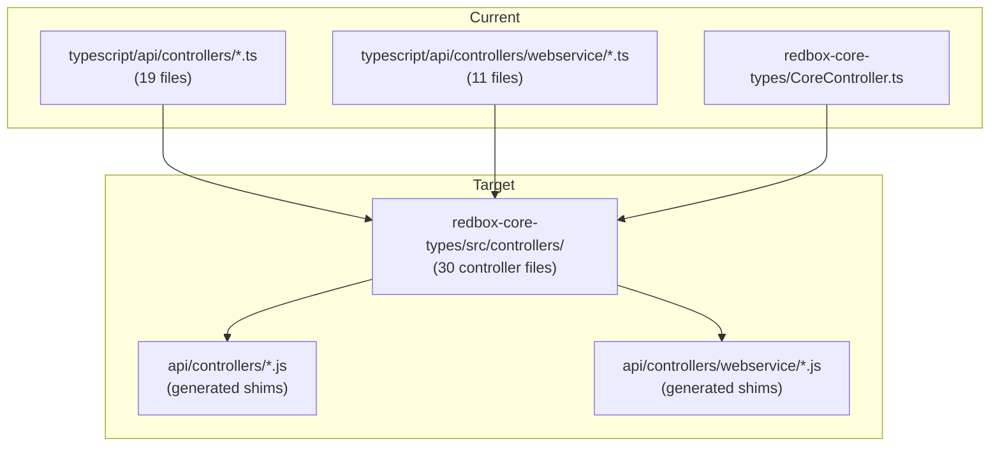

# Migrate Sails Controllers to redbox-core-types

Migrate all 30 TypeScript controllers from `typescript/api/controllers/` (19 API controllers + 11 webservice controllers) to `packages/redbox-core-types`, with shim generation following the established services migration pattern.

## Goals

1. **Move all controllers** to `redbox-core-types/src/controllers/`
2. **Handle webservice controllers** via separate `WebserviceControllerExports` object
3. **Generate controller shims** via `redbox-loader.js`
4. **Support hook controller overrides** using `hasControllers` pattern (full replacement like services)
5. **Convert constructors to init() methods** called during bootstrap (same pattern as services, after service init)
6. **Create unit tests** for controllers in redbox-core-types

---

## Current Architecture



---

## User Review Required

> [!IMPORTANT]
> **Init Method Pattern**: Controllers with constructor logic (e.g., `RecordController` uses `registerSailsHook`) must convert to an `init()` method called during bootstrap **after service init**. Constructors and field initializers cannot rely on sails globals being available at instantiation time. `init` must be included in exported methods so it is visible to bootstrap; ensure no routes map to `init`.

> [!WARNING]
> **Route Safety**: Do not map any routes to `init`. It is exported only so bootstrap can call it and must never be exposed as a public endpoint.

> [!WARNING]  
> **Route Compatibility**: Routes reference controllers by name (e.g., `RecordController.getMeta`). The shim files must maintain exact naming to preserve route mappings.

---

## Proposed Changes

### Phase 1: Infrastructure Setup

---

#### [MODIFY] [redbox-loader.js](file:///home/vagrant/src/worktrees/feature/migrate-controllers-to-core/redbox-loader.js)

Add controller discovery and shim generation.

**1. Update lazy-loaded imports:**

```diff
- let WaterlineModels, Policies, Middleware, Responses, Config, ServiceExports;
+ let WaterlineModels, Policies, Middleware, Responses, Config, ServiceExports, ControllerExports, WebserviceControllerExports;

function loadCoreTypes() {
    if (!WaterlineModels) {
        const coreTypes = require('@researchdatabox/redbox-core-types');
        WaterlineModels = coreTypes.WaterlineModels || {};
        Policies = coreTypes.Policies || {};
        Middleware = coreTypes.Middleware || {};
        Responses = coreTypes.Responses || {};
        Config = coreTypes.Config || {};
        ServiceExports = coreTypes.ServiceExports || {};
+       ControllerExports = coreTypes.ControllerExports || {};
+       WebserviceControllerExports = coreTypes.WebserviceControllerExports || {};
    }
}
```

**2. Update `findAndRegisterHooks()` for controller discovery:**

```javascript
// Check for controllers
if (depPackageJson.sails && depPackageJson.sails.hasControllers === true) {
    log.verbose(`Found hook with controllers: ${depName}`);
    const hookModule = require(depName);
    if (typeof hookModule.registerRedboxControllers === 'function') {
        const controllers = hookModule.registerRedboxControllers();
        for (const controllerName of Object.keys(controllers)) {
            hookControllers[controllerName] = {
                module: depName,
                controller: controllers[controllerName]
            };
        }
    }
    // Webservice controllers
    if (typeof hookModule.registerRedboxWebserviceControllers === 'function') {
        const wsControllers = hookModule.registerRedboxWebserviceControllers();
        for (const controllerName of Object.keys(wsControllers)) {
            hookWebserviceControllers[controllerName] = {
                module: depName,
                controller: wsControllers[controllerName]
            };
        }
    }
}
```

**3. Add controller name exports and `generateControllerShims()` function (no controller instantiation during shim generation):**

> [!IMPORTANT]
> `ControllerExports` uses getters that instantiate controllers; shim generation must not touch those getters. Add explicit `ControllerNames` and `WebserviceControllerNames` arrays (or equivalent) to export names without instantiating controllers.

```javascript
async function generateControllerShims(controllersDir, hookControllers, hookWebserviceControllers) {
    loadCoreTypes();

    // API Controllers
    const coreControllerNames = ControllerNames;
    const allApiControllers = new Set([...coreControllerNames, ...Object.keys(hookControllers)]);

    // Webservice Controllers  
    const coreWSControllerNames = WebserviceControllerNames;
    const allWSControllers = new Set([...coreWSControllerNames, ...Object.keys(hookWebserviceControllers)]);

    let generated = 0;
    let fromHooks = 0;
    const promises = [];

    // Generate API controller shims
    for (const name of allApiControllers) {
        if (hookControllers[name]) {
            // Hook takes precedence (registerRedboxControllers())
            const filePath = path.join(controllersDir, `${name}.js`);
            const content = `'use strict';
/**
 * ${name} controller shim - from hook
 * Auto-generated by redbox-loader.js
 * Provided by: ${hookControllers[name].module}
 * Do not edit manually - regenerated when .regenerate-shims marker exists
 */
const { registerRedboxControllers } = require('${hookControllers[name].module}');
module.exports = registerRedboxControllers()['${name}'];
`;
            promises.push(writeFileIfChanged(filePath, content).then(w => { if(w) {generated++; fromHooks++;} }));
            continue;
        }
        if (ControllerExports[name]) {
            const filePath = path.join(controllersDir, `${name}.js`);
            const content = `'use strict';
/**
 * ${name} controller shim
 * Auto-generated by redbox-loader.js
 */
const { ControllerExports } = require('@researchdatabox/redbox-core-types');
module.exports = ControllerExports['${name}'];
`;
            promises.push(writeFileIfChanged(filePath, content).then(w => { if(w) generated++; }));
        }
    }

    // Generate webservice controller shims
    const wsDir = path.join(controllersDir, 'webservice');
    await fs.mkdir(wsDir, { recursive: true });

    for (const name of allWSControllers) {
        if (hookWebserviceControllers[name]) {
            const filePath = path.join(wsDir, `${name}.js`);
            const content = `'use strict';
/**
 * ${name} webservice controller shim - from hook
 * Auto-generated by redbox-loader.js
 * Provided by: ${hookWebserviceControllers[name].module}
 * Do not edit manually - regenerated when .regenerate-shims marker exists
 */
const { registerRedboxWebserviceControllers } = require('${hookWebserviceControllers[name].module}');
module.exports = registerRedboxWebserviceControllers()['${name}'];
`;
            promises.push(writeFileIfChanged(filePath, content).then(w => { if(w) {generated++; fromHooks++;} }));
            continue;
        }
        if (WebserviceControllerExports[name]) {
            const filePath = path.join(wsDir, `${name}.js`);
            const content = `'use strict';
/**
 * ${name} webservice controller shim
 * Auto-generated by redbox-loader.js
 */
const { WebserviceControllerExports } = require('@researchdatabox/redbox-core-types');
module.exports = WebserviceControllerExports['${name}'];
`;
            promises.push(writeFileIfChanged(filePath, content).then(w => { if(w) generated++; }));
        }
    }

    await Promise.all(promises);
    return { generated, fromHooks, total: allApiControllers.size + allWSControllers.size };
}
```

---

#### [NEW] [src/controllers/index.ts](file:///home/vagrant/src/worktrees/feature/migrate-controllers-to-core/packages/redbox-core-types/src/controllers/index.ts)

Separate exports for API and webservice controllers:

```typescript
/**
 * Controllers index - exports all controller classes
 */

// API controller imports
import * as ActionControllerModule from './ActionController';
import * as AdminControllerModule from './AdminController';
// ... all 19 API controllers

// Webservice controller imports
import * as WSAdminControllerModule from './webservice/AdminController';
import * as WSRecordControllerModule from './webservice/RecordController';
// ... all 11 webservice controllers

// Lazy instantiation cache
const controllerCache: Record<string, any> = {};
function getOrCreate(name: string, factory: () => any): any {
    if (!controllerCache[name]) controllerCache[name] = factory();
    return controllerCache[name];
}

// API Controllers export
export const ControllerExports = {
    get ActionController() { return getOrCreate('ActionController', () => new ActionControllerModule.Controllers.Action().exports()); },
    get AdminController() { return getOrCreate('AdminController', () => new AdminControllerModule.Controllers.Admin().exports()); },
    // ... all 19 API controllers
};

// Webservice Controllers export (separate object, not prefixed)
export const WebserviceControllerExports = {
    get AdminController() { return getOrCreate('WS_AdminController', () => new WSAdminControllerModule.Controllers.Admin().exports()); },
    get RecordController() { return getOrCreate('WS_RecordController', () => new WSRecordControllerModule.Controllers.Record().exports()); },
    // ... all 11 webservice controllers (internal cache key prefixed, export name matches file)
};

// Export controller names without instantiating (used by redbox-loader shim generation)
export const ControllerNames = [
    'ActionController',
    'AdminController',
    // ... all 19 API controllers
];

export const WebserviceControllerNames = [
    'AdminController',
    'RecordController',
    // ... all 11 webservice controllers
];
```

---

#### [MODIFY] [src/index.ts](file:///home/vagrant/src/worktrees/feature/migrate-controllers-to-core/packages/redbox-core-types/src/index.ts)

```diff
// Services
export { ServiceExports } from './services';
export * from './services';

+ // Controllers
+ export { ControllerExports, WebserviceControllerExports, ControllerNames, WebserviceControllerNames } from './controllers';
+ export * from './controllers';
```

---

### Phase 2: Constructor → Init() Pattern

> [!CAUTION]
> **Critical Migration Pattern**: Controllers instantiated via `new Controller().exports()` cannot use constructors that depend on sails globals. These must be converted to `init()` methods called during bootstrap.

#### Example: RecordController Migration

**Before** (constructor with sails dependency):
```typescript
export class Record extends controllers.Core.Controller {
    recordsService: RecordsService = sails.services.recordsservice;
    searchService: SearchService;
    datastreamService: DatastreamService = sails.services.recordsservice;

    constructor() {
        super();
        this.registerSailsHook('after', ['hook:redbox:storage:ready', ...], function () {
            that.datastreamService = sails.services[datastreamServiceName];
            that.searchService = sails.services[sails.config.search.serviceName];
        });
    }
}
```

**After** (init method pattern):
```typescript
export class Record extends controllers.Core.Controller {
    recordsService: RecordsService;
    searchService: SearchService;
    datastreamService: DatastreamService;

    protected _exportedMethods: any = [
        'init',  // Exported for bootstrap to call; do not map to routes
        'edit',
        // ... other methods
    ];

    public init(): void {
        this.recordsService = sails.services.recordsservice;
        this.datastreamService = sails.services.recordsservice;
        
        this.registerSailsHook('after', ['hook:redbox:storage:ready', ...], () => {
            const datastreamServiceName = sails.config.record.datastreamService;
            if (datastreamServiceName) {
                this.datastreamService = sails.services[datastreamServiceName];
            }
            this.searchService = sails.services[sails.config.search.serviceName];
        });
    }
}
```

#### Controllers Requiring Init Migration

| Controller | Has Constructor Logic | Notes |
|---|---|---|
| `RecordController` | ✅ Yes | Uses `registerSailsHook` for service initialization |
| `webservice/RecordController` | ✅ Yes | Similar pattern |
| Others | Check each | Audit constructors and field initializers; move any sails usage into init() |

---

### Phase 3: Controller Migration

#### API Controllers (19 files)

| Controller | Size | Init Required |
|---|---|---|
| `ActionController.ts` | 3KB | No |
| `AdminController.ts` | 11KB | Check |
| `AppConfigController.ts` | 3KB | No |
| `AsynchController.ts` | 7KB | Check |
| `BrandingAppController.ts` | 6KB | Check |
| `BrandingController.ts` | 10KB | Check |
| `DynamicAssetController.ts` | 10KB | Check |
| `EmailController.ts` | 6KB | Check |
| `ExportController.ts` | 3KB | No |
| `RecordAuditController.ts` | 3KB | No |
| **`RecordController.ts`** | **63KB** | **Yes** |
| `RenderViewController.ts` | 2KB | No |
| `ReportController.ts` | 4KB | Check |
| `ReportsController.ts` | 3KB | No |
| `TranslationController.ts` | 8KB | Check |
| `UserController.ts` | 21KB | Check |
| `VocabController.ts` | 8KB | Check |
| `WorkspaceAsyncController.ts` | 2KB | No |
| `WorkspaceTypesController.ts` | 4KB | No |

#### Webservice Controllers (11 files)

| Controller | Size | Init Required |
|---|---|---|
| `AdminController.ts` | 4KB | No |
| `AppConfigController.ts` | 3KB | No |
| `BrandingController.ts` | 6KB | Check |
| `ExportController.ts` | 4KB | No |
| `FormManagementController.ts` | 4KB | Check |
| **`RecordController.ts`** | **53KB** | **Yes** |
| `RecordTypeController.ts` | 4KB | No |
| `ReportController.ts` | 4KB | Check |
| `SearchController.ts` | 7KB | Check |
| `TranslationController.ts` | 8KB | Check |
| `UserManagementController.ts` | 12KB | Check |

---

### Phase 4: Unit Testing

Create unit tests for controllers in `packages/redbox-core-types/test/controllers/`:

```
test/controllers/
├── ActionController.test.ts
├── RecordController.test.ts
├── UserController.test.ts
└── webservice/
    ├── RecordController.test.ts
    └── SearchController.test.ts
```

#### Test Pattern (following existing service tests):

```typescript
import { expect } from 'chai';
import * as sinon from 'sinon';
import { Controllers } from '../../src/controllers/RecordController';

describe('RecordController', () => {
    let controller: Controllers.Record;
    let mockSails: any;

    beforeEach(() => {
        mockSails = {
            config: { record: { datastreamService: 'recordsservice' }, search: { serviceName: 'solrsearchservice' } },
            services: { recordsservice: { getMeta: sinon.stub() } },
            log: { verbose: sinon.stub(), error: sinon.stub() }
        };
        (global as any).sails = mockSails;
        controller = new Controllers.Record();
        controller.init(); // Call init after sails is available
    });

    afterEach(() => {
        sinon.restore();
        delete (global as any).sails;
    });

    describe('getMeta', () => {
        it('should return 400 for empty OID', async () => {
            const req = { param: sinon.stub().returns(''), session: { branding: 'default' } };
            const res = {};
            const sendRespStub = sinon.stub(controller, 'sendResp');
            
            await controller.getMeta(req, res);
            
            expect(sendRespStub.calledWith(req, res, sinon.match({ status: 400 }))).to.be.true;
        });
    });
});
```

Add tests to cover:
- Controller `init()` is called during bootstrap (after service init)
- Hook controller overrides take precedence and load from `registerRedboxControllers()` / `registerRedboxWebserviceControllers()`

> [!NOTE]
> Test setup should define `global.sails` and `global._` where controllers depend on them.

---

## Verification Plan

### Automated Tests

1. **Build redbox-core-types**
   ```bash
   cd packages/redbox-core-types && npm run build
   ```

2. **Run redbox-core-types unit tests with coverage**
   ```bash
   cd packages/redbox-core-types && npm test
   ```

3. **Run full mocha test suite**
   ```bash
   # Run with dev changes mounted
   npm run test:mocha:mount
   
   # For a fresh run (delete containers first)
   npm run test:mocha:clean
   ```

4. **Run Bruno integration tests**
   ```bash
   # Run with dev changes mounted
   npm run test:bruno:general:mount
   
   # For a fresh run (delete containers first)
   npm run test:bruno:general:clean
   ```

### Manual Verification

1. Start the application and verify it lifts without errors
2. Verify controller shims are generated in `api/controllers/` and `api/controllers/webservice/`
3. Test key endpoints through the browser

---

## Additional Required Changes

1. **Bootstrap wiring**: After service init, iterate `sails.controllers` and call `init()` if present (exported on controllers; keep it out of routes).
2. **Hook contract**: Use `registerRedboxControllers()` / `registerRedboxWebserviceControllers()` for hook shims; do not assume `ControllerExports` exists in hook modules.
3. **Cleanup**: Delete legacy `typescript/api/controllers/` and `typescript/api/controllers/webservice/` after migration and remove stale shims where applicable.

---

## Implementation Order

1. **Infrastructure** - redbox-loader.js updates, controllers/index.ts
2. **Small API controllers** - ActionController, RenderViewController, etc.
3. **Medium API controllers** - BrandingController, EmailController, etc.  
4. **Large API controllers** - UserController, RecordController (with init() migration)
5. **Webservice controllers** - All 11 webservice controllers
6. **Unit tests** - Add tests for migrated controllers
7. **Final verification** - Full test suite
