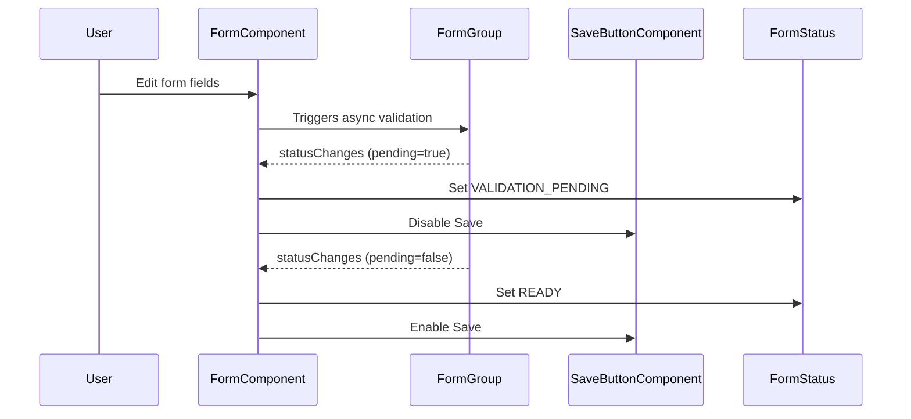

# Design: Form Lifecycle Enhancement

## 1. `FormStatus` Enum

- Add a new status: `VALIDATION_PENDING` to the existing `FormStatus` enum in `status.model.ts`.
- Enum values will now include: `INIT`, `READY`, `SAVING`, `VALIDATION_ERROR`, `LOAD_ERROR`, `VALIDATION_PENDING`.

## 2. FormComponent Status Management

- The `FormComponent` will monitor the `form` (FormGroup) for async validation state.
- When `form.pending` is `true`, set status to `FormStatus.VALIDATION_PENDING`.
- When async validation completes (`form.pending` becomes `false`), revert to the appropriate status (`READY`, etc.).
- Use Angular’s `statusChanges` observable to detect changes in validation state.

## 3. SaveButtonComponent Enhancement

- The Save button will receive a `formReady` or `canSave` input (boolean).
- The button will be disabled if:
  - The form is invalid,
  - The form is in a non-ready state (e.g., `VALIDATION_PENDING`, `SAVING`),
  - Or any other custom logic as required.
- The button’s disabled state will be bound to this input.

## 4. Component Interaction

- `FormComponent` exposes a property or observable indicating readiness (not pending, valid, etc.).
- `SaveButtonComponent` consumes this property to determine its enabled/disabled state.

## 5. UI/UX

- When the form is validating asynchronously, show a spinner or subtle indicator near the Save button or form fields.
- Tooltip or message on the Save button: “Please wait, validating form…”
