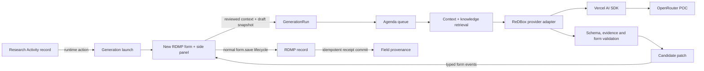
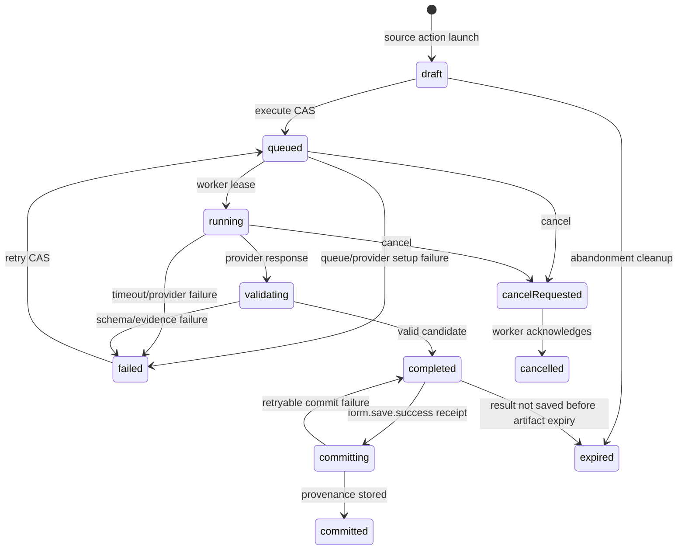

# Design

Status: proposed

Requirements: [requirements.md](requirements.md)

Delivery: core capability with a researcher-first POC and post-POC administration/provider phases

The design treats generation as a form-runtime effect, not a record-writing integration. A published Generation Binding exposes an authorised runtime action. That action creates a `GenerationRun` intent and navigates to the bound target form. The form side panel collects or confirms context, the server queues provider execution, and the model returns a strict response keyed by stable profile field IDs. ReDBox validates and maps that response into a candidate patch. The browser performs a final three-way safety check and populates the normal form controls. The existing save lifecycle remains the only way to create or update the target record.



## 1. Data Model (Waterline Models)

### Purpose and scope

The persistence model separates reusable configuration, immutable published versions, execution audit, transient content, and field provenance. This is intentional:

- configuration is independently manageable and versioned;
- a run remains reproducible even after an administrator publishes later versions;
- raw source/provider content can expire without destroying audit history;
- provider credentials are never placed in MongoDB;
- every collection can be queried with an obligatory `brandId`; and
- generated values remain ordinary record metadata rather than acquiring a parallel record store.

All new models live in `packages/redbox-core/src/waterline-models/`, are exported from `waterline-models/index.ts`, and are added to `WaterlineModels` so the existing pre-lift loader creates Sails model shims. The feature is core; no `registerRedboxModels()` hook export is involved.

### Model overview

| Model | Lifetime | Purpose |
|---|---|---|
| `GenerationProfile` | durable | Stable brand-scoped identity and pointers for a reusable generation use case. |
| `GenerationProfileVersion` | durable/immutable when published | Questionnaire, source mappings, prompt policy, target allowlist, output schema policy, knowledge references, fixture tests, and deployment reference. |
| `GenerationBinding` | durable | Declares where a published profile appears, who can invoke it, and which source/target form lifecycle it uses. |
| `GenerationModelConnection` | durable | Provider adapter selection, non-secret connection settings, secret reference, and provider data-policy metadata. |
| `GenerationModelDeployment` | durable/immutable when published | Versioned model identifier, parameters, capability snapshot, routing policy, and connection reference. |
| `KnowledgeCollection` | durable | Stable brand-scoped identity for approved knowledge. |
| `KnowledgeCollectionVersion` | durable/immutable when published | Published manifest, precedence, content digest, ingestion settings, and status. |
| `KnowledgeDocument` | durable | Approved source metadata and content belonging to one collection version. |
| `KnowledgeChunk` | durable | Stable, tagged chunks used by deterministic retrieval and cited by candidate fields. |
| `GenerationRun` | durable non-content audit | One logical creation intent and its state, pinned versions, hashes, usage, and terminal outcome. |
| `GenerationRunArtifact` | encrypted and expiring | Frozen input, retrieved content, prompt, raw response, and candidate patch needed during async execution/debugging. |
| `GenerationFieldProvenance` | durable | Lightweight per-field link between a saved record, generated value hash, evidence, review state, and run. |

### `GenerationProfile`

File: `packages/redbox-core/src/waterline-models/GenerationProfile.ts`

| Attribute | Type | Rules |
|---|---|---|
| `brandId` | string | Required; always resolved from authenticated brand. |
| `key` | string | Required stable slug; lowercase; unique within brand. |
| `name` | string | Required display name. |
| `nameLower` | string | Normalised for case-insensitive uniqueness/search. |
| `description` | string | Optional plain text. |
| `latestVersionId` | string | Optional reference to the most recent draft/published version. |
| `publishedVersionId` | string | Optional reference to the currently published immutable version. |
| `enabled` | boolean | Defaults `true`; disabling prevents new launches without invalidating historical runs. |
| `createdBy` / `updatedBy` | string | Required actor identifiers. |

Indexes:

- unique `{ brandId: 1, key: 1 }`;
- unique `{ brandId: 1, nameLower: 1 }`;
- `{ brandId: 1, enabled: 1 }`.

Deleting a profile is allowed only when it has no published version, binding, or run. Otherwise it is disabled/retired.

### `GenerationProfileVersion`

File: `packages/redbox-core/src/waterline-models/GenerationProfileVersion.ts`

| Attribute | Type | Rules |
|---|---|---|
| `brandId` | string | Required and must equal the parent profile brand. |
| `profileId` | string | Required reference. |
| `version` | number | Positive monotonically increasing integer within profile. |
| `status` | string | `draft`, `published`, or `retired`. |
| `schemaVersion` | number | Version of the Generation Profile definition contract. Starts at `1`. |
| `definition` | JSON | Typed definition described below. |
| `contentHash` | string | SHA-256 of canonical definition JSON. |
| `createdBy` | string | Required. |
| `publishedBy` / `publishedAt` | string | Required only after publication. |
| `retiredBy` / `retiredAt` | string | Optional. |

Indexes:

- unique `{ brandId: 1, profileId: 1, version: 1 }`;
- `{ brandId: 1, profileId: 1, status: 1 }`;
- `{ brandId: 1, contentHash: 1 }` for idempotent bootstrap/import.

Published versions reject updates in both model lifecycle validation and service logic. A new draft copies the prior definition and receives the next version number. Publishing atomically switches `GenerationProfile.publishedVersionId`; existing runs retain their pinned ID.

The version `definition` has this conceptual TypeScript shape:

```typescript
interface GenerationProfileDefinitionV1 {
  purpose: string;
  systemInstructions: string;
  sourceSlots: Array<{
    id: string;
    recordType: string;
    allowedPaths: string[];
    maxBytes: number;
  }>;
  questions: Array<{
    id: string;
    labelKey: string;
    helpTextKey?: string;
    type: 'text' | 'textarea' | 'boolean' | 'date' | 'enum' | 'multiEnum';
    options?: Array<{ value: string; labelKey: string }>;
    required: boolean;
    sourceDefaultExpression?: string;
    maxLength?: number;
  }>;
  targetFields: Array<{
    id: string;
    metadataPointer: string;
    expectedComponentClasses: string[];
    output: GenerationOutputType;
    operation: 'fill';
    maxLength?: number;
    knowledgeTags?: string[];
    grounding: 'sourceRequired' | 'guidanceRequired' | 'sourceOrGuidance' | 'inferenceAllowed';
    fallback?: { value: unknown; reasonCode: string; reviewRequired: boolean };
  }>;
  knowledgeCollectionVersionIds: string[];
  modelDeploymentId: string;
  contextLimits: {
    totalBytes: number;
    maxKnowledgeChunks: number;
    maxChunkBytes: number;
  };
  fixtureTests: GenerationProfileFixture[];
}
```

The POC supports a flat five-question array. The data contract leaves room for a future condition expression, but the POC publisher rejects it so conditional branching is not accidentally delivered half-complete.

`GenerationOutputType` is a discriminated union for string, boolean, ISO date, enum, enum array, supported object, and supported object array. Enum values are embedded in the provider schema after resolving any vocabulary references. The model never chooses a metadata path or operation.

### `GenerationBinding`

File: `packages/redbox-core/src/waterline-models/GenerationBinding.ts`

Attributes:

- `brandId`, `key`, `name`, `description`, `enabled`;
- `profileId` (stable profile; runtime resolves its published version);
- `sourceRecordType` and optional allowed source workflow stages/modes;
- `targetRecordType`, optional target form name, target starting workflow stage, and allowed target mode (`create` for POC);
- `allowedRoles` for visibility, in addition to ordinary source/target record authorization;
- `action` JSON: translation label/help keys, icon, placement, and order;
- `sourceRelationship` JSON: source slot ID and deterministic target metadata pointer used to link the new record;
- `allowMultipleTargetsPerSource` (`true` for the POC);
- `maxSuccessfulRunsPerIntent` (`1` for the POC);
- `createdBy`, `updatedBy`.

Indexes:

- unique `{ brandId: 1, key: 1 }`;
- `{ brandId: 1, sourceRecordType: 1, enabled: 1 }`;
- `{ brandId: 1, targetRecordType: 1, enabled: 1 }`.

The relationship pointer is never exposed as a model target. It is added to the target form as trusted runtime initial state after verifying the field exists in the effective target form. A binding is invalid if any referenced profile, form, record type, or relationship belongs to another brand or is unavailable.

### `GenerationModelConnection`

File: `packages/redbox-core/src/waterline-models/GenerationModelConnection.ts`

Attributes:

- `brandId`, `key`, `name`, `adapterId`, `enabled`;
- `endpoint` (non-secret URL; the POC OpenRouter default is `https://openrouter.ai/api/v1`);
- `authStrategy` (`bearerSecret`, `awsCredentialChain`, `assumeRole`, `workloadIdentity`, `customHeaders`, or `none`);
- `secretRef` (for example `env:OPENROUTER_API_KEY`; never the value);
- `nonSecretHeaders` allowlisted by the adapter;
- `dataPolicy` JSON recording configured retention/training/region controls and the date on which an administrator verified them;
- `timeoutMs`, `createdBy`, `updatedBy`, `lastHealthStatus`, `lastHealthCheckedAt`.

Indexes:

- unique `{ brandId: 1, key: 1 }`;
- `{ brandId: 1, adapterId: 1, enabled: 1 }`.

Model validation rejects likely secret fields (`apiKey`, `token`, `password`, `authorization`) in persisted JSON. Endpoint validation is adapter/operator controlled and re-run before invocation to prevent an administrator from using a generic adapter for SSRF.

### `GenerationModelDeployment`

File: `packages/redbox-core/src/waterline-models/GenerationModelDeployment.ts`

Attributes:

- `brandId`, `key`, `version`, `name`, `status` (`draft`, `published`, `retired`);
- `connectionId`;
- `modelId` (OpenRouter slug in the POC);
- `parameters` (temperature, maximum output tokens, seed where supported; no tools);
- `routingPolicy` (for OpenRouter: required-parameter, data-collection, ZDR, provider order/allowlist, and fallback policy);
- `requiredCapabilities` and a tested `capabilitySnapshot`;
- `contentHash`, `createdBy`, `publishedBy`, `publishedAt`.

Indexes:

- unique `{ brandId: 1, key: 1, version: 1 }`;
- `{ brandId: 1, key: 1, status: 1 }`;
- `{ brandId: 1, connectionId: 1 }`.

A published deployment is immutable. A model change creates and tests a new deployment version and then a new Generation Profile version references it. The POC does not hard-code or document one permanent model selection.

### Knowledge models

Files:

- `packages/redbox-core/src/waterline-models/KnowledgeCollection.ts`
- `packages/redbox-core/src/waterline-models/KnowledgeCollectionVersion.ts`
- `packages/redbox-core/src/waterline-models/KnowledgeDocument.ts`
- `packages/redbox-core/src/waterline-models/KnowledgeChunk.ts`

`KnowledgeCollection` attributes mirror the stable identity pattern: `brandId`, `key`, `name`, `description`, `enabled`, `latestVersionId`, `publishedVersionId`, and actor fields. `{ brandId, key }` is unique.

`KnowledgeCollectionVersion` contains `collectionId`, integer `version`, `status`, `manifest`, `retrievalStrategy`, `contentHash`, actor/publication fields, and the same brand. The POC strategy is `tagged`; future allowed values are `keyword`, `vector`, and installed retrieval-adapter IDs. Published versions are immutable.

`KnowledgeDocument` contains:

- `brandId`, `collectionVersionId`, `documentKey`, `title`;
- `authority` (`binding`, `institutionPolicy`, `approvedGuidance`, `funderGuidance`, `example`);
- `effectiveFrom`, `effectiveTo`, `owner`, `classification`;
- `sourceUri` or bootstrap-relative source identifier;
- `mediaType`, `content`, `contentHash`, `tags`, and `ordinal`.

`KnowledgeChunk` contains:

- `brandId`, `collectionVersionId`, `documentId`;
- stable `chunkKey`, `ordinal`, `heading`, `content`, `contentHash`, `tags`;
- optional `retrievalMetadata` for future indexes, but no provider-specific vector is required in the POC.

Indexes:

- unique collection key per brand;
- unique collection version number and content hash per brand/collection;
- unique document key per brand/collection version;
- unique chunk key per brand/collection version;
- `{ brandId, collectionVersionId, tags: 1 }` and ordered-document indexes.

The POC retrieves chunks deterministically by target-field `knowledgeTags`, authority order, document order, and chunk order. This provides genuine source grounding without adding an embedding dependency or nondeterministic external vector service.

### `GenerationRun`

File: `packages/redbox-core/src/waterline-models/GenerationRun.ts`

One run represents the entire logical creation intent, including retries after failure. It is created by the source-record action before navigation.

Attributes:

- `brandId`, `bindingId`, `profileVersionId`, `modelDeploymentId`, and `knowledgeCollectionVersionIds`;
- `initiatedByUserId`, `initiatedByUsername`;
- `sourceRefs`: array of source slot, record type, OID, revision descriptor, and allowlisted payload hash;
- `targetDescriptor`: record type, form name, mode, initial target hash, and eventually `targetOid`;
- `status`: `draft`, `queued`, `running`, `validating`, `completed`, `failed`, `cancelRequested`, `cancelled`, `committing`, `committed`, or `expired`;
- `phase`: stable UI phase code (`context`, `provider`, `validation`, `population`, `saveCommit`);
- `attemptCount`, `queueJobId`, `cancelRequestedAt`;
- `inputDigest`, `candidateDigest`, `candidateSummary` (counts only);
- `requestedProvider`, `requestedModel`, `actualProvider`, `actualModel`, and safe router metadata summary;
- token/usage/cost fields when reported;
- `errorCode`, `errorSummary` (sanitised), and `retryable`;
- `createdAt`, `queuedAt`, `startedAt`, `completedAt`, `committedAt`, `lastHeartbeatAt`;
- `artifactExpiresAt` and `diagnosticRetentionDays`.

Indexes:

- unique `{ brandId: 1, id: 1 }` (explicit for native compare-and-set paths);
- `{ brandId: 1, initiatedByUserId: 1, createdAt: -1 }`;
- `{ brandId: 1, status: 1, createdAt: 1 }`;
- `{ brandId: 1, targetDescriptor.targetOid: 1 }`;
- `{ brandId: 1, bindingId: 1, createdAt: -1 }`.

The run ID itself is the creation-intent identity. A service-level compare-and-set permits `failed -> queued` retry but refuses `completed|committing|committed -> queued`. Clicking the Research Activity action again creates a different run, which is how the same source can produce another RDMP.

### `GenerationRunArtifact`

File: `packages/redbox-core/src/waterline-models/GenerationRunArtifact.ts`

This model is intentionally separate from the durable audit. It contains:

- `brandId`, `runId`, `expiresAt`;
- `encryptionKeyId`, `iv`, `authTag`, and `ciphertext` for an AES-256-GCM envelope;
- `payloadVersion` and a non-sensitive `contentKinds` array.

The encrypted payload may contain:

- frozen source and target snapshots required by an asynchronous worker;
- reviewed question values;
- retrieved knowledge chunks;
- rendered provider request;
- raw provider response;
- validated candidate patch; and
- detailed validation diagnostics.

Operational input/candidate content exists only until commit, cancellation, abandonment expiry, or explicit cleanup. If diagnostic retention is zero, the artifact is deleted immediately after commit. Otherwise it may be rewritten to the configured diagnostic subset and retained for the configured period (proposed seven days, maximum thirty).

Indexes:

- unique `{ brandId: 1, runId: 1 }`;
- TTL `{ expiresAt: 1 }` with `expireAfterSeconds: 0`.

The TTL index is verified in `GenerationPersistenceService.bootstrap()` using the native Mongo manager, following the existing Agenda index pattern. The feature fails closed if artifact encryption is enabled but no valid key can be resolved. Plaintext fallback is prohibited.

### `GenerationFieldProvenance`

File: `packages/redbox-core/src/waterline-models/GenerationFieldProvenance.ts`

Attributes:

- `brandId`, `runId`, `targetRecordOid`;
- stable `profileFieldId` and resolved `metadataPointer`;
- `generatedValueHash` and `candidateDigest`;
- verified `evidenceRefs` containing stable project fact or knowledge chunk IDs and hashes;
- bounded `rationale` and server-derived `groundingState`;
- `reviewRequired`, `reviewReasonCode`, `reviewedBy`, `reviewedAt`;
- `generatedAt`, `committedAt`.

Indexes:

- unique `{ brandId: 1, runId: 1, profileFieldId: 1 }`;
- `{ brandId: 1, targetRecordOid: 1 }`;
- `{ brandId: 1, targetRecordOid: 1, metadataPointer: 1 }`.

The current display state is derived when provenance is read:

- current value hash equals `generatedValueHash`: `AI generated`;
- hash differs and value remains present: `AI-assisted, edited`;
- value absent: `AI-assisted, removed`.

No historic user value is copied into provenance. An explicit review updates only review actor/time. A normal record destroy operation should delete provenance for that record; a soft-deleted record retains provenance with the record audit.

### Validation, lifecycle hooks, and defaults

- Model lifecycle hooks normalise keys, names, statuses, actor identifiers, hashes, and retention bounds.
- Cross-entity/brand validation belongs in services because Waterline lifecycle hooks cannot safely express all association and authorization checks.
- Published configuration immutability is enforced twice: model hook and service compare-and-set.
- Native compare-and-set updates control run transitions and profile publication.
- No model hook invokes a provider.
- No LLM-generated value is created in a Waterline lifecycle hook.
- Provider model/connection health fields are informational and never bypass invocation-time checks.
- All timestamps are stored as ISO strings in UTC, matching current model conventions.

### Access control considerations

- Controllers never accept `brandId` in a writable payload. Services receive it from `BrandingService.getBrandFromReq(req)` or the trusted queued run.
- Every lookup uses both entity ID and brand ID. A globally unique Mongo ID is not sufficient authorization.
- Admin CRUD is Admin-only for the active brand.
- Researcher run access requires matching initiating user (or an explicitly authorised Admin diagnostic path), source record access, and target intent ownership.
- Queue workers re-resolve the user and brand and repeat record permission checks before sending data externally.

### File locations and naming

In addition to the model files:

- add generation model types under `packages/redbox-core/src/model/generation/`;
- export runtime-safe client contracts from `packages/sails-ng-common/src/generation/`;
- add native index verification to `packages/redbox-core/src/services/GenerationPersistenceService.ts`;
- add model unit tests under `packages/redbox-core/test/models/` and live persistence tests under `test/integration/models/`.

### Hook delivery requirements

None. This is a core feature. `redbox-hook-dev` contains only representative record/form configuration and development fixtures. It must not register generation models, services, controllers, or provider adapters.

## 2. Services Layer (Business Logic)

### Service responsibilities

The service layer is deliberately decomposed so provider, form, storage, and orchestration policy remain testable independently.

| Service/module | Responsibility |
|---|---|
| `GenerationPersistenceService` | Native indexes, canonical JSON hashing, compare-and-set helpers, and strict brand-scoped model access. |
| `GenerationCryptoService` | Secret-key resolution for artifacts; AES-256-GCM encrypt/decrypt; key IDs and rotation support; zero plaintext logging. |
| `GenerationProfileService` | Profile/version CRUD, validation, fixture evaluation, publish/retire, and immutable-version resolution. |
| `GenerationBindingService` | Binding CRUD, matching, action resolution, source/target permission checks, and deterministic relationship initial values. |
| `GenerationModelService` | Connection/deployment CRUD, capability tests, publication, data-policy validation, and safe connection summaries. |
| `GenerationProviderRegistryService` | Registry of installed adapter factories and capability negotiation. No executable adapter code is stored in the database. |
| `OpenRouterGenerationProvider` | POC ReDBox adapter that configures the Vercel AI SDK OpenAI-compatible provider, OpenRouter authentication/routing policy, guarded fetch, strict structured output, and safe result/usage normalisation. |
| `GenerationSecretResolverService` | Resolves `env:`, config, workload identity, or installed secret-provider references just in time. POC needs `env:`. |
| `GenerationKnowledgeService` | Knowledge/version CRUD, bootstrap ingestion, canonical chunking, hashing, publication, and deterministic tagged retrieval. |
| `GenerationContextService` | Builds the minimal authorised source/question/target snapshot and evidence catalogue. |
| `GenerationSchemaService` | Resolves the effective client form, checks supported components, creates provider JSON Schema, maps stable field IDs, and validates values. |
| `GenerationPromptService` | Constructs provider-neutral messages from instructions plus clearly delimited untrusted context and knowledge. |
| `GenerationRunService` | Launch, execute request, status, retry, cancel, result, commit, retention cleanup, rate/concurrency checks, and state machine. |
| `GenerationWorkerService` | Queue handler that reloads/reauthorizes the run, retrieves knowledge, invokes the adapter, validates output, stores artifact/result summary, and finalises status. |
| `GenerationProvenanceService` | Idempotent commit after record create, provenance reads, current-value state derivation, and explicit review. |
| `GenerationBootstrapService` | Idempotently loads POC connections, deployments, knowledge, profiles, and bindings from the configured bootstrap path. |

All services extend `Services.Core.Service`, export their public methods through `_exportedMethods`, avoid `sails` access in constructors, and are added to `packages/redbox-core/src/services/index.ts` with lazy `ServiceExports` getters. Async APIs use `Promise` where orchestration is naturally sequential and may expose Observables only where existing callers require them.

### End-to-end orchestration

```mermaid
sequenceDiagram
    actor U as Researcher
    participant F as Angular form
    participant GC as GenerationController
    participant RS as GenerationRunService
    participant AQ as AgendaQueueService
    participant W as GenerationWorkerService
    participant OR as OpenRouter

    U->>F: Create data management plan
    F->>GC: POST launch(binding, sourceOid)
    GC->>RS: launch(authorised brand/user/source)
    RS-->>F: runId + target URL
    F->>GC: GET target form with generationRunId
    GC-->>F: form + runtime initial values + questions
    U->>F: Confirm/edit context; Generate
    F->>GC: POST run/:id/execute
    GC->>RS: freeze context and CAS draft/failed -> queued
    RS->>AQ: now(GenerationRunService-Execute, runId)
    GC-->>F: 202 queued
    AQ->>W: execute(runId)
    W->>OR: strict structured request
    OR-->>W: structured response
    W->>W: parse, evidence check, form/schema validation
    W-->>RS: completed + encrypted candidate artifact
    loop bounded polling
        F->>GC: GET run/:id
        GC-->>F: phase/status/result when complete
    end
    F->>F: three-way check + populate controls
    U->>F: Edit/review and save
    F->>GC: existing record create endpoint
    GC-->>F: form.save.success + targetOid
    F->>GC: POST run/:id/commit(targetOid, reviewed fields)
    GC->>RS: verify saved values and persist provenance
```

### Public service methods and errors

Representative method contracts:

```typescript
interface GenerationRunService {
  resolveRuntimeActions(input: RuntimeActionContext): Promise<FormRuntimeAction[]>;
  launch(input: LaunchGenerationInput): Promise<GenerationLaunchResult>;
  getForActor(input: RunActorInput): Promise<GenerationRunView>;
  execute(input: ExecuteGenerationInput): Promise<GenerationRunView>;
  retry(input: RetryGenerationInput): Promise<GenerationRunView>;
  requestCancel(input: RunActorInput): Promise<GenerationRunView>;
  executeQueuedRun(job: QueueJob<{ brandId: string; runId: string }>): Promise<void>;
  commit(input: CommitGenerationInput): Promise<GenerationCommitResult>;
  expireAbandonedRuns(job: QueueJob): Promise<void>;
}

interface GenerationProviderAdapter {
  readonly adapterId: string;
  getConfigurationSchema(): JsonSchema;
  getSecretSchema(): JsonSchema;
  getCapabilities(input: DeploymentConfig): Promise<ProviderCapabilities>;
  healthCheck(input: ProviderConnectionContext): Promise<ProviderHealth>;
  invoke(input: ProviderGenerationRequest, signal: AbortSignal): Promise<ProviderGenerationResponse>;
}
```

Stable domain errors include:

- `GENERATION_NOT_CONFIGURED`;
- `GENERATION_ACTION_NOT_AVAILABLE`;
- `GENERATION_SOURCE_FORBIDDEN`;
- `GENERATION_TARGET_FORBIDDEN`;
- `GENERATION_INVALID_STATE`;
- `GENERATION_ALREADY_COMPLETED`;
- `GENERATION_RATE_LIMITED`;
- `GENERATION_PROFILE_INVALID`;
- `GENERATION_DEPLOYMENT_INCOMPATIBLE`;
- `GENERATION_PROVIDER_TIMEOUT`;
- `GENERATION_PROVIDER_RATE_LIMITED`;
- `GENERATION_PROVIDER_UNAVAILABLE`;
- `GENERATION_OUTPUT_PARSE_FAILED`;
- `GENERATION_OUTPUT_SCHEMA_INVALID`;
- `GENERATION_EVIDENCE_INVALID`;
- `GENERATION_TARGET_CONFLICT`;
- `GENERATION_ARTIFACT_EXPIRED`;
- `GENERATION_COMMIT_INVALID`.

Controllers translate these to safe HTTP statuses/messages. Raw provider errors are retained only in encrypted diagnostics when enabled.

### Runtime action resolution

`GenerationBindingService.resolveActions()` receives the authenticated brand/user, effective record/form mode, current record, and form name. It:

1. queries enabled bindings by brand/source type;
2. resolves the published profile and deployment;
3. checks allowed source workflow/mode and roles;
4. checks actual source record view permission;
5. verifies the user can create the target record type under its starting workflow;
6. omits disabled/incomplete bindings; and
7. returns client-safe action descriptors containing only binding key, label/help/icon/order, and action kind.

The descriptor is returned in the form response `meta.runtimeActions`; it is not inserted into `FormConfigFrame.componentDefinitions` and is not persisted in normal form configuration.

### Context construction and data minimisation

At execute time, `GenerationContextService`:

1. reloads the run, brand, initiating user, source record, profile version, binding, deployment, and knowledge versions;
2. rechecks all brands and permissions;
3. projects the source record to the exact `allowedPaths` for its source slot;
4. validates question IDs/types and applies the submitted reviewed values;
5. resolves the effective target form for create/edit mode and the initiating user's roles;
6. projects the submitted target draft through `FormRecordConsistencyService.projectMetadataClientFormConfig`;
7. retains only target fields required for overwrite/conflict snapshots and profile-authorised context;
8. computes revision/content hashes; and
9. encrypts the frozen input in `GenerationRunArtifact` before queuing.

For the POC, source revision is the record OID plus the best available saved timestamp/revision metadata and a hash of the allowlisted source payload. Unsaved target revision is a canonical hash of the allowlisted target snapshot.

Context limits are applied before persistence and again before provider invocation. Oversized content produces a deterministic error or configured truncation marker; silent truncation is prohibited.

### Knowledge retrieval and precedence

The POC `tagged` retriever takes the union of `knowledgeTags` for requested target fields, filters chunks within the pinned collection versions, and orders by:

1. explicit binding requirement;
2. institution policy;
3. approved guidance/service catalogue;
4. funder guidance;
5. curated example;
6. document/chunk ordinal.

It stops at the profile's chunk/byte limits. Every retrieved chunk receives an opaque evidence ID such as `knowledge:<collectionVersionId>:<chunkKey>`. Source facts receive IDs such as `source:<slotId>:<jsonPointer>:<valueHash>`. The provider sees these IDs and content but no database IDs that confer access.

A future vector retriever implements the same input/output contract and must keep a separate brand namespace/index. Profile versions pin retrieval adapter and collection versions.

### Provider-neutral prompt and output contract

The prompt has four logical sections:

1. immutable platform safety instructions;
2. published profile instructions;
3. an output field catalogue containing stable IDs, descriptions, types, allowed enum values, length bounds, and grounding requirements; and
4. JSON-encoded untrusted project/question/knowledge data with evidence IDs.

The platform instruction states that data may contain instructions and must be treated only as evidence. The request contains no tools. Provider plugins, browsing, server tools, or conversation history are disabled.

The provider output schema is generated for the exact selected target fields. Conceptually:

```json
{
  "type": "object",
  "additionalProperties": false,
  "required": ["answers"],
  "properties": {
    "answers": {
      "type": "object",
      "additionalProperties": false,
      "required": ["data.summary", "storage.location", "sharing.plan"],
      "properties": {
        "data.summary": {
          "type": "object",
          "additionalProperties": false,
          "required": ["value", "evidenceIds", "rationale"],
          "properties": {
            "value": { "type": "string", "maxLength": 4000 },
            "evidenceIds": { "type": "array", "items": { "type": "string" } },
            "rationale": { "type": "string", "maxLength": 500 }
          }
        }
      }
    }
  }
}
```

The exact schema contains every selected field and nothing else. ReDBox derives review/grounding state after verifying evidence. A model-provided confidence score is neither requested nor used for automatic application.

For OpenRouter, the POC adapter configures `@ai-sdk/openai-compatible` with the fixed OpenRouter base URL and invokes non-streaming `generateText` plus `Output.object` from `ai`. It supplies the exact generated schema and OpenRouter provider options for required parameters, data collection, ZDR, provider allow/order, and fallback behaviour. A custom guarded `fetch` preserves the response-size, redirect, timeout, and redaction controls. AI SDK retries, tools, cross-provider fallback, and telemetry are disabled; ReDBox owns those policies. ReDBox records only normalised output, usage, warnings, and requested/actual model/provider metadata, and then performs its complete local validation pipeline independently of SDK validation. See the official [AI SDK structured-output](https://ai-sdk.dev/docs/ai-sdk-core/generating-structured-data), [OpenRouter structured outputs](https://openrouter.ai/docs/guides/features/structured-outputs), [provider routing](https://openrouter.ai/docs/guides/routing/provider-selection), and [router metadata](https://openrouter.ai/docs/guides/features/router-metadata) documentation.

### Output validation pipeline

`GenerationSchemaService.validateCandidate()` runs these gates in order:

1. maximum response byte limit before parsing;
2. JSON parsing with no repair-by-default;
3. dynamic Zod/platform envelope validation;
4. exact stable field ID set and duplicate/missing handling;
5. evidence ID membership and content-hash verification;
6. server-derived grounding/review state;
7. target type, enum, cardinality, length, and format validation;
8. rich text sanitisation/conversion where applicable;
9. mapping to the current effective form and supported component class;
10. `FormRecordConsistencyService` projection/value validation against a candidate target record;
11. overwrite policy evaluation against the frozen target snapshot; and
12. canonical candidate digest generation.

Unknown fields never survive gate 4. Invalid individual optional fields may become explicit rejected items only if the profile permits partial completion; structural or evidence integrity failures fail the complete run. The POC profile requires a complete result, with a deterministic fallback for the deliberately unresolved sharing field.

### Candidate patch contract

The client-safe patch contains no raw prompt or source text:

```typescript
interface GenerationCandidatePatch {
  runId: string;
  candidateDigest: string;
  baseTargetDigest: string;
  items: Array<{
    fieldId: string;
    metadataPointer: string;
    value: unknown;
    operation: 'fill';
    valueHash: string;
    groundingState: 'sourceBacked' | 'guidanceBacked' | 'sourceAndGuidance' | 'inferred' | 'requiresReview';
    reviewRequired: boolean;
    reviewReasonCode?: string;
    rationale: string;
    evidence: Array<{ id: string; label: string; kind: 'source' | 'knowledge' }>;
  }>;
}
```

`metadataPointer` is added by the server after model parsing; the model only returned `fieldId`. Evidence labels are bounded, safe display text rather than full chunks.

### State transitions and idempotency



Native Mongo compare-and-set updates include brand, run ID, expected status, and attempt count. Agenda jobs carry only `{ brandId, runId }`. Redelivery sees the terminal/leased state and exits safely. Provider retry is bounded to transient failures against the same deployment; it increments `attemptCount` and never changes the model silently.

### Transaction boundaries and side effects

- Launch creates a durable run and artifact shell; no target record exists.
- Execute freezes/encrypts input and changes the run to queued before enqueue. If enqueue fails, run becomes retryable `failed`.
- Worker status/artifact writes are ordered and idempotent; no target record write occurs.
- Candidate application is client-side only.
- Record creation remains in `RecordsService` and existing hooks.
- Provenance commit is a separate idempotent operation after `form.save.success`. It verifies the saved record and uses compensating retry rather than pretending a distributed transaction exists across record storage and generation collections.
- Profile/knowledge/deployment publication uses a datastore transaction where supported; otherwise a compare-and-set pointer switch with compensation and tests.

### Queue configuration

Add jobs to `packages/redbox-core/src/config/agendaQueue.config.ts`:

- `GenerationRunService-Execute` -> `generationworkerservice.executeQueuedRun`, with a provider-appropriate lock lifetime, bounded concurrency, and heartbeat;
- `GenerationRunService-ExpireArtifacts` -> `generationrunservice.expireAbandonedRuns`, scheduled periodically on Mongo-backed Agenda only;
- optional `GenerationRunService-PurgeDiagnostics` if TTL/index verification requires explicit fallback cleanup.

The concurrency setting is a global ceiling. `GenerationRunService` also enforces per-brand and per-user limits before queuing.

### Secrets and outbound security

`GenerationSecretResolverService` accepts only installed reference schemes. For the POC, `env:OPENROUTER_API_KEY` resolves from process environment. Resolved values are held only for invocation scope and are never attached to the run or job.

`OpenRouterGenerationProvider` uses the adapter's fixed origin by default. Future generic endpoints pass `GenerationOutboundPolicyService` checks:

- HTTPS only;
- normalised URL and allowed port;
- operator hostname allowlist;
- DNS resolution checks against loopback/private/link-local/metadata networks;
- redirects disabled or revalidated;
- request body/response size and timeout limits;
- redacted headers/errors.

### Retention and observability

Durable metrics/log fields: correlation/run ID, brand ID, status transition, phase duration, adapter ID, requested/actual model, token counts, candidate accepted/rejected counts, and safe error code. Do not log source OIDs together with raw metadata, question answers, prompt fragments, evidence text, candidate values, Authorization headers, or raw provider bodies.

Suggested metrics:

- run counts and durations by status/adapter/profile version;
- queue wait/provider/validation time;
- provider HTTP/error categories;
- input/output tokens and reported cost;
- target fields generated/flagged/conflicted;
- provenance commit retries;
- artifact cleanup lag.

### Dependencies on models, configs, and external services

Add `generation.config.ts` with typed defaults for enabled state, provider adapters, encryption key reference, artifact/diagnostic retention, timeouts, request/response/context limits, polling interval bounds, queue job names, concurrency/rate limits, and outbound policy.

The POC adds exactly pinned `ai` and `@ai-sdk/openai-compatible` dependencies to `packages/redbox-core`. It otherwise uses Node `fetch`, `AbortController`, `crypto`, Zod, Agenda, Waterline/Mongo, FormsService, FormRecordConsistencyService, RecordsService, RecordTypesService, BrandingService, UsersService, and the existing form event bus. No OpenRouter-specific SDK, vector database, or DMPChef dependency is required.

Future Google Vertex and Bedrock delivery adds exactly pinned `@ai-sdk/google-vertex` and `@ai-sdk/amazon-bedrock` packages only when each provider is implemented. Credential-chain packages are added only where the provider requires them. All SDK package versions are selected and compatibility-tested together because their provider-spec versions must align. ReDBox retains its adapter contract, capability probes, outbound policy, secret references, and conformance tests; the AI SDK is an invocation implementation detail rather than the persisted configuration or public service contract.

## 3. Webservice Controllers (REST API)

### Purpose

REST endpoints serve future administration, automated configuration, health checks, and diagnostics. They are contract-first routes under `/:branding/:portal/api/generation/*`, declared in `packages/redbox-core/src/api-routes/groups/generation.ts`, registered by `route-registry.ts`, documented in OpenAPI/APIB, and implemented by `packages/redbox-core/src/controllers/webservice/GenerationAdminController.ts`.

These REST routes belong to the post-POC administration milestone. The POC uses persisted bootstrap configuration through the same service methods, validates it with service/Mocha tests, and exposes only the session-authenticated researcher AJAX routes in section 4. This keeps the customer demonstration focused without creating a temporary or incomplete administrative API. The contracts below define the complete feature and should be implemented before the admin Angular app.

### Endpoint list

#### Profiles and versions

| Method/path | Purpose |
|---|---|
| `GET /api/generation/profiles` | Brand-scoped list/filter/page. |
| `POST /api/generation/profiles` | Create stable profile plus initial draft. |
| `GET /api/generation/profiles/:id` | Profile summary, current draft/published pointers, and version list. |
| `POST /api/generation/profiles/:id/versions` | Copy a selected/published version into a new draft. |
| `PUT /api/generation/profile-versions/:versionId` | Update a draft definition only. |
| `POST /api/generation/profile-versions/:versionId/validate` | Validate references, mappings, capabilities, and fixtures without publishing. |
| `POST /api/generation/profile-versions/:versionId/test` | Execute an admin-authored synthetic fixture using the referenced deployment. |
| `POST /api/generation/profile-versions/:versionId/publish` | Publish immediately as Admin and switch the profile pointer. |
| `POST /api/generation/profile-versions/:versionId/retire` | Retire for future launches; historical runs remain readable. |

#### Bindings

| Method/path | Purpose |
|---|---|
| `GET /api/generation/bindings` | List by source/target/profile/status. |
| `POST /api/generation/bindings` | Create a binding. |
| `GET /api/generation/bindings/:id` | Read one binding and validation summary. |
| `PUT /api/generation/bindings/:id` | Update mutable binding configuration. |
| `DELETE /api/generation/bindings/:id` | Delete only if unused; otherwise disable. |
| `POST /api/generation/bindings/:id/validate` | Resolve forms/permissions/mappings and return diagnostics. |

#### Connections and deployments

| Method/path | Purpose |
|---|---|
| `GET /api/generation/model-connections` | List redacted connections. |
| `POST /api/generation/model-connections` | Create non-secret connection plus secret reference. |
| `PUT /api/generation/model-connections/:id` | Update allowed non-secret fields/reference. |
| `POST /api/generation/model-connections/:id/test` | Resolve secret and run adapter health/capability check. |
| `GET /api/generation/model-deployments` | List deployment versions. |
| `POST /api/generation/model-deployments` | Create draft deployment. |
| `PUT /api/generation/model-deployments/:id` | Update draft only. |
| `POST /api/generation/model-deployments/:id/test` | Test required capabilities and a minimal structured response. |
| `POST /api/generation/model-deployments/:id/publish` | Publish immutable deployment version. |
| `POST /api/generation/model-deployments/:id/retire` | Prevent future profile publication/reference. |

#### Knowledge

| Method/path | Purpose |
|---|---|
| `GET /api/generation/knowledge-collections` | List collections and version pointers. |
| `POST /api/generation/knowledge-collections` | Create collection plus draft version. |
| `POST /api/generation/knowledge-collections/:id/versions` | Create a draft copy. |
| `PUT /api/generation/knowledge-versions/:id` | Update draft manifest/settings. |
| `POST /api/generation/knowledge-versions/:id/documents` | Add/update approved text/Markdown document. |
| `DELETE /api/generation/knowledge-versions/:id/documents/:documentId` | Remove document from a draft. |
| `POST /api/generation/knowledge-versions/:id/preview` | Chunk and return hashes/tags/sample retrieval without publication. |
| `POST /api/generation/knowledge-versions/:id/test-retrieval` | Run an admin query/field-tag fixture. |
| `POST /api/generation/knowledge-versions/:id/publish` | Persist immutable documents/chunks and switch collection pointer. |
| `POST /api/generation/knowledge-versions/:id/retire` | Retire for new profiles/runs. |

#### Runs and diagnostics

| Method/path | Purpose |
|---|---|
| `GET /api/generation/runs` | Admin list with non-content filters/summaries. |
| `GET /api/generation/runs/:id` | Non-content run audit. |
| `GET /api/generation/runs/:id/diagnostics` | Decrypt short-lived diagnostic content if present and authorised. |
| `DELETE /api/generation/runs/:id/diagnostics` | Immediately purge the artifact/diagnostic payload. |

### Request/response and status conventions

- Use the existing contract-first route builder and Zod/OpenAPI schemas.
- List responses use the existing list response/summary shape.
- Create returns `201`; async fixture test may return `202`; delete/purge returns `204`.
- Validation returns `200` with `{ valid, errors, warnings, resolvedCapabilities, contentHash }`; invalid draft content is not an HTTP transport failure.
- `400` malformed request, `401` unauthenticated, `403` wrong role/brand, `404` absent within brand, `409` immutable/invalid state/version conflict, `422` semantically invalid definition, `429` quota, `502/503/504` safe provider health/test failures.
- `ETag`/content hash or explicit `expectedContentHash` protects concurrent admin draft edits.
- Connection responses always redact the resolved secret and return only `secretRef`, `secretConfigured`, and safe health metadata.

### Authn/authz and policies

Add Admin read/update path rules for `/:branding/:portal/api/generation(/*)` in `packages/redbox-core/src/config/auth.config.ts`. The controller also verifies Admin role and active brand. Diagnostics additionally require an explicit `generation.allowAdminDiagnostics` configuration flag and create a safe audit event.

### Error handling and controller conventions

`GenerationAdminController` extends `Controllers.Core.Controller`, has no `sails`-dependent constructor state, uses `init()` only when needed, exposes every action in `_exportedMethods`, retrieves validated request data through `getValidatedApiRequest()`, delegates all logic to services, and responds with the repository's actual `this.sendResp(req, res, payload)` convention.

Add it to `WebserviceControllerExports` and `WebserviceControllerNames` in `packages/redbox-core/src/controllers/index.ts` so loader shims are generated.

## 4. Ajax Controllers (Controllers)

### Purpose and file location

`packages/redbox-core/src/controllers/GenerationController.ts` exposes CSRF-backed, session-authenticated researcher/form endpoints. It extends `Controllers.Core.Controller`, delegates to services, and never calls OpenRouter directly.

### Endpoint list and contracts

#### `POST /:branding/:portal/generation/launch`

Request:

```json
{ "bindingKey": "demo-research-activity-to-rdmp", "sourceOid": "..." }
```

Response `201`:

```json
{
  "data": {
    "runId": "...",
    "targetUrl": "/default/rdmp/record/demoRdmp/edit?generationRunId=..."
  }
}
```

The server resolves brand/user, rechecks action availability, pins the current published versions, creates `draft` run/artifact metadata, and returns a relative URL. The response does not include source metadata.

#### `GET /:branding/:portal/generation/runs/:id`

Returns actor-safe run state:

```json
{
  "data": {
    "runId": "...",
    "status": "running",
    "phase": "provider",
    "attemptCount": 1,
    "retryable": false,
    "questions": [],
    "result": null,
    "artifactExpiresAt": "..."
  }
}
```

For `draft`, `questions` contains the profile-defined five questions and mapped defaults. For `completed`, `result` contains the validated client-safe candidate patch. No raw provider payload is returned.

#### `POST /:branding/:portal/generation/runs/:id/execute`

Request contains `answers`, `targetForm` descriptor, and the current target draft. The service ignores payload brand/profile/provider/model values. Success returns `202` with queued state and `Retry-After`. If a prior attempt failed, the same endpoint may retry only when `retryable` is true; completed runs return `409 GENERATION_ALREADY_COMPLETED`.

#### `POST /:branding/:portal/generation/runs/:id/cancel`

Sets `cancelRequested` for queued/running runs and returns `202`; cancels a draft synchronously; is idempotent for terminal cancellation. The worker aborts an in-process adapter when possible and always discards output after a cancellation request.

#### `POST /:branding/:portal/generation/runs/:id/commit`

Request:

```json
{
  "targetOid": "new-record-oid",
  "candidateDigest": "sha256...",
  "reviewedFieldIds": ["sharing.plan"]
}
```

The service verifies the run actor/brand/status, target record type/form/creator/edit access, source relationship, saved field hashes, and candidate digest. It creates/upserts provenance rows and marks the run committed. Repeating the same commit returns the same result. A different target or digest returns `409`.

#### `GET /:branding/:portal/record/:oid/generation-provenance`

Requires record view access and returns compact field provenance with display state derived from current values. It never returns source metadata, knowledge chunk bodies, raw prompt, or raw response.

#### `POST /:branding/:portal/generation/provenance/:id/review`

Requires target edit access and records an explicit review. For the POC, pre-save review is normally included in the commit payload; this endpoint supports review after reload and the complete feature.

### Form response integration

Modify `RecordController.getForm()` to call a narrowly scoped generation runtime-context method after it has built the effective client form and confirmed record access.

Add to response meta:

```typescript
interface FormRuntimeMeta {
  runtimeActions?: FormRuntimeAction[];
  generationSession?: {
    runId: string;
    bindingKey: string;
    autoOpen: boolean;
    initialValues: Array<{ metadataPointer: string; value: unknown }>;
  };
}
```

For a normal source form, only `runtimeActions` may be present. For a new target form with an authorised `generationRunId`, the session and deterministic relationship initial value are present. Invalid or cross-brand run IDs produce no leaked context and should normally return `403/404` rather than silently opening an unlinked target.

The current form client parses the page query string for behaviour context, but `FormService.getFormConfig()` constructs a fresh `/record/form/...` URL containing only `ts`, `edit`, and optional `formName`. It therefore does **not** currently forward `generationRunId` to `RecordController.getForm()`. The POC must add an explicit transport seam:

1. `FormComponent` reads the already-parsed `generationRunId` request parameter before downloading the form definition.
2. It passes only that allowlisted scalar value to `FormService.downloadFormComponents()`/`getFormConfig()` as typed runtime context.
3. `getFormConfig()` appends `generationRunId` to the server request only when it is a single non-empty string satisfying the run-ID format/length bound.
4. It must not copy the complete browser query string, arrays, booleans, or unrelated parameters into the server request.
5. The controller treats the value as an untrusted opaque identifier and independently authorises actor, brand, status, binding, target type, and target form before returning session metadata.

The `generationRunId` remains available in the form's ordinary `requestParams` JSONata context for compatibility, but that client-side visibility grants no authority. Unit tests must prove that the form-definition request includes the valid allowlisted value, excludes every unrelated page parameter, and preserves existing URLs when no run is present.

`RecordController` remains responsible only for assembling the form response. Generation validation/orchestration stays in services.

### Authn/authz and error handling

Add Researcher/Librarian/Admin update rules for the browser generation paths, but service-level record permissions are authoritative. All routes remain CSRF enabled. The controller uses `_exportedMethods`, safe domain-error mapping, no raw `res.json`, and no provider details in messages.

Add `GenerationController` to `ControllerExports`/`ControllerNames`, route entries to `routes.config.ts`, auth entries to `auth.config.ts`, and log namespace defaults to `lognamespace.config.ts`.

## 5. Angular App(s)

### POC: modify the existing embedded `form` app

Generation is part of the existing embedded form experience at `angular/projects/researchdatabox/form/`; it is not a separate SPA and does not use Angular Router.

#### Shared client contracts

Add `packages/sails-ng-common/src/generation/`:

- `generation-runtime-action.ts`;
- `generation-profile.ts` (client-safe question/output types only);
- `generation-run.ts`;
- `generation-candidate-patch.ts`;
- `generation-provenance.ts`;
- barrel exports from `packages/sails-ng-common/src/index.ts`.

Extend form response meta typing without placing generation data on `FormConfigFrame`.

#### Typed event bus additions

Add discriminated events and factories in `form-component-event.types.ts`:

- `form.action.requested` with a runtime action ID/kind;
- `generation.panel.open.requested` / `generation.panel.closed`;
- `generation.run.requested`;
- `generation.run.started`;
- `generation.run.progress`;
- `generation.run.completed`;
- `generation.run.failed`;
- `generation.patch.applied` with changed/flagged/conflicted field IDs;
- `generation.provenance.reviewed`;
- `generation.commit.success` / `generation.commit.failure`.

Add optional `origin` and `correlationId` to field-change events, with backwards-compatible defaults. Generation applies values with `origin: 'generation'`; subsequent ordinary user events let provenance state become edited. Behaviours may observe the typed lifecycle events through the existing event bus, but generation does not expand v1 behaviour configuration with an AI-specific processor.

#### NgRx generation feature state

Add `form-state/generation/` or extend the existing form feature with:

- actions for runtime action launch, panel state, execute/retry/cancel, polling, result, patch application, provenance load/review, and commit;
- reducer state: available actions, active run, questions/answers, phase/status, candidate, pending provenance, conflicts, and errors;
- selectors used by the toolbar/panel/badges;
- effects that call the API service, navigate after launch, poll with bounded backoff, publish event-bus lifecycle events, apply the candidate, and commit after `form.save.success`;
- a guard that ignores duplicate clicks while launch/execute is pending and refuses execute after completion.

The event bus remains ephemeral coordination; NgRx owns UI state and replay while the form is open; `GenerationRun` owns server durability.

#### Components

`FormRuntimeActionsComponent`

- mounted by the form root near the existing action area;
- renders only server-returned authorised actions;
- publishes `form.action.requested` rather than containing generation logic;
- disables while launching and restores focus after a failure;
- uses translation keys and accessible button text.

`GenerationSidePanelComponent`

- fixed side panel/overlay with accessible title, focus trap, close/cancel behaviour, and live-region progress;
- draft state displays the five pre-populated editable questions and `Generate plan`;
- running state displays the four stable progress stages, not token streaming;
- completed state applies the validated patch and closes or presents a concise populated/flagged summary;
- failed state presents a safe message and retry only when permitted;
- a completed run has no second-generation control.

`GenerationFieldProvenanceComponent` or wrapper integration

- rendered from `FormBaseWrapperComponent` using the field lineage pointer;
- compact `AI generated`, `AI-assisted, edited`, and `Review required` states;
- expandable rationale/evidence labels;
- `Mark reviewed` when the user has edit permission;
- treats `Review required` as an advisory POC flag rather than a form-validation/save blocker; institutions may add stricter form behaviours later;
- never changes field editability and never exposes prompts/model internals.

`GenerationProgressComponent`

- optionally extracted from the panel for testability;
- maps stable phase/error codes to translations;
- uses `aria-live="polite"` and avoids rapid announcements from polling.

#### Angular services

`GenerationApiService` lives under the form app and extends `HttpClientService` from `@researchdatabox/portal-ng-common`. It injects `HttpClient`, `APP_BASE_HREF`, `UtilityService`, and `ConfigService`, calls `enableCsrfHeader()` during initialization, uses `brandingAndPortalUrl`, and sends `httpContext` on mutation requests.

Methods:

- `launch(bindingKey, sourceOid)`;
- `getRun(runId)`;
- `execute(runId, answers, targetForm, targetDraft)`;
- `cancel(runId)`;
- `commit(runId, targetOid, candidateDigest, reviewedFieldIds)`;
- `getProvenance(oid)`;
- `reviewProvenance(id)`.

`GenerationPatchApplierService`:

1. resolves each server path through the existing form component map/lineage utilities;
2. verifies the component class and current value against the base snapshot;
3. skips conflicts and unsupported/disabled controls;
4. applies values with `emitEvent: false`;
5. marks changed controls dirty but not touched;
6. updates pending provenance state;
7. revalidates/broadcasts form status once after the batch;
8. emits exactly one explicit `field.value.changed` per changed field and one aggregate patch event.

The candidate never mutates `FormConfigFrame`, creates controls, or writes a record.

#### Save lifecycle bridge

The generation effect listens for `form.save.success`. When the active run is completed and the save returned a newly created OID, it sends the idempotent commit. The normal save success remains successful even if commit fails. A small non-blocking status retries commit and tells the user if provenance could not yet be attached.

The effect does not call save automatically. The researcher remains in control of the normal Save button.

### Post-POC: `admin-generation` embedded Angular app

Location: `angular/projects/researchdatabox/admin-generation/` with output `assets/angular/admin-generation/browser/` and an entry in `angular/angular.json`.

No Angular Router is used. A single Sails/EJS page mounts `<admin-generation>` and the app manages internal list/detail/tab state.

Suggested internal screens:

1. **Profiles** — list, create/copy draft, guided questionnaire editor, source mapping editor, target allowlist browser, prompt editor, validation, fixtures, test, publish/retire, version history.
2. **Bindings** — source/target form selectors, modes/workflows/roles, action label/placement, relationship mapping, validation.
3. **Models** — redacted connections, installed adapter schema-driven form, deployment/model parameters, capability/health test, publish/version history, data-policy summary.
4. **Knowledge** — collection/version list, text/Markdown document editor/upload, authority/effective dates/tags, chunk preview, test retrieval, publish/retire/reindex.
5. **Runs** — non-content audit list and detail; encrypted diagnostics shown only when present and permitted; immediate purge.

The default editor should be approachable for technical administrators: progressive disclosure, schema-driven controls, field pickers from the effective ReDBox form, validation before publish, and explicit advanced JSON/expression sections. It must not require manually typing model-facing JSON Schema.

### State management and error handling

- Poll only active runs; stop on terminal state, component destroy, logout, or brand change.
- Use exponential/bounded polling informed by `Retry-After`; do not leave intervals alive after navigation.
- Closing a running panel preserves server run state; reopening resumes polling.
- An expired artifact yields an explanation and requires launching a new target creation intent.
- Client validation improves UX but never substitutes for server authorization/schema validation.
- Model/provider errors map to stable translation codes; raw bodies stay server-side.

### EJS and render path

The existing researcher form uses `views/default/default/record/edit.ejs` and the existing `dmp`/form bundle; no new researcher EJS route is required.

The future admin app is served through `RenderViewController.render` or a minimal `GenerationController.manager` view action with `locals.view = 'admin/generation'`. Its EJS view includes the component tag and hashed polyfills/main/styles through `CacheService.getNgAppFileHash('admin-generation', ...)`, matching current vocabulary management.

## 6. Additional Views

### POC

No additional researcher view is required. Modify only the existing form app and, if necessary, its root template/styles to mount the runtime action area and generation panel. The Sails record edit/view routes remain authoritative.

### Post-POC administration

Add `views/default/default/admin/generation.ejs`:

- include the existing admin sidebar layout;
- mount `<admin-generation>` with CSP nonce support;
- display the existing loading indicator fallback;
- load hashed `polyfills`, `main`, and `styles` assets for `admin-generation`.

Wire `GET /:branding/:portal/admin/generation` to `RenderViewController.render` with `locals.view = 'admin/generation'` and a translation-backed page title, or to `GenerationController.manager` delegating to `sendView`. Prefer `RenderViewController` unless the page needs extra server locals.

No server-side profile/connection data is embedded into the EJS. The Angular app loads authorised, redacted data via APIs.

### Demo configuration and data

Development-only artifacts are not core defaults:

- `packages/redbox-hook-dev/src/form-config/researchActivity-1.0-draft.ts`;
- `packages/redbox-hook-dev/src/form-config/demoRdmp-1.0-draft.ts`;
- updates to `packages/redbox-hook-dev/src/form-config/index.ts`;
- `researchActivity` and `demoRdmp` entries in the dev hook's record type/workflow/dashboard configuration;
- `support/resources/development/bootstrap-data/records/researchActivity.json` with synthetic records;
- `support/resources/development/bootstrap-data/generation/` manifests for the OpenRouter connection/deployment, fictional knowledge, profile, and binding.

The demo target form contains ordinary supported components. It contains no AI-specific profile mappings; its only deterministic source relationship control may be hidden/read-only according to normal form rules.

## 7. Navigation Configuration

### POC researcher navigation

No static global menu item is added. The Research Activity form receives a server-resolved runtime action from the matching Generation Binding. This preserves per-brand, per-role, per-record, and per-workflow visibility without modifying the form definition.

The action label uses a translation key such as `generation-action-create-dmp`. The target URL is returned only after successful launch authorization.

### Post-POC admin navigation

Add an Admin-only sidebar item to `packages/redbox-core/src/config/brandingConfigurationDefaults.config.ts`, preferably in a new `automation` section or the existing integrations/system section:

```typescript
{
  id: 'generation',
  labelKey: 'menu-generation-management',
  href: '/admin/generation'
}
```

Brand configuration may hide/reorder it using the existing admin-sidebar mechanism. Add Admin path rules for the page and all AJAX/REST management endpoints. Librarians receive no management access unless a later explicit role decision changes the requirement.

# Consistency Analysis

## Cross-checks across all layers

| Concern | Model/service | Controller/API | Angular/form | Verification |
|---|---|---|---|---|
| Brand isolation | `brandId` on every entity; service association checks | brand derived from request; worker reauth | client never chooses brand | cross-brand model/service/API tests |
| Published immutability | version status + hashes + CAS | publish/retire endpoints | admin editor creates new draft | model/service concurrency tests |
| Source action | binding matcher | form meta + launch endpoint | runtime action toolbar/event | source form integration/browser test |
| One success per intent | run state machine | execute returns 409 after completion | button removed/disabled | double-click, retry, duplicate-job tests |
| Multiple plans per activity | new run per launch; no source uniqueness | launch never queries existing target count | action remains visible | two-launch API/browser test |
| Form separation | mappings stored in profile | runtime meta separate from form config | no Generation Profile on `FormConfigFrame` | form response snapshot test |
| No direct record write | worker only persists run/artifact | no generation endpoint writes metadata | candidate populates controls | service spy/integration test |
| Normal save lifecycle | provenance separate | existing create endpoint unchanged | save event triggers commit afterward | end-to-end save test |
| Explicit target allowlist | profile validation/schema service | result returns mapped allowed paths | patch applier rechecks path/class | malicious output tests |
| Unsupported components | publish-time class rejection | invalid profile 422 | applier refuses unknown controls | component matrix tests |
| Grounding | immutable knowledge/evidence IDs | safe evidence summaries | expandable markers | invalid citation/fallback tests |
| Retention | encrypted artifact TTL | admin purge endpoint | no raw content | TTL/encryption/log-capture tests |
| Provider flexibility | deployment + adapter registry | provider-neutral run API | no provider-specific UI in researcher flow | fake adapter contract tests |
| OpenRouter POC | built-in adapter | worker invokes configured deployment | four progress phases | opt-in live smoke test |

## POC versus complete feature

| Capability | POC | Post-POC |
|---|---|---|
| Researcher end-to-end flow | complete | refine/extend |
| OpenRouter adapter | complete | maintain |
| Exact model | runtime configuration selected near demo | versioned admin management |
| Bootstrap-persisted config | complete | remains import/bootstrap option |
| Admin CRUD UI | deferred | complete embedded app |
| Admin REST CRUD | absent; services/bootstrap are tested directly | complete contracts above |
| Tagged knowledge retrieval | complete | optional keyword/vector adapters |
| Existing-record regeneration | absent | three-way replacement review |
| Vertex/Gemini, Bedrock, and generic OpenAI-compatible providers | interfaces and fixtures only | AI SDK-backed implementations |
| Conditional questionnaire | absent | optional versioned capability |

## Assumptions

- The current record storage exposes enough saved timestamp/revision metadata to pair with an allowlisted content hash. The hash is authoritative if no monotonic revision exists.
- `RecordTypesService`/workflow configuration can determine whether the actor may create the target; if no direct helper exists, `GenerationBindingService` implements the same role rules and records that technical debt.
- The form response can be extended with typed `meta.runtimeActions`/`meta.generationSession` without breaking current clients, which ignore unknown response metadata.
- The POC can require an artifact encryption key in development/demo environments; the bootstrap setup documents it.
- OpenRouter model choice and routing policy remain unset or replaceable until the final capability smoke test.
- The live presentation uses synthetic data, so no product-level disclosure component is required for the POC.

## Open questions that do not block the POC design

- Whether a future production deployment should default diagnostic retention to seven days or zero. The model supports both; POC configuration can use seven days for debugging.
- Whether future administration should be one embedded app with internal sections or several EJS-mounted apps. One app is proposed for shared state and simpler navigation.
- Which non-OpenRouter provider is delivered first after POC. Google Vertex AI/Gemini is the leading customer model-invocation integration and Bedrock is the leading AWS-hosted demo option; both use the same conformance contract. Confirm whether the client means Gemini models on Vertex AI or the separate Gemini Enterprise search/agent API: the Vercel AI SDK covers the former, while the latter requires a distinct integration contract.
- Whether future rich-text targets should accept a restricted structured document model or sanitised HTML. The POC can use textarea controls and avoid deciding this prematurely.
- Whether a future saved-record regeneration feature permits `replace`, `append`, or `merge` per target. The POC implements only `fill`.

## Risks and mitigations

| Risk | Impact | Mitigation |
|---|---|---|
| Model follows instructions embedded in project/policy text | Incorrect or manipulated output | No tools; strict separation of instructions/data; allowlisted output; evidence verification; local schema/form validation; user review. |
| Free/selected OpenRouter model availability changes | Demo failure | Model is deployment config; capability smoke test near demo; deterministic fake adapter for all standard tests; no code dependency on a free slug. |
| Provider claims structured output but endpoint ignores it | Parse/shape failure | `require_parameters`, strict schema, response-size cap, local Zod/dynamic validation, safe terminal error. |
| Sensitive data leaves tenant boundary | Privacy breach | field allowlists, record authorization, brand queries, explicit provider data policy, ZDR/data controls where configured, synthetic POC. |
| Generic endpoint enables SSRF | Infrastructure compromise | fixed OpenRouter origin in POC; operator allowlist, DNS/IP/redirect validation for generic adapters. |
| Queue redelivery causes duplicate cost/runs | Cost and confusing results | run CAS/lease, one logical run per intent, terminal-state checks, same-deployment bounded retries. |
| Researcher edits during generation are overwritten | Data loss | frozen target snapshot plus client three-way check; fill-only policy; current-value recheck. |
| Provenance commit fails after save | Missing badge/audit linkage | idempotent post-save commit, retry UI/effect, durable run/candidate until expiry; saved record remains valid. |
| TTL cleanup is delayed by Mongo behaviour | Content retained longer than expected | explicit expiry timestamps, TTL index verification, scheduled fallback cleanup, admin purge, retention tests/metrics. |
| Configuration points at unsupported form components | Runtime failure | publish-time effective-form validation plus invocation-time revalidation; unsupported components excluded. |
| Admin changes model without evaluation | Quality regression | immutable deployment/profile versions, fixture tests, explicit publish, pinned run versions. |
| Overgeneralising DMP semantics in core | Limited reuse | core concepts use generation/source/target terminology; all DMP prompts, questions, mappings, policies, and demo forms are seeded configuration. |

## Missing pieces or conflicts found in the current repository

1. Current form behaviour v1 supports only `jsonataTransform`/`fetchMetadata` processors and `setValue`/`emitEvent` actions, with emitted events limited to `field.value.changed`. The design therefore adds typed runtime-action/generation events and an NgRx effect rather than pretending a long provider call fits an existing synchronous processor.
2. There is no generic runtime action toolbar. It must be added to the form root and populated from server response metadata.
3. `FormRecordConsistencyService.buildSchemaForFormConfig()` exists, but structural `validateRecordSchema` is not complete. Generation must add its own strict dynamic output validation and then call the working projection/value validation paths; it cannot rely on the TODO method.
4. The record create payload currently contains metadata directly. Provenance therefore commits after `form.save.success` instead of changing the record API envelope in the POC.
5. Core intentionally contains no opinionated record types/forms. Representative Research Activity/RDMP configuration belongs in `redbox-hook-dev`, even though all generation runtime code belongs in core.
6. Existing model decorators support indexes, but the TTL and state-machine indexes must be verified against the native Mongo manager during bootstrap.
7. The form root parses browser request parameters for JSONata context, but its form-definition HTTP client does not forward them. The POC therefore needs the explicit, single-parameter `generationRunId` transport described above; forwarding all request parameters would create an unnecessary trust and data-exposure boundary.

## Traceability

- Data model and versioning: FR-CFG-001–009, FR-AUD-001–005.
- Runtime actions and state machine: FR-ACT-001–009, NFR-REL-001–006.
- Context/knowledge/prompt: FR-CTX-001–007, FR-KNW-001–007.
- Provider adapters: FR-PRV-001–010, NFR-SEC-004–005.
- Candidate/form application: FR-PAT-001–010.
- Provenance: FR-PRVNC-001–006.
- UI/accessibility: NFR-UX-001–005.
- POC fixture and demonstration: AC-POC-001–020.

# Implementation Plan

The complete ordered, file-level delivery plan is maintained in [implementation_plan.md](implementation_plan.md). It deliberately separates the customer-facing POC from later administration, additional providers, regeneration, and production rollout while retaining the provider-neutral contracts required to avoid an OpenRouter-only architecture.

The critical POC sequence is: establish contracts and safe persistence; publish bootstrap configuration; build schema/context/knowledge and OpenRouter execution; add the idempotent run/provenance lifecycle; expose authorised runtime APIs and form metadata; integrate the typed form state/event system; build the side-panel and safe patch application; add representative demo forms/data; then pass service, API, browser, security, and live-provider gates.

# Task List (With Tests and Skill Usage)

The execution-ready checklist is maintained in [task.md](task.md). It follows the same architecture order as this design, interleaves tests with implementation work, and includes mandatory implementation-review, Mocha, Bruno, browser, and final regression gates. Tasks are marked `[POC]` or `[FULL]` so a POC delivery team can stop at the defined customer-demonstration boundary without silently omitting architectural prerequisites.
