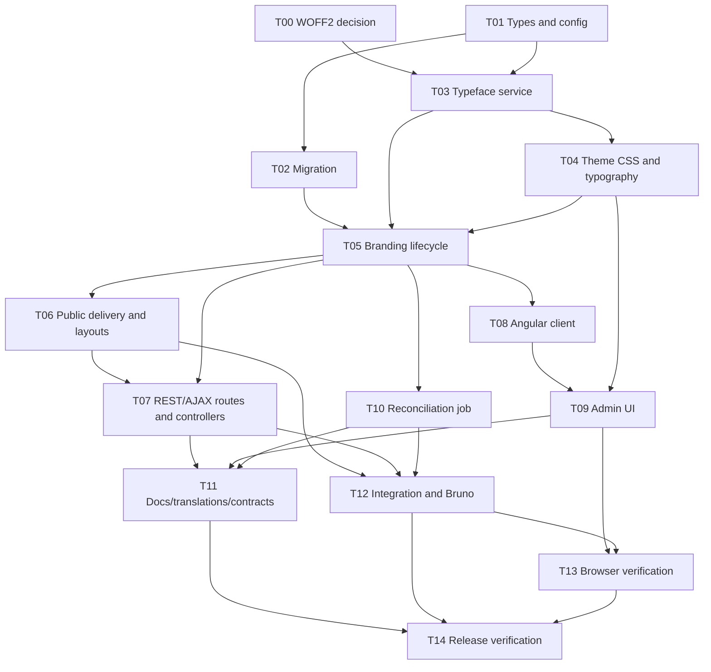

# Custom Brand Typeface Orchestration Task List

Status: ready to assign
Architecture contract: [design.md](design.md)
Implementation narrative: [implementation_plan.md](implementation_plan.md)

This is the execution ledger for the custom Brand Typeface feature. Each task is intended to produce a reviewable change with its own tests. Check a task only when its completion evidence is recorded; compilation alone is not completion.

## Orchestrator rules

- `design.md` is the decision source. Agents should link to a section rather than inventing or duplicating product rules.
- Do not use the `redbox-feature-design-planner` skill for this work.
- Read the repository `AGENTS.md` and the authoritative wiki pages it routes to before editing.
- Use exact package versions. Never introduce `^`, `~`, wildcard, or inequality dependency ranges.
- Preserve unrelated working-tree changes and do not bulk-format unrelated files.
- Assign only tasks whose dependencies are complete and merged into the assignee's starting point.
- One task owns a file at a time. If a task needs a file owned by another active task, coordinate a handoff instead of editing concurrently.
- Write or update the focused tests in the same task as production code.
- Do not weaken WOFF2 validation to filename or client MIME checks if T00 cannot select a safe inspector.
- Do not add a variable-font path, licensing acknowledgement, decompressed-size limit, feature flag, font asset model, generic storage abstraction, or Angular router.
- Do not change logo/favicon to use the new version lifecycle.
- Every task handoff must include changed files, commands run, results, and any remaining risk.

## Dependency graph

Safe initial parallelism: T00 and T01. After T05: T06, T08, and T10. After T06 and T08: T07 and T09. T12 can run beside the latter part of T09 once T07 is complete.

## Milestone A — Safe foundations

### T00 — Select and prove the WOFF2 inspector

Depends on: none
May run with: T01
Suggested capability: dependency/security research plus TypeScript fixture testing
Exclusive ownership:

- `package.json` and lockfile, if a dependency is selected
- new WOFF2 validation fixtures and spike tests
- new implementation-decision note under `docs/adr/`

Checklist:

- [ ] Read `design.md` sections 2, 3.2, 8.1, 8.2, and 14.
- [ ] Create/licence-record fixtures for valid static, variable, malformed, truncated, and descriptor-mismatch WOFF2.
- [ ] Evaluate Buffer parsing, structural failure, `fvar` detection, metadata extraction, Node compatibility, licence, transitive dependencies, and crafted-input behaviour.
- [ ] Explicitly resolve the known `fontkit@2.0.4` crafted-font denial-of-service concern before choosing it.
- [ ] Prove the choice against the repository's Node 24 CI and Node 26 runtime images.
- [ ] Demonstrate that malformed input returns a controlled error without terminating or indefinitely blocking the test process.
- [ ] Pin the exact version if adding a dependency.
- [ ] Record the selected approach and rejected alternatives.
- [ ] Run core compile/lint and the fixture test.

Completion evidence:

- decision note path;
- exact dependency/version or internal-inspector location;
- fixture test names/results;
- security concern disposition.

Stop condition: if nothing meets the design gate, mark the feature blocked and report why. Do not substitute extension or MIME validation.

### T01 — Add shared types, model fields, and config defaults

Depends on: none
May run with: T00
Suggested capability: `Redbox Services`
Exclusive ownership:

- `packages/redbox-core/src/waterline-models/BrandingConfig.ts`
- `packages/redbox-core/src/waterline-models/BrandingConfigHistory.ts`
- `packages/redbox-core/src/model/storage/BrandingModel.ts`
- new shared brand-typeface type/normalisation module
- `packages/redbox-core/src/config/branding.config.ts`
- focused type/config/model unit tests

Checklist:

- [ ] Add `BrandingTypefaceSlot`, inspection, face, and state types once in a shared core module.
- [ ] Encode fixed slot ordering and active/draft invariants without storage/controller dependencies.
- [ ] Add active `typeface`, `draftTypeface`, and default-zero `draftRevision` to `BrandingConfig` and its compatibility interface.
- [ ] Add `typeface`, `actorId`, `actorDisplayName`, and `restoredFromVersion` to history.
- [ ] Update `BrandingModel` so in-memory cached values expose all active/draft/version fields.
- [ ] Add 2 MiB face, 8 MiB family, three-version, and 24-hour grace defaults.
- [ ] Add safe positive-integer config lookup with logged default fallback.
- [ ] Normalise absent legacy typeface to Default Typography.
- [ ] Test defaults, invalid config fallback, null normalisation, slots, and invariants.
- [ ] Run focused tests, core compile, and lint.

Completion evidence:

- public type exports and import example;
- focused test results;
- confirmation that no feature flag or decompressed-size setting exists.

### T02 — Implement the idempotent upgrade migration

Depends on: T01
May run with: nothing that edits Waterline branding model tests
Suggested capability: Waterline migration/integration testing
Exclusive ownership:

- new timestamped file under `api/migrations/`
- migration-specific tests/fixtures
- `test/integration/models/BrandingConfig.test.ts`

Checklist:

- [ ] Read `design.md` sections 5, 6, and 16.
- [ ] Backfill active/draft typeface fields and revision without overwriting existing values.
- [ ] Backfill old history as Default Typography.
- [ ] Detect legacy rollback/non-monotonic active state before pruning.
- [ ] Preserve unmatched or divergent current active colours as `max(maxHistoryVersion, activeVersion) + 1` exactly once.
- [ ] Prune to configured newest history count only after preservation.
- [ ] Make a second execution produce no writes or new history.
- [ ] Use conditional writes plus the unique brand/version index to make concurrent pending-migration runners converge; verify rather than blindly accept a duplicate row.
- [ ] Avoid bootstrap service/cache dependencies and cross-instance-lock assumptions.
- [ ] Omit and explain unsafe destructive `down` behaviour.
- [ ] Cover fresh, normal, rewound, unmatched, divergent, over-retained, and rerun fixtures.
- [ ] Run migration/model tests and core compile.

Completion evidence:

- before/after tables for each test fixture;
- rerun-idempotency result;
- explicit confirmation that no active colour state is lost.

### T03 — Implement `BrandingTypefaceService`

Depends on: T00 and T01
May run with: T02 after T01, provided tests/files are disjoint
Suggested capability: `Redbox Services` and `Redbox Testing`
Exclusive ownership:

- new `packages/redbox-core/src/services/BrandingTypefaceService.ts`
- `packages/redbox-core/src/services/index.ts`
- new unit/integration tests named for `BrandingTypefaceService`
- reusable WOFF2 test fixtures after T00 handoff

Checklist:

- [ ] Read `design.md` sections 4.1, 5, 8, 12, 13, and 14.
- [ ] Export the service through the existing service-index/lazy-loader convention.
- [ ] Regenerate or smoke-check `api/services/BrandingTypefaceService.js`; never hand-edit the generated shim.
- [ ] Implement fixed slot descriptors and private key/URL helpers.
- [ ] Inspect exact bytes structurally; ignore filename and client MIME for validity.
- [ ] Reject variable fonts and return warnings for embedded descriptor mismatch.
- [ ] Enforce configured compressed face size and distinct-content family size.
- [ ] Hash exact bytes with full lowercase SHA-256.
- [ ] Store/reuse immutable objects at the exact per-brand key.
- [ ] Implement verified read and whole-snapshot availability checks.
- [ ] Implement reference collection and safe orphan reconciliation callable by T10.
- [ ] Ensure public metadata never contains the internal key or bytes.
- [ ] Test parser failures, limits, warnings, hashes, same-brand dedupe, cross-brand isolation, disk failures, corruption, snapshot checks, grace/race reconciliation, pagination, and unexpected keys.
- [ ] Run focused unit/integration tests, core compile, and lint.

Completion evidence:

- concise public method list;
- storage key and dedupe tests;
- malformed/variable/limit test results;
- reconciliation safety test results.

Reject during review if WOFF2 parsing, key construction, or reconciliation rules leak into controllers or `BrandingService`.

## Milestone B — Theme and lifecycle

### T04 — Generate typeface CSS and wire typography roles

Depends on: T01 and T03
May run with: T02
Suggested capability: `Redbox Services` plus SCSS regression testing
Exclusive ownership:

- `packages/redbox-core/src/services/BrandingThemeCssService.ts`
- `packages/redbox-core/test/services/BrandingThemeCssService.test.ts`
- shared base typography SCSS files identified by the task's font-family audit

Checklist:

- [ ] Read `design.md` sections 3.4 and 9.
- [ ] Accept a normalised typeface snapshot and brand URL context in theme generation.
- [ ] Emit the fixed alias and canonical Regular/Bold/Italic/Bold Italic descriptors.
- [ ] Add `font-display: swap` to every present face.
- [ ] Add `--rb-brand-font-family` to `:root` and `:host` only for custom typeface.
- [ ] Keep arbitrary/legacy font-family input outside the editable token allow-list.
- [ ] Include typeface CSS/hashes in the deterministic composite hash.
- [ ] Wrap each existing text-role family with its own CSS-variable fallback.
- [ ] Cover body, headings, nav/menu, footer, button, form, and print.
- [ ] Preserve icon font and `pre`/`code`/`kbd`/`samp` families.
- [ ] Use the design's relative CSS font URL so normal and preview CSS resolve correctly with or without root context.
- [ ] Test Default Typography equivalence, slots, missing optionals, fixed alias, URL encoding/root-context resolution, `swap`, Shadow DOM, hash stability/change, token rejection, roles, exclusions, and print.
- [ ] Run service tests and the relevant style/Angular build.

Completion evidence:

- representative generated CSS for default and all-face custom states;
- exact list of SCSS roles changed;
- tests proving filenames/embedded family names cannot enter CSS.

### T05 — Implement revisioned draft and version lifecycle

Depends on: T02, T03, and T04
May run with: no other task editing `BrandingService`
Suggested capability: `Redbox Services` and `Redbox Testing`
Exclusive ownership:

- `packages/redbox-core/src/services/BrandingService.ts`
- `packages/redbox-core/test/services/BrandingService.test.ts`
- existing BrandingService integration test while this task is active
- `TransactionUtils.ts` only if strictly required

Checklist:

- [ ] Read `design.md` sections 3.3, 5, 7, 11.3, and 16.
- [ ] Add one canonical Admin-state response builder and retained-version listing.
- [ ] Require and conditionally match `expectedDraftRevision` for every colour/typeface draft mutation.
- [ ] Increment revision once per successful logical mutation and return current counters on conflict.
- [ ] Implement upload staging, per-slot replace/remove, Use Default Typography, and typeface-only revert.
- [ ] Ensure colour edits preserve draft typeface and typeface edits preserve colour draft.
- [ ] Bind preview to an exact draft revision and add non-mutating history preview.
- [ ] Require both active version and draft revision for publish and restore.
- [ ] Re-read/hash every candidate face before active mutation.
- [ ] Make unchanged publish idempotent using normalised snapshots plus composite hash.
- [ ] Persist complete actor-attributed history and monotonically allocate versions.
- [ ] Map unique version-allocation/write conflicts to a re-read `409`, not a generic storage error.
- [ ] Implement canonical restore with explicit brand/history constraint, new version, restored-from metadata, aligned active/draft state, and one revision increment.
- [ ] Keep a temporary service-level `rollback` alias with restore semantics only.
- [ ] Prune newest configured count after durable transition and refresh cache only after commit.
- [ ] Use optional transactions; prove the fallback cannot expose partially changed active state.
- [ ] Return health warnings for active missing/corrupt faces without failing config retrieval.
- [ ] Cover every mutation/conflict/integrity/idempotency/restore/prune/cache case listed in implementation plan T05.
- [ ] Run unit and integration service tests, compile, and lint.

Completion evidence:

- state-transition test table with starting/ending version and revision;
- transaction and no-transaction results;
- proof that cross-brand restore is rejected;
- proof old version rewind no longer exists.

## Milestone C — Delivery surfaces

### T06 — Serve public fonts and integrate layouts

Depends on: T05
May run with: T08 and T10
Suggested capability: `Redbox Controllers` plus EJS/SCSS rendering tests
Exclusive ownership:

- `packages/redbox-core/src/controllers/BrandingController.ts`
- public font additions to `packages/redbox-core/src/config/routes.config.ts`
- layout/render helpers added to `BrandingService.ts` only after exclusive T05 handoff
- all EJS files containing current external font requests
- public delivery/layout tests

Checklist:

- [ ] Read `design.md` sections 3.4, 8.3, 9, 10.3, and 14.
- [ ] Add exported GET/HEAD public action and portal-independent route.
- [ ] Validate exact hash and resolve storage only through `BrandingTypefaceService`.
- [ ] Return canonical MIME, ETag, immutable cache, nosniff, length, and HEAD behaviour.
- [ ] Return not-found for absent/corrupt content and log corruption without substitution.
- [ ] Add rendering helpers for active custom state and Regular public URL.
- [ ] Audit all Google font/preload/import occurrences, not only the three primary layouts.
- [ ] Omit existing external font requests only for active custom brands.
- [ ] Preload Regular exactly once and no optional face.
- [ ] Preserve Default Typography HTML and hook CSS ordering.
- [ ] Remove the read-time write that “corrects” `BrandingConfig.hash`; derive the theme response ETag without mutating publication state.
- [ ] Verify root context, public/sessionless handling, and same-origin CSP.
- [ ] Test representative layouts for both custom and default states.
- [ ] Run focused controller/render tests, compile, and lint.

Completion evidence:

- full audited list of font-request files;
- example GET and HEAD headers;
- tests for session bypass/CSP and conditional layout output.

Handoff requirement: T06 owns the first edit to `routes.config.ts`. T07 starts only after T06 is merged, avoiding a concurrent route-table conflict.

### T07 — Add REST/AJAX management actions and contracts

Depends on: T05 and T06
May run with: T09 and T10
Suggested capability: `Redbox Controllers` and `Redbox Testing`
Exclusive ownership:

- `packages/redbox-core/src/controllers/BrandingAppController.ts`
- `packages/redbox-core/src/controllers/webservice/BrandingController.ts`
- management additions to `packages/redbox-core/src/config/routes.config.ts`
- `packages/redbox-core/src/config/auth.config.ts`
- `packages/redbox-core/src/api-routes/groups/branding.ts`
- API route contracts and shared file-contract validator, if needed
- controller/route contract tests

Checklist:

- [ ] Read `design.md` sections 10, 14, and 16.
- [ ] Add REST config parity and all draft face/default/revert endpoints.
- [ ] Add draft/history preview, versions, publish, canonical restore, and deprecated rollback alias endpoints on both surfaces.
- [ ] Update `_exportedMethods` and route/auth maps.
- [ ] Keep actions thin and actor identity session-derived.
- [ ] Require the correct expected counters on each action.
- [ ] Use Skipper runtime max for multipart and leave structural/second size validation to the service.
- [ ] Delete all Skipper temporary files from a `finally` path for success, validation failure, conflict, and unexpected error.
- [ ] Use standard `sendResp` handling for touched JSON actions.
- [ ] Map 400/404/409/413/500 consistently; include current counters in conflicts.
- [ ] Return complete canonical Admin state from draft mutations.
- [ ] Make rollback alias call restore and send/document a deprecation header for one major release.
- [ ] Extend file contract validation narrowly if needed for runtime max; never trust MIME as font validity.
- [ ] Update OpenAPI/route schemas including default/configurable limit metadata.
- [ ] Test route exposure, policy, actor spoof rejection, multipart, status mapping, same-brand restore, alias, and REST/AJAX parity.
- [ ] Run controller tests, API route validation, compile, and lint.

Completion evidence:

- endpoint matrix with implementation method and policy;
- example conflict and deprecated-alias responses;
- `validate:api-routes` result.

### T08 — Implement the Angular API/state layer

Depends on: T05
May run with: T06 and T10; endpoint names are fixed by `design.md`
Suggested capability: `Redbox Angular Services`
Exclusive ownership:

- `angular/projects/researchdatabox/branding/src/app/branding-admin.service.ts`
- branding client model/interfaces under `angular/projects/researchdatabox/branding/src/app/`
- new/focused `branding-admin.service.spec.ts`

Checklist:

- [ ] Read `design.md` sections 5.3, 7, 10.1, 10.2, and 11.
- [ ] Model active/draft typeface, faces, history, warnings, limits, active version, and draft revision.
- [ ] Add multipart upload and all other draft/preview/version/publish/restore calls.
- [ ] Send counters from one canonical state source.
- [ ] Replace client state from mutation responses rather than merging fields locally.
- [ ] Normalise conflict and upload-limit errors for UI use.
- [ ] Leave unsaved preview sample text outside the service/server model.
- [ ] Do not call the deprecated rollback route.
- [ ] Test exact URLs, verbs, form/body values, counters, full-state replacement, and 409/413 handling.
- [ ] Run focused Angular tests and library compile.

Completion evidence:

- client method/request table;
- focused test results;
- confirmation that components need no direct HTTP calls.

### T09 — Build the Administrator typography experience

Depends on: T04 and T08
May run with: T07 and T10
Suggested capability: `Redbox Angular Apps`
Exclusive ownership:

- `angular/projects/researchdatabox/branding/src/app/branding-admin.component.ts`
- `angular/projects/researchdatabox/branding/src/app/branding-admin.component.html`
- `angular/projects/researchdatabox/branding/src/app/branding-admin.component.scss`
- `angular/projects/researchdatabox/branding/src/app/branding-admin.component.spec.ts`
- `angular/projects/researchdatabox/branding/src/app/branding-preview.component.ts`
- `angular/projects/researchdatabox/branding/src/app/branding-preview.component.html`
- `angular/projects/researchdatabox/branding/src/app/branding-preview.component.spec.ts`
- branding-local presentational helpers only

Checklist:

- [ ] Read `design.md` section 11 and the relevant accessibility/security points in section 14.
- [ ] Add Default/Custom state and four explicit slot cards.
- [ ] Show escaped filename, bytes, slot, inspection metadata, and warnings.
- [ ] Implement accessible upload/replace/remove with request progress and duplicate-submit prevention.
- [ ] Add Use Default Typography and typeface-only Revert actions.
- [ ] Explain optional browser synthesis and block custom publish without Regular.
- [ ] Render clear parser, face limit, family limit, storage, and concurrency errors.
- [ ] Add reload UX for conflict without losing local sample text.
- [ ] Expand Shadow DOM preview across text roles and four styles.
- [ ] Keep sample text unsaved/local.
- [ ] Add retained version list, actor/date/typeface summary, active marker, historical preview, and confirmed immediate restore.
- [ ] Refresh canonical state after publish/restore.
- [ ] Preserve current colour/logo/favicon flows and existing embedded-app structure.
- [ ] Test all render/action/error/accessibility/history states and filename escaping.
- [ ] Run focused and full Angular tests plus compile.

Completion evidence:

- component test results;
- screenshots or rendered test output for default, complete custom, incomplete custom, warning, and conflict states;
- confirmation that no Angular route or new nav item was added.

### T10 — Register daily orphan reconciliation

Depends on: T03 and T05
May run with: T06 and T08, then T07/T09
Suggested capability: `Redbox Services` and Agenda integration testing
Exclusive ownership:

- `packages/redbox-core/src/config/agendaQueue.config.ts`
- reconciliation schedule/registration tests

Checklist:

- [ ] Read `design.md` section 12.
- [ ] Register `BrandingTypefaceService-ReconcileAssets` once.
- [ ] Use Mongo backend, daily cadence, skip immediate, concurrency one, lock limit one, and bounded lock lifetime.
- [ ] Delegate all scan/reference/delete rules to the T03 service method.
- [ ] Log bounded summary counts and allow individual failures to retry next day.
- [ ] Test exact job config, invocation, repeated execution, partial failure, and large/paginated result handling.
- [ ] Confirm there is no in-process timeout cleanup.
- [ ] Run focused service/config tests and compile.

Completion evidence:

- registered job definition;
- schedule/lock test output;
- reconciliation invocation/failure test output.

If T03's service interface is insufficient, stop and request a serialized T03 follow-up; do not concurrently edit its service file.

## Milestone D — Documentation and end-to-end evidence

### T11 — Add translations and authoritative documentation

Depends on: T07, T09, and T10
May run with: T12
Suggested capability: technical writing plus generated API tooling
Exclusive ownership:

- `language-defaults/en/translation.json`
- `language-defaults/meta.json`
- `support/wiki/Theme-Customization-Guide.md`
- `support/wiki/Configuration-Guide.md`
- `support/wiki/Services-Architecture.md`
- `support/wiki/Controllers-Architecture.md`
- generated API/reference outputs

Checklist:

- [ ] Inventory every new visible UI string and add translation/default metadata.
- [ ] Document face slots/formats, Default Typography, scope, preview/publish/restore, retention, synthesis/fallback, and errors.
- [ ] Document the four config parameters and grandfathering behaviour.
- [ ] Document primary disk path semantics, same-origin immutable delivery, Agenda job, grace period, and health warnings.
- [ ] Document service/controller extension seams for hook developers.
- [ ] Mark rollback alias deprecated, restore-equivalent, and scheduled for next-major removal.
- [ ] Generate rather than hand-edit API reference artifacts.
- [ ] Run translation tests and all docs generation/audit/tests.

Completion evidence:

- wiki pages/sections changed;
- generated API route links;
- translation/docs command results.

### T12 — Add mounted integration and Bruno journeys

Depends on: T02, T03, T05, T06, T07, and T10
May run with: T09 and T11
Suggested capability: `Redbox Testing`
Exclusive ownership:

- branding service/storage integration tests not already owned by active tasks
- REST branding Bruno collection
- AJAX Admin branding Bruno collection
- public general Bruno collection for fonts
- test-only mounted fixtures/config

Checklist:

- [ ] Read `design.md` section 17 and implementation plan T12.
- [ ] Check in only small, licence-compatible, source-recorded WOFF2 fixtures.
- [ ] Run migration against representative old data in the mounted test path.
- [ ] Cover a complete REST lifecycle from config through restore/default.
- [ ] Cover an equivalent AJAX lifecycle.
- [ ] Fetch the published face through public GET and HEAD.
- [ ] Demonstrate shared draft conflict across requests/sessions.
- [ ] Verify Admin policy denial and public font session independence.
- [ ] Verify history pruning while active/draft/history references remain fetchable.
- [ ] Verify integrity failure is non-mutating.
- [ ] Verify old rollback endpoint has restore semantics and deprecation metadata.
- [ ] Run core, mounted Mocha, and both applicable Bruno profiles.

Completion evidence:

- collection/test file list;
- command/result matrix;
- version/revision traces from happy, conflict, restore, and prune journeys.

### T13 — Verify the real browser experience

Depends on: T09 and T12
May run with: T11
Suggested capability: `redbox-dev-login-browser` then `Web Interface Verification`
Exclusive ownership:

- browser verification report and screenshots only
- no production-code edits; discovered defects become follow-up tasks

Checklist:

- [ ] Record environment URL, commit/build identifier, browser, viewport, and test brand/portal.
- [ ] Authenticate as Admin using the established development workflow.
- [ ] Upload/replace/remove each face; exercise Default, Revert, preview, publish, history preview, and confirmed restore.
- [ ] Reload and use a second session to prove durable draft and conflict UX.
- [ ] Verify public/login/researcher/Admin/record/branded-error/print rendering.
- [ ] Inspect body/headings/nav/footer/buttons/forms, bold/italic, icons, code, and hook overrides.
- [ ] Verify custom brand makes no current Google font request and preloads Regular once.
- [ ] Verify WOFF2 same-origin immutable headers and cross-portal cache reuse.
- [ ] Verify default brand still requests and renders current fonts.
- [ ] Verify narrow viewport and keyboard/focus/basic screen-reader labelling.
- [ ] Capture a controlled missing-font fallback plus Admin warning if the test environment supports safe fixture manipulation.
- [ ] Save evidence and open concrete remediation tasks for any failure.

Completion evidence:

- verification report path;
- screenshot/evidence paths;
- pass/fail matrix matching the checklist;
- remediation task links, if any.

### T14 — Run release verification and close acceptance criteria

Depends on: T11, T12, and T13, plus all remediation tasks
May run with: none
Suggested capability: repository-wide validation and focused implementation review
Exclusive ownership: release report and necessary serialized remediation only

Checklist:

- [ ] Run `npm run compile:core`.
- [ ] Run `npm run compile:ng`.
- [ ] Run `npm run lint`.
- [ ] Run `npm run format:check`.
- [ ] Run `npm run test:core`.
- [ ] Run `npm run test:angular`.
- [ ] Run `npm run test:translations`.
- [ ] Run `npm run validate:api-routes`.
- [ ] Run `npm run docs:audit` and `npm run docs:test`.
- [ ] Re-run mounted Mocha and Bruno commands from T12.
- [ ] Confirm browser report T13 is complete and all failures are resolved.
- [ ] Walk all 17 verification criteria in `design.md` section 17 and link evidence.
- [ ] Verify exact dependency pinning and licence record.
- [ ] Search for accidental feature flag, decompressed-size option, variable-font acceptance, font asset model, untrusted CSS family use, actor request fields, or internal storage keys in responses.
- [ ] Verify logo/favicon are still immediate/unversioned.
- [ ] Verify migration backup and irreversible-prune deployment notes.
- [ ] Verify next-major rollback-alias removal is tracked.
- [ ] Check working tree for generated uploads, secrets, screenshots in the wrong location, or unrelated formatting.

Completion evidence:

- final command matrix with exit codes;
- design-criterion evidence matrix;
- list of deliberately deferred items (only if outside the agreed design);
- release recommendation: ready or blocked with exact failures.

## Final acceptance ledger

The orchestrator should leave these unchecked until the cited task evidence exists.

- [ ] Static WOFF2 validation is structurally sound and variable WOFF2 is rejected. (T00, T03)
- [ ] One brand-wide custom family supports four authoritative slots. (T01, T03, T04)
- [ ] Draft colours and typeface are durable and conflict-safe. (T05, T07, T08)
- [ ] Publication is integrity-checked, atomic, actor-attributed, and idempotent. (T05, T12)
- [ ] Restoration creates a new version and cannot cross brands. (T05, T07, T12)
- [ ] Exactly the configured newest three complete versions are retained by default. (T02, T05, T12)
- [ ] Assets are per-brand content-addressed and reconciled safely after grace. (T03, T10, T12)
- [ ] Public delivery is same-origin, immutable, correctly typed, and portal-independent. (T06, T12)
- [ ] Custom typeface reaches all branded browser/print surfaces while icons/code/hooks remain correct. (T04, T06, T13)
- [ ] Google requests stop only for an active custom brand and only Regular is preloaded. (T06, T13)
- [ ] REST and AJAX expose the same lifecycle with Admin policy and standard responses. (T07, T12)
- [ ] The existing Admin branding app supports upload through restore accessibly. (T08, T09, T13)
- [ ] Default Typography and logo/favicon behaviour have no regression. (T04, T06, T09, T13)
- [ ] Migration preserves the current active state and is idempotent. (T02, T12)
- [ ] Config, API, user, operator, and extension documentation is current. (T11, T14)
- [ ] Full repository and mounted test suites pass. (T14)
