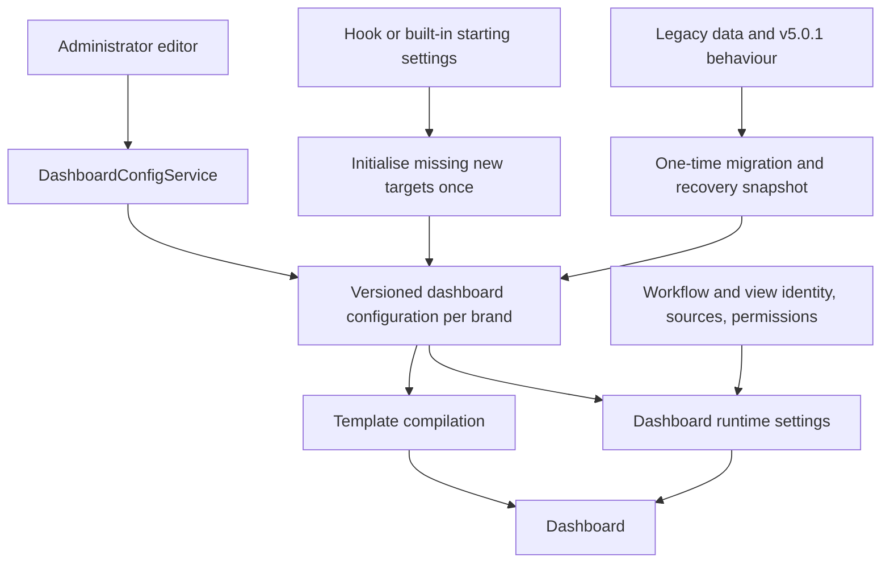

# Independent dashboard stage configuration

Status: agreed product design and implementation handoff. No application changes have been made for this design.

Prepared: 2026-09-25.

Repository examined: `9b8938db03daf672fd52651f6b0a589cac24e050`.

Production baseline: stock `v5.0.1`, tag commit `9aaadb4c21abb4add26ef0fb9e45e4a0e981fa96`. Two production users need migration. Their actual databases, installed customer hooks, and deployed assets have not been inspected. Findings below come from source inspection; they are not a claim that customer migration has been tested.

## 1. Objective

Replace dashboard profiles, defaults, and partial stage overrides with one complete, independently editable configuration for each workflow stage and custom dashboard-view step.

An administrator should be able to select a stage, see all settings that control its dashboard, edit them directly, and copy saved settings between stages. Editing or clearing a setting must have a predictable result. Copying must create independent values: subsequent changes to the source must never propagate automatically.

This document is intended to be sufficient for Opus to implement the feature without the preceding interview. Product decisions are settled. The proposed data structures and endpoint names below are an implementation design, not existing repository APIs; adjust names to repository conventions without weakening the stated behaviour.

## 2. Agreed scope and decisions

| Area | Required behaviour |
| --- | --- |
| Ownership | Administrator configuration shared by users, scoped to the current brand. No personal dashboard configuration. |
| Configuration unit | A workflow stage or custom-view step owns its full dashboard settings. |
| Independence | No live profile references, default overrides, or inherited table settings after initialisation/migration. |
| Included settings | Columns, column sorting, row actions/rules, filters, overall sorting, grouping, group rows/rules, formatting and search controls. |
| Excluded settings | Workflow identity, forms, permissions, source-record selection, view source/fetch definitions, and surrounding page/navigation structure. |
| Custom views | Use the same independent settings model and editing/copy experience as workflow stages. |
| Profiles | Remove profile management and inheritance controls from this page. Do not replace them with a user-managed template library. |
| Copy scope | Within the current brand, including across record types and between compatible workflow/view targets. |
| Copy selection | Three semantic groups, or all settings. Selected groups replace destination groups completely; unselected groups remain unchanged. |
| Copy source | Saved settings only. A bulk copy requires saving the source first. |
| Copy from | Load selected groups from a saved source into the current editor for review; persist only when the destination is saved. |
| Copy to | Preview destinations and selected groups, then apply the bulk operation. |
| Compatibility | Block structurally invalid settings and known broken references. Warn about references that cannot be verified; an administrator may proceed after reviewing warnings. |
| Bulk failure | All destinations update or none do. A stale preview/conflicting edit must not overwrite newer settings. |
| Initial settings | One-time copy from hook-provided settings where available, otherwise built-in starting settings. Later hook updates do not overwrite saved settings. |
| Hidden stages | Include them in the editor and label them clearly. This does not make them visible to ordinary dashboard users. |
| Removed stages | Retain settings for recovery but omit them from normal editing and copying. |
| Renames | Explicit migrations; no fuzzy matching or automatic reassignment. |
| Existing UI | Retain the existing column, action/rule, and format editors. Simplify navigation and configuration ownership; do not build a new visual template or query editor. |
| Runtime compatibility | Preserve existing dashboard URLs and intentional standard/workspace/custom-view behaviour. |
| Configuration API | Replace legacy profile/default/override operations with independent configuration operations. Retired operations return clear errors. Document the breaking API change. |
| Migration | Preserve actual pre-upgrade behaviour wherever independently representable. Retain original configuration. Report and resolve unavoidable differences before upgrading either production customer. |

### 2.1 Explicit non-goals

- Personal dashboards, shared live templates, cross-brand copying, or continued profile inheritance.
- Copying individual columns as a patch/merge operation. The unit of selective copying is a group of settings.
- Automatic field-path mapping between record types.
- Workflow creation, deletion, renaming, permissions, or general hook/workflow reconciliation UI.
- A new action language, query builder, Handlebars editor, or dashboard mode matrix.
- Real-time broadcasting of edits to already-open dashboard tabs. A fresh load must see the committed configuration; an open page must remain internally consistent.
- A general-purpose configuration history, distributed transaction framework, or automatic application rollback system.

## 3. Current implementation and why it must change

### 3.1 Existing persistence and resolution

Dashboard profiles are persisted `DashboardType` records. Per-brand overrides are stored in `AppConfig` under `dashboardTableConfig`, with this shape:

```ts
{
  recordTypes: {
    [recordTypeName]: {
      default?: { dashboardType, tableConfig? },
      steps?: { [stageName]: { dashboardType, tableConfig? } }
    }
  },
  views: {
    [viewName]: {
      default?: { dashboardType, tableConfig? },
      steps?: { [stepName]: { dashboardType, tableConfig? } }
    }
  }
}
```

Workflow tables also exist on persisted `WorkflowStep.config.dashboard.table`. Custom-view definitions and step tables come from resolved `sails.config.dashboardview`. Hook packages can contribute all these definitions.

The current merged-config service combines a profile table, a workflow/view table, and a selected override. Stage and record-type default table overrides are alternatives, not two consistently merged layers. Table arrays replace whole arrays, while separately resolved format rules use ordinary Lodash merging and can merge arrays by index.

When no database `AppConfig` exists, `AppConfigService` can return `brandingConfigurationDefaults.dashboardTableConfig`. Absence of a database override is therefore not evidence that the installation has no custom configuration.

The editor loads local overrides and shows inherited settings in separate previews. Editing an inherited column can require recreating the column array. Removing a local property can reactivate inherited values.

Relevant sources:

- [DashboardConfigService](../../../packages/redbox-core/src/services/DashboardConfigService.ts).
- [Legacy configuration models and schema](../../../packages/redbox-core/src/configmodels/DashboardTableOverrideConfig.ts).
- [AppConfigService](../../../packages/redbox-core/src/services/AppConfigService.ts).
- [Dashboard editor](../../../angular/projects/researchdatabox/dashboard-config-editor/src/app/dashboard-config-editor.component.ts).

### 3.2 Runtime is not equivalent to the merged-config API

This is the principal migration hazard. **Do not migrate by calling `getMergedDashboardTableConfig()` for each stage and persisting its result.**

Source inspection of stock v5.0.1 shows:

| Behaviour | Existing source/path |
| --- | --- |
| Column list, order, headings and column sort settings | Raw persisted workflow table, or Angular's built-in table defaults. |
| Cell template content | Precompiled templates extracted from backend merged configuration. |
| Template identity | Context/stage, array index and field variable; these must match the column being rendered. |
| Missing compiled template | Can produce an empty string; the supplied inline template is not a reliable fallback. |
| Initial ordinary-dashboard format rules | Selected profile's top-level `formatRules`, replaced when a processed stage declares raw format rules. |
| Subsequent ordinary stages | Shared mutable `formatRules` can carry a preceding stage's rules forward. |
| Search controls | Some helpers read the final shared format rules rather than a stage-specific value. |
| Custom views | Raw view-step structure, merged precompiled templates, and a separate step snapshot/restore path. |
| Row actions | Ordinary dashboards and custom views do not currently supply rule sets identically. Some action/mode fields are stored but not fully implemented by runtime helpers. |

Consequently a template edit can work while a heading edit does not; adding/reordering columns can yield old headings with blank cells. Correcting this discrepancy changes behaviour unless the migration first reconstructs the actual old result.

The new design must eliminate the discrepancy and shared mutable stage configuration. It must not silently activate previously ignored settings during migration. Preserve inactive original values in recovery data and report material differences.

Read these paths together:

- [RecordController](../../../packages/redbox-core/src/controllers/RecordController.ts): `getWorkflowSteps`, dashboard type/view responses, and record listing.
- [Dashboard component](../../../angular/projects/researchdatabox/dashboard/src/app/dashboard.component.ts): `initStepTableConfig`, ordinary/view loading, rendering, filtering and sorting.
- [DashboardTypesService](../../../packages/redbox-core/src/services/DashboardTypesService.ts): table/template extraction.
- [HandlebarsTemplateService](../../../angular/projects/researchdatabox/portal-ng-common/src/lib/handlebars-template.service.ts): module registration and lookup.

### 3.3 Dashboard contexts are distinct from editable profiles

Preserve these intentional contexts:

- Standard dashboards show a record type's workflow stages.
- Workspace uses the existing-locations stage table as a layout while aggregating workspace records across types/stages.
- The legacy consolidated URL redirects to a custom view with its own view step, layout, grouping and sources.

Stock configuration does not establish a need for different saved table configurations for the same stage in every mode. Do not introduce a stage-by-mode settings matrix speculatively. If a customer actually uses incompatible settings for the same target in multiple contexts, report that as a migration exception.

Separate source constraints and routing from the stage's editable table behaviour. For example, copying filters into a workspace table must not remove the requirement that its source is workspace records. Existing record access checks remain authoritative.

### 3.4 Persistence and bootstrap constraints

- `AppConfig` does not declare uniqueness for `(branding, configKey)` and explicitly handles duplicate records by selecting the latest. Its current save method has no revision check.
- Migrations execute before core and hook bootstraps. Fresh installs therefore do not yet have seeded workflow records when migrations run.
- `WorkflowStepsService.bootstrap()` seeds when the table is empty; `bootstrapAlways` can destroy and recreate workflow/profile records.
- A newly added hook stage definition does not automatically reconcile an existing workflow database.
- Editor discovery currently excludes hidden stages. Migration and administration need separate all-stage discovery without changing ordinary visibility filtering.

These constraints rule out using the existing unguarded `createOrUpdateConfig()` path for the new bulk operation.

## 4. Target architecture



### 4.1 Identity and structural boundary

Use explicit discriminated target identities:

```ts
type DashboardTarget =
  | { kind: 'workflow'; recordType: string; stage: string }
  | { kind: 'view'; view: string; step: string };
```

Brand identity is supplied by the authenticated request context, not accepted as an alternative brand in the target payload. Portal remains part of routing; it is not an additional settings ownership level.

Use canonical names as the lookup identity, consistent with existing configuration. Display labels are metadata, not keys. Do not concatenate unescaped names into ambiguous string keys. Keep maps structured by kind and owner, or use a collision-free tuple encoding internally.

Workflow roles/forms/order, view `sourceRecordType`, `sourceWorkflowStage`, `fetchMode`, `baseRecordType`, titles and admin-sidebar/page controls are structural metadata. Copying dashboard settings never copies or modifies these fields.

Some legacy format fields mix structure with appearance. Inventory and classify them explicitly:

| Legacy field | Treatment |
| --- | --- |
| `recordTypeFilterBy` | Source/context selection; preserve outside the copyable settings. |
| `filterWorkflowStepsBy` | Dashboard composition/visible-stage selection; preserve outside the copyable settings. |
| `hideWorkflowStepTitleForRecordType` | Materialise the relevant target's title visibility as a per-target presentation value; do not retain a rule allowing one target to control other stages. |
| `filterBy` | Editable filtering except any predicate that defines the structural source context; extract such a predicate into non-copyable source constraints. |
| `queryFilters` | Editable search/filter controls; preserve field paths and template expressions. |

Keep structural context in existing route/view/workflow definitions where possible. If profile-owned context values need persistence to survive profile retirement, store explicit read-only context metadata alongside the brand document. It must contain no inherited table configuration and must not become another editable profile system.

If an existing predicate cannot be separated into source constraints and editable filtering without changing its meaning, report a migration exception instead of guessing. Structural constraints continue to apply when an administrator clears or copies editable filters.

### 4.2 Complete settings contract

Recommended shape, reusing and completing the existing row/rule types:

```ts
interface DashboardSettings {
  searchable: boolean;
  showStageTitle: boolean;
  tableConfig: {
    rowConfig: DashboardRowConfig[];
    rowRulesConfig: DashboardRulesConfig[];
    groupRowConfig: DashboardRowConfig[];
    groupRowRulesConfig: DashboardRulesConfig[];
    formatRules: StageDashboardFormatRules;
  };
}

interface StageDashboardFormatRules {
  filterBy?: Record<string, unknown>;
  queryFilters?: Record<string, QueryFilter[]>;
  sortBy?: string;
  groupBy?: string;
  sortGroupBy?: SortGroupBy[];
}
```

This is a contract sketch, not permission to discard existing fields. Align backend types, JSON schema and shared Angular DTOs: they currently disagree about fields such as `secondarySort`, query filters, and group-sort attributes. Preserve supported hook-specific values or produce a migration finding requiring explicit classification. Do not silently strip fields because the current TypeScript interface omits them.

Rules for normalisation:

1. Required arrays and containers are present in stored settings, including empty arrays and an empty format-rules object.
2. Optional formatting values mean disabled/absent locally. They never trigger lookup from another stage, profile or hook.
3. Empty column arrays are explicit empty configuration. Do not replace them with built-in columns at runtime or during template extraction; show an appropriate empty-table state.
4. Empty templates stay empty. Do not replace them with an inherited template.
5. There is one location for effective format rules, not separate top-level and table-level versions with different semantics.
6. Do not store `dashboardType`, `default`, `inheritsFrom`, or source-target references as live settings dependencies.
7. Built-in values are applied by initialisation, not as a read-time merge for an existing settings object.

Unknown extension fields need deliberate handling because current schemas permit additional properties. Preserve them in ordinary round trips. Before shipping, classify every discovered field into a copy group or structural metadata. Until a field is classified, block operations that would ambiguously copy it and explain why; do not silently drop it or invent a general plugin framework for this change.

### 4.3 Storage and atomic updates

Recommended implementation: a small dedicated Waterline model, provisionally `DashboardConfiguration`, containing one aggregate document per brand:

```ts
interface DashboardConfigurationData {
  schemaVersion: 1;
  workflows: Record<string, Record<string, DashboardSettings>>;
  views: Record<string, Record<string, DashboardSettings>>;
  // Optional explicit non-copyable context metadata, only where required.
}

interface DashboardConfigurationRecord {
  branding: string;             // Unique database index.
  revision: number;             // Positive, monotonically increasing.
  configData: DashboardConfigurationData;
  // Existing model timestamps; migration provenance if required.
}
```

Logical independence does not require a database record for every stage. A brand aggregate keeps a multi-target copy in one atomic database update and avoids introducing multi-document transactions for this feature. Keep legacy recovery snapshots outside this live document to avoid duplicating large templates on every save.

Use repository Waterline decorators/model exports and a database-enforced unique brand index. Existing indexed model examples include `FigshareVocabularyCrosswalk`. Verify the deployed adapter installs/enforces the index; a TypeScript declaration alone is not sufficient.

Every writer, including single-stage saves, bulk copy, initialisation and explicit rename migrations, must use a database conditional update on the aggregate revision:

```text
read brand document at revision R
construct and validate complete next document in memory
UPDATE document WHERE id = D AND revision = R
SET configData = nextDocument, revision = R + 1
zero matched records => conflict; no destination changed
```

The exact Waterline/adapter call must be integration-tested. Do not implement this as an ordinary read/check followed by an unconditional update, a process-local mutex, or a loop of stage writes. A client-provided timestamp is not sufficient conflict protection.

One brand revision deliberately means an unrelated stage edit can invalidate a preview. This is an acceptable simplicity tradeoff for this release; return a clear refresh message. Do not add per-stage merge reconciliation unless evidence requires it.

Create missing brand documents using the unique constraint, handling a concurrent creator by reloading. Initialisation must insert missing targets without replacing existing targets. A conflict during automatic initialisation may reload/recompute safely; user saves/copies must return the conflict rather than silently rebase a reviewed operation.

Ordinary reads must use the authoritative new store, not the cached legacy branding defaults. Generic AppConfig operations must not be able to bypass revision checks or reactivate `dashboardTableConfig` inheritance.

Validate the complete candidate document against the deployed datastore's document-size limit before committing. A size failure must leave the operation unchanged and explain the problem; do not split a failing bulk copy into partial writes.

### 4.4 Authoritative runtime and compiled templates

Expose one service path for obtaining independent target settings. Both administrative reads and dashboard display/template generation must use it.

Adapt the existing dashboard-facing responses so ordinary users can load settings through their normal permitted dashboard routes. Do not require ordinary users to call Admin-only configuration APIs.

Maintain configuration and interaction state per target. Filters, grouping, search visibility, selected filter fields, sorting, pagination and template lookup must not depend on the last stage initialised or rendered. Preserve server-side record authorisation independently of display/action rules.

Template identity must include at least brand, target kind, owner, stage/step, and settings revision or content fingerprint. Include portal/context where template generation depends on it. Query-filter templates also need target identity; record type plus dashboard mode is insufficient when stages have different controls.

A page must not combine settings from revision R with templates from R+1. Recommended minimal behaviour:

- Return a revision/fingerprint with runtime settings.
- Request compiled templates for that same revision/fingerprint, include it in the dynamic-import URL and client registry identity, and verify it at the server.
- If the server only has a newer configuration, return a mismatch and reload settings/templates together. Do not silently compile new settings under an old requested version.
- Existing loaded pages may continue using their already-loaded consistent snapshot. A fresh page load reads the latest saved configuration.
- Avoid adding an unbounded revision history merely to satisfy template requests; a bounded reload/error path is sufficient.

Retain existing URL entry points and source-selection semantics for standard, workspace and consolidated/custom views. Remove profile-derived table fallbacks from their new runtime paths. Old profile records may remain for migration/recovery but must not influence live editable settings.

## 5. Editing and copying

### 5.1 Page structure

Keep the existing embedded Angular app and EJS host. Use navigation grouped into workflow record types/stages and custom views/steps. Show human-readable labels with enough identity to distinguish similarly named targets. Add simple filtering if the target list warrants it; do not build a separate dashboard management application.

For the selected target:

- Show complete settings using the existing field editors.
- Provide Save, Copy from, and Copy to actions, with dirty-state feedback.
- Remove profile lists/CRUD, default entries, “Inherits From”, inherited previews and reset-to-inheritance controls.
- Label hidden stages; exclude removed targets from ordinary selection/copy options.
- Protect unsaved edits when changing target or applying Copy from. Cancelling retains the current draft.
- Keep technical templates/JSON within the existing advanced field controls. Routine copy flow should use names, settings groups and readable differences.

Retaining the field editors does not mean leaving supported settings inaccessible. Add the small missing controls needed for complete settings, such as search/title toggles and supported filter fields, within the existing editor structure. Preserve values in fields the administrator has not edited. Do not confuse the copy preview (settings differences) with a promise of a new live record-data preview engine.

### 5.2 Copy group definitions

The groups are semantic and need not match the current editor tabs exactly:

| Group ID | User label | Values replaced |
| --- | --- | --- |
| `columnsAndActions` | Columns and row actions | `rowConfig` and `rowRulesConfig`, including column `initialSort`, `defaultSort`, `secondarySort`, templates and named row-rule sets. |
| `filtersAndSearch` | Filters, sorting and search | Editable `filterBy`, `queryFilters`, overall `sortBy`, `searchable`, and per-target title visibility/presentation controls classified here. |
| `grouping` | Grouping and group rows | `groupBy`, `sortGroupBy`, `groupRowConfig`, and `groupRowRulesConfig`, including group-row templates/actions. |
| All settings | All settings | The complete copyable `DashboardSettings` object; never target identity or structural/source metadata. |

Column-specific sorting belongs with columns; overall query sorting belongs with filters. A partial copy must use an explicit field partition. Do not copy the entire `formatRules` object for the filters group, because that would overwrite unselected grouping values.

Replacement is exact. If the source has no filter, copying filters removes the destination's filter. If the source has no row rules, copying columns/actions removes the destination's row rules. Source and destination must never share mutable object references.

Example:

```text
Source:      columns [Title, Updated], filter none, grouping none
Destination: columns [Title, Owner],   filter My records, grouping By type

Copy columns/actions only:
Result:      columns [Title, Updated], filter My records, grouping By type

Then copy filters/search:
Result:      columns [Title, Updated], filter none,       grouping By type
```

This copies a whole group, not “add Updated to every destination”. Make that replacement consequence explicit in the preview.

### 5.3 Copy from

1. Select a saved source and one or more groups, or all settings.
2. Fetch/validate against the saved source and current destination draft; preserve destination draft values in unselected groups.
3. Show replacement details and compatibility findings. If the existing draft would be overwritten in selected groups, require an explicit apply/cancel choice.
4. Apply to the local editor only, marking it dirty. Cancelling writes nothing.
5. Save the resulting full settings through the ordinary revision-checked save path. A subsequent source edit does not change this draft snapshot.

Fetching a newer source must not silently advance the destination draft's base revision. Only reloading/reconciling the destination can do that; otherwise the source fetch could hide a concurrent destination edit. A conflict leaves the draft available for the administrator to review.

### 5.4 Copy to

1. Require the source to be saved. Do not silently save an unsaved source as a side effect of opening the dialog.
2. Select one or more destinations and groups. Exclude self, duplicate destinations and removed targets. Hidden targets are selectable and labelled.
3. Server reads one brand snapshot, calculates complete candidate settings for every destination, and validates those resulting settings.
4. Preview source identity, selected groups, destination identities, meaningful before/after differences, clears/removals, errors and warnings.
5. An administrator reviews warnings and applies. Server reloads/revalidates against the preview revision and current target catalogue.
6. Commit one conditional aggregate update. On conflict, invalid target/settings, or unacknowledged warning, change nothing and return actionable details.
7. Show a concise result with the count of updated destinations. Refresh the editor's revision.

Do not silently skip a problematic destination. The administrator may remove it and request a new preview.

### 5.5 Validation and dependencies

Validate the resulting destination, not just the source or selected fragment. A copied column may reference an existing group rule; a retained sort may reference a removed column. Dependencies can cross the proposed groups.

Blocking examples:

- Invalid JSON/shape, malformed Handlebars, invalid enums, or duplicate rule-set identities that make lookup ambiguous.
- A statically known rule-set reference whose required target rule set is absent.
- A source/destination outside the authenticated brand, unknown/removed target, or unsupported copy group.
- An unclassified field whose ownership/copy semantics cannot be determined.

Warning examples:

- A field path not found in the available destination metadata/form information; records may legitimately contain additional data.
- A dynamic Handlebars rule-set name or helper dependency that cannot be proven compatible statically.
- Search controls keyed to a different record type, or templates containing source-specific names/URLs.

Use the installed Handlebars parser/compiler and existing schema tooling. Do not execute templates or queries to “validate” arbitrary input. Literal helper references can be checked; dynamic references cannot all be discovered reliably. Never present a partial static check as proof of full compatibility.

Do not automatically rewrite field paths, record-type keys or URLs, drop incompatible settings, or add unselected groups without the administrator seeing and selecting that change.

Use stable finding identifiers with target and field path so warnings can be acknowledged for the exact reviewed operation. A changed revision or changed candidate invalidates that acknowledgement. Ordinary saves must use the same structural/dependency validation, including after Copy from.

## 6. Service and API contract

Keep orchestration in `DashboardConfigService`; controllers should resolve/authenticate the brand, validate request envelopes, delegate, and translate typed errors to responses. Keep pure normalisation, copy and legacy-conversion functions separately testable without creating a generic configuration framework.

Suggested service responsibilities:

- Discover available workflow/view targets, including hidden stages.
- Read complete settings with revision.
- Save one target with expected revision.
- Build/validate a copy preview and apply a copy with expected revision.
- Initialise missing targets once.
- Supply runtime settings and template inputs from the same source.
- Run legacy preflight/conversion through a clearly separated migration entry point.

### 6.1 Proposed operations

Paths below are relative to `/:branding/:portal`. Register REST endpoints through the existing route factory/OpenAPI descriptors. Use CSRF-backed admin routes for session-based editor mutations, delegating to the same service as authenticated REST operations, following repository controller conventions.

| Method | REST path | Purpose |
| --- | --- | --- |
| GET | `/api/dashboard-config/targets` | Available target metadata; no profile/default hierarchy. |
| GET | `/api/dashboard-config/workflows/:recordType/:stage` | Complete settings and revision for one workflow stage. |
| PUT | `/api/dashboard-config/workflows/:recordType/:stage` | Replace complete settings using `expectedRevision`. |
| GET | `/api/dashboard-config/views/:view/:step` | Complete settings and revision for one view step. |
| PUT | `/api/dashboard-config/views/:view/:step` | Replace complete settings using `expectedRevision`. |
| POST | `/api/dashboard-config/validate` | Read-only validation of complete proposed settings for a target, including a copy-from draft. |
| POST | `/api/dashboard-config/copy/preview` | Read-only computation of bulk-copy candidates, differences and findings. |
| POST | `/api/dashboard-config/copy/apply` | Apply the reviewed copy atomically. |

The validation operation accepts `{ target, expectedRevision, settings }` and returns structured errors/warnings plus a validation fingerprint. It does not save the draft or make it a saved source for bulk copying. The editor uses it before Save and when reviewing Copy from. The actual save always revalidates; this is not a way to bypass server validation.

Example envelopes, adapting to existing `sendResp` conventions:

```ts
// Read response
{
  data: { target, settings, revision: 12, schemaVersion: 1 }
}

// Save request
{
  expectedRevision: 12,
  settings,
  validationFingerprint: '...', // Required when acknowledging warnings.
  acknowledgedWarningIds: []
}

// Copy preview request
{
  source: { kind: 'workflow', recordType: 'rdmp', stage: 'draft' },
  destinations: [
    { kind: 'workflow', recordType: 'rdmp', stage: 'review' }
  ],
  groups: ['columnsAndActions']
}

// Preview data
{
  expectedRevision: 12,
  previewFingerprint: '...',
  source, destinations, groups,
  changes: [/* target-specific before/after summaries */],
  errors: [],
  warnings: [/* stable id, target, path, message */]
}

// Apply request: repeat the operation, not client-authored candidate settings
{
  expectedRevision: 12,
  previewFingerprint: '...',
  source, destinations, groups,
  acknowledgedWarningIds: ['...']
}
```

A revision plus deterministic re-evaluation can keep copy previews stateless. Recheck the target catalogue, structural metadata and validation context at apply time. If those can change independently of the brand revision, include a catalogue/context fingerprint in the preview and require it on apply. Do not claim that a revision check covers hook/view changes outside the document.

The preview/validation fingerprint should bind the brand, target(s), operation/groups, expected revision, canonical candidate settings, catalogue/context identity and relevant validation findings. Recompute it on apply/save before accepting acknowledgements. A deterministic content hash using existing platform primitives is sufficient; no server-side draft/session store is required. Do not reuse acknowledgements merely because the same warning text or field path occurs in a different candidate.

Resolve the requested brand explicitly and fail if it is invalid or unauthorised. Do not fall back to the default brand on a malformed new API request. Translate names through the target catalogue rather than trusting arbitrary object paths from the client.

Suggested error semantics:

| Status | Meaning |
| --- | --- |
| 400 | Malformed request, invalid settings or unsupported operation/groups. |
| 401/403 | Existing authentication/authorisation failures. |
| 404 | Target unavailable in the authorised brand. |
| 409 | Stale revision/context, unresolved dependency conflict, or warnings requiring review. Include structured findings where applicable. |
| 410 | Retired legacy configuration operation, with a stable error code and replacement guidance. |
| 503 | Configuration unavailable because required migration/initialisation has not completed; never silently fall back to inheritance. |

Use typed/domain error codes rather than matching exception-message text to infer status. Administrative responses should not be cached.

### 6.2 Retire the complete old mutation surface

Inventory both explicit route descriptors and exported controller actions. Legacy operations include defaults, overrides, merged workflow/view/type operations and profile CRUD. Update the Angular client, API descriptions and tests together.

Authenticated callers of retired operations should receive a clear `410` response identifying the new configuration model. Preserve normal authentication before returning details. Do not leave a generic AppConfig write to `dashboardTableConfig` as a silent successful no-op or an alternative write path. Restrict writes to legacy/recovery keys appropriately while allowing the migration to read them internally.

Keep dashboard display/type/view URL entry points that are needed for existing bookmarks and runtime contexts. Their compatibility responses may describe the context, but must not supply an editable profile layer that overrides saved stage settings.

## 7. Initialisation and lifecycle

### 7.1 Fresh installation

Migrations cannot seed stages that do not exist yet. After normal core and hook bootstraps have established brands/workflows/views, initialise complete settings for every available target that lacks them.

Use a narrow, explicit post-bootstrap initialisation call before the server reports ready. Ensure it runs after hook bootstraps too, because they can add targets. Do not globally reorder existing migrations after bootstrap.

Hook-provided initial settings may be normalised from existing legacy declarations using a one-time compatibility adapter. The adapter can resolve profile/table declarations while creating a target, but the saved result must be complete and independent. With no hook settings, use the existing built-in dashboard starting configuration normalised to the new contract. Do not accidentally seed demo workflow types in pristine core.

### 7.2 Newly available targets

When an actual workflow stage is created through the supported service path, initialise its settings. When hook startup introduces a new view step, the post-bootstrap pass initialises it. This feature does not make a declaration in a hook automatically create a database workflow stage where core currently does not do so.

Initialisation is insert-if-missing by target identity. An existing target with empty settings is not missing. A hook upgrade or `bootstrapAlways` must not replace already saved dashboard settings.

Avoid silently treating an existing production target with an incomplete migration as a new target. The migration/readiness process must distinguish existing legacy targets from genuinely new targets and must fail/report when expected migrated settings are absent. Do not backfill them from fresh defaults during an incomplete upgrade.

### 7.3 Hidden, removed and renamed targets

Admin/migration discovery includes hidden stages; ordinary dashboard discovery retains its existing visibility rules.

Keep stored entries whose targets disappear. They remain inactive recovery data and are not copy sources/destinations. Determine availability from the current target catalogue rather than deleting settings on startup.

Names are configuration identities. Reintroducing the exact same identity finds its retained settings. If a reused name represents a different logical stage, the hook migration must explicitly archive/replace that identity. Renames require an explicit old-to-new mapping, conflict checks and an idempotent move; never infer a rename from similar labels.

## 8. Migration from v5.0.1

### 8.1 Migration contract

The acceptance baseline is actual pre-upgrade dashboard behaviour, not the intended meaning of saved overrides or the editor preview.

Preserve existing behaviour where it can be represented as independent stage/view settings. If behaviour depends on stage order, user-visible stage composition, unsupported runtime fields or incompatible contexts such that a single target configuration cannot reproduce it, emit a finding. Resolve findings explicitly before production upgrade. Do not preserve a live dependency on another stage to avoid reporting an exception.

Migration must be repeatable, must not overwrite administrator edits on rerun, and must retain sufficient original data to recover. Customer-specific changes require customer-specific evidence; source inspection alone is insufficient.

### 8.2 Capture and preflight deliverables

Implement a documented read-only capture/preflight entry point and a conversion service usable in staging. Do not imply an existing CLI already supports this. Use a restored copy of each customer's deployment/database and its actual v5.0.1 assets/hooks to establish the baseline.

Capture only the dashboard-relevant configuration, rather than indiscriminately exporting credentials or all Sails configuration:

- Application version/commit, relevant hook versions and relevant resolved configuration fingerprint.
- Brand and record-type identities; all workflow stages, including hidden stages, and their ordering/visibility metadata.
- Raw relevant `DashboardType` and `AppConfig` records, including duplicate legacy AppConfig rows and which row the old service selected.
- Resolved `brandingConfigurationDefaults.dashboardTableConfig`, even when no database override exists.
- Raw workflow tables and resolved custom-view definitions/source contexts.
- Relevant runtime defaults, profile format rules and template compilation/lookup inputs.
- Representative rendered tables, headings, cells/actions, filters, sorting, grouping, search controls and result identities/counts for the customer workflows and roles.

Do not turn user-relative filter expressions into the current administrator's ID. Preserve expressions and their evaluation context; use representative users only to validate their behaviour.

The preflight report should contain per-brand/target/context outcomes: preserved, needs an explicit resolution, inactive/orphaned, or cannot be converted. Include old input fingerprint, proposed settings, material differences, unsupported fields and missing dependencies. Produce both machine-readable JSON and a readable summary.

Customer snapshots and record data are deployment artifacts, not committed repository fixtures. Commit sanitised representative fixtures that reproduce the same configuration problems.

### 8.3 Reconstruct old effective behaviour

Build and test a legacy conversion module separately from the new runtime resolver. It is a one-time compatibility component, not the new runtime's fallback.

For each actual dashboard context and target:

1. Determine the old structural source and the set/order of visible stages.
2. Derive columns/headings/sort flags using the old raw-workflow/view plus Angular-default path.
3. Derive the templates actually found for those columns through the old merged-template lookup keys. Account for array index/variable mismatches and empty results.
4. Derive actual filters, grouping, title/search behaviour and rule usage, including shared-state effects. Separate structural source constraints from editable filters.
5. Keep expressions/templates as configuration. Do not persist query results, rendered HTML containing record data, or a user-specific evaluation as the new reusable settings.
6. Materialise a complete independent candidate and compare it in the new renderer against the baseline.
7. Report anything not faithfully representable. Multiple contexts or roles producing incompatible configuration for one target are exceptions, not a reason to invent hidden inheritance.

A previously ignored action rule becoming active is a behaviour change. The agreed scope does not authorise a general action-engine rewrite. Keep currently supported behaviour working; document/report unsupported or newly activated behaviour rather than silently correcting it during migration.

If preserving a known blank cell requires an explicit empty template, that is valid independent configuration. If the old behaviour cannot be represented without recreating an ordering bug, report the difference instead.

### 8.4 Snapshot, conversion and publication

Recommended sequence:

1. Verify the capture/preflight inputs and any explicit resolutions match the deployed configuration fingerprint.
2. Save an immutable, versioned legacy recovery snapshot per brand before publishing any new live configuration. A dedicated AppConfig backup key can be used internally if writes are controlled; do not put it in the editable live aggregate.
3. Retain raw legacy data and the effective resolved seed/view inputs. A second run must reuse the original snapshot, not replace it with a post-migration snapshot.
4. Construct and validate all candidates in memory. Fail on unresolved material migration findings; no automatic approval of differences.
5. Publish the complete versioned brand document atomically, including migrated settings and any required context metadata/provenance. Preserve inactive legacy entries/recovery records.
6. Verify the new stored schema and conversion provenance. Existing successfully migrated documents are not recreated or overwritten on retry.
7. Let the existing migration runner record success only after completion. The normal runtime uses only the new settings after readiness checks pass.

An operator-reviewed resolution file/report can provide target-specific replacement settings for unavoidable differences. Bind it to the capture fingerprint and list the expected behavioural changes. Do not add a general dashboard approval workflow for this.

The current runner has no distributed migration lock and executes before core/hook bootstrap. Use its established single-instance upgrade procedure. Implement idempotency for failure after backup creation, after one brand publishes, and after all writes but before the migration log is recorded. A rerun must complete remaining work and preserve any already published/current settings.

Use a supported discoverable migration wrapper, for example a timestamped app-local module under `api/migrations/`, delegating to the tested core conversion implementation. App-local migration modules are authored source; they are distinct from generated controller/service/model shims. Before bootstrap, read persisted brands and relevant models directly through migration-aware service code; do not assume `BrandingService.getDefault()` or the in-memory AppConfig map has been initialised. Do not copy the wiki's illustrative `key`/`value` fields literally: the real AppConfig fields are `configKey` and `configData`.

For fresh installs the migration has no legacy targets to convert; the post-bootstrap initialisation handles new targets. For upgrades, ensure later bootstrap cannot overwrite the migrated dashboard store. If migration skipping is enabled on an existing unmigrated installation, fail dashboard readiness explicitly rather than silently serving inherited or defaulted settings as if migration succeeded.

### 8.5 Production rollout and recovery

For each of the two production users:

1. Restore a recent database and exact hooks/assets into a controlled staging deployment.
2. Capture v5.0.1 behaviour, run preflight, resolve reported differences and rehearse the complete upgrade.
3. Verify before/after behaviour with representative roles/records; include workspace and custom views where used.
4. Record the approved migration report/fingerprint and take the normal production database/deployment backup.
5. Upgrade using one application instance, allow migrations and post-bootstrap readiness checks to complete, then restore normal instance count.
6. Verify the expected target counts and representative dashboards, and check that the new editor can save/copy settings correctly.

The legacy snapshot is recovery evidence; it is not an automatic application rollback mechanism. The existing migration runner does not execute `down()` during normal startup. Document a rehearsed operator rollback using the matching old application/hooks/assets and database backup. Do not claim that downgrading application code alone restores post-upgrade edits, or that arbitrary new settings can be translated back losslessly.

## 9. Repository implementation map

Use [AGENTS.md](../../../AGENTS.md) and the wiki for conventions. Edit TypeScript sources and registration points; generated `api` and root config shims are not the implementation source.

| Area | Files / action |
| --- | --- |
| Domain service | [DashboardConfigService.ts](../../../packages/redbox-core/src/services/DashboardConfigService.ts): independent settings, copy/validation, initialisation and runtime access. Isolate legacy conversion from ordinary reads. |
| New persistence | Add a dedicated model under [waterline-models](../../../packages/redbox-core/src/waterline-models) and register through [index.ts](../../../packages/redbox-core/src/waterline-models/index.ts), storage types and required exports. Follow existing decorator/index conventions. |
| Legacy types | [DashboardTableOverrideConfig.ts](../../../packages/redbox-core/src/configmodels/DashboardTableOverrideConfig.ts): retain only where required for conversion/retired contracts; introduce canonical new DTO/schema types. |
| Shared types | [workflow.config.ts](../../../packages/redbox-core/src/config/workflow.config.ts), [dashboardview.config.ts](../../../packages/redbox-core/src/config/dashboardview.config.ts), [dashboard-models.ts](../../../angular/projects/researchdatabox/portal-ng-common/src/lib/dashboard-models.ts), editor DTOs: align supported fields and distinguish seeds/context from stored settings. |
| Admin controller | [DashboardConfigController.ts](../../../packages/redbox-core/src/controllers/DashboardConfigController.ts): retain EJS host and add CSRF-backed browser operations as required. |
| REST controller | [webservice/DashboardConfigController.ts](../../../packages/redbox-core/src/controllers/webservice/DashboardConfigController.ts): new operations, typed errors, retire legacy operations. |
| API descriptors | [api-routes/groups/dashboard-config.ts](../../../packages/redbox-core/src/api-routes/groups/dashboard-config.ts): actual request/response schemas and documented retirement errors. |
| Authorisation/routes | [auth.config.ts](../../../packages/redbox-core/src/config/auth.config.ts), [routes.config.ts](../../../packages/redbox-core/src/config/routes.config.ts), applicable policies: preserve Admin access and browser/API authentication conventions. |
| AppConfig bypasses | [AppConfigService.ts](../../../packages/redbox-core/src/services/AppConfigService.ts), generic config controllers/registration: legacy dashboard keys cannot bypass the new model. Avoid broad unrelated changes to other AppConfig keys. |
| Target discovery | [WorkflowStepsService.ts](../../../packages/redbox-core/src/services/WorkflowStepsService.ts): admin/migration all-stage enumeration and creation initialisation without widening normal dashboard visibility. |
| Bootstrap/migrations | [bootstrapShimRuntime.ts](../../../packages/redbox-core/src/loader/bootstrapShimRuntime.ts), [bootstrap.ts](../../../packages/redbox-core/src/bootstrap.ts), [MigrationRunner.ts](../../../packages/redbox-core/src/loader/MigrationRunner.ts): narrow post-bootstrap initialisation plus a discoverable migration wrapper. Do not reorder all migrations. |
| Runtime responses | [RecordController.ts](../../../packages/redbox-core/src/controllers/RecordController.ts), [DashboardTypesService.ts](../../../packages/redbox-core/src/services/DashboardTypesService.ts): preserve contexts, return authoritative stage/view settings, retire live table inheritance. |
| Dynamic templates | [DynamicAssetController.ts](../../../packages/redbox-core/src/controllers/DynamicAssetController.ts), [TemplateService.ts](../../../packages/redbox-core/src/services/TemplateService.ts), [HandlebarsTemplateService](../../../angular/projects/researchdatabox/portal-ng-common/src/lib/handlebars-template.service.ts): consistent target/version template extraction and caching. |
| Admin Angular app | [dashboard-config-editor/src/app](../../../angular/projects/researchdatabox/dashboard-config-editor/src/app): navigation, complete settings editing, dirty state, copy dialogs/preview/findings; retain field editor components. |
| Dashboard Angular app | [dashboard/src/app](../../../angular/projects/researchdatabox/dashboard/src/app): per-target config/interaction state, consistent settings/templates and existing modes. |
| Shared HTTP/runtime | [portal-ng-common/src/lib](../../../angular/projects/researchdatabox/portal-ng-common/src/lib): RecordService response types, API service and template module loading. |
| Seed examples | [redbox-hook-dev/src/config](../../../packages/redbox-hook-dev/src/config) and applicable hook-archetype examples: demonstrate one-time stage/view seeds without reintroducing admin profiles. |
| Documentation | Update [Configuring-Dashboard-Tables.md](../../wiki/Configuring-Dashboard-Tables.md), [Data-Migrations.md](../../wiki/Data-Migrations.md), generated configuration/REST reference inputs, and release notes. Explain copying, seeds, API retirement and customer upgrade procedure. |

New services/controllers must follow core exports and `_exportedMethods` conventions. Preserve exact dependency pins; no new dependency is expected for the core copy/normalisation work.

## 10. Implementation sequence

1. **Characterise v5.0.1.** Add sanitised fixtures and tests for raw columns versus merged templates, filter leakage, view behaviour, empty values and source contexts. Establish the legacy capture/conversion contract before replacing old runtime paths.
2. **Define canonical types and field ownership.** Complete the field inventory, schema, normaliser, copy-group partition and context boundary. Remove type/schema drift deliberately.
3. **Build the store and service operations.** Add unique-brand storage, revision checks, independent reads/saves, preview/validation and one-write bulk apply. Prove adapter behaviour in integration tests.
4. **Implement migration and initialisation.** Add immutable backup, preflight/findings, idempotent conversion/publication and fresh/new-target initialisation after bootstrap. Test crash/retry and bootstrap interactions.
5. **Wire the runtime and template paths.** Make ordinary/view/workspace dashboards use canonical settings consistently. Remove cross-stage shared config and align template cache identities.
6. **Replace the editor flow and API.** Implement target navigation, complete settings editing and copy flows, update auth/CSRF routes, retire old mutations and generic bypasses.
7. **Finish regression coverage and documentation.** Verify realistic end-to-end scenarios, API contracts, migration fixtures and fresh installation; regenerate relevant reference artifacts.
8. **Rehearse customer upgrades.** Validate against actual customer configurations in staging. If those inputs are unavailable, deliver working code/tooling/tests and identify customer rehearsal as outstanding; do not claim production migration complete.

Intermediate commits may separate these steps, but do not ship an editor that saves the new model while the live dashboard still reads the old one.

## 11. Verification and acceptance criteria

### 11.1 Core behaviour

- Saving a stage changes its dashboard after reload and leaves other stages unchanged.
- Editing a hook seed or legacy profile after initialisation has no effect on saved settings.
- Clearing filters, grouping, rule arrays, templates and columns does not restore inherited/built-in values.
- Custom-view steps and workflow stages behave identically for ownership and copy semantics.
- Existing workflow/view source selection, permissions, forms and route behaviour remain intact.
- Hidden stages are editable by administrators without becoming ordinarily visible. Removed stages are unavailable for editing/copying but their saved data remains recoverable.
- Same stage names under different record types, same owner names across workflow/view kinds, and different brands never collide.

### 11.2 Copy and concurrency

- Each group replaces exactly its assigned fields, including empty values. Unselected fields remain equal to the destination values.
- All-settings copy transfers complete dashboard behaviour, excluding structural metadata.
- Copying columns retains unselected grouping/filter values; copying filters does not replace grouping.
- Literal missing rule references block apply; dynamic/unverifiable references produce reviewable warnings.
- Cross-record-type copying does not silently rewrite field paths, URLs or search-control keys.
- Copy from edits a draft only; cancelling or navigating away with discard leaves saved data untouched.
- Fetching a copy source does not erase a stale destination revision or acknowledge warnings for a different draft.
- Dirty sources cannot be bulk-copied until saved; changes to the source after preview produce a conflict.
- Two concurrent requests based on the same revision cannot both overwrite it. The loser gets a conflict and changes no destinations.
- One invalid/removed destination, a stale catalogue/context fingerprint or an unacknowledged warning prevents every destination write.
- A second process/instance observes the same revision semantics. Mock-only concurrency tests are insufficient.

### 11.3 Runtime and templates

- Column headings/order, cell templates, row actions, grouping and search controls derive from the same saved settings.
- Loading/rendering/searching stage A then B, and B then A, does not transfer config or interaction state between them.
- Ordinary and custom-view steps with different query filters load distinct filter templates.
- A save between settings fetch and template fetch triggers a consistent reload/error, never a mixed render.
- A fresh dashboard load sees updated templates without needing an application restart.
- Standard dashboards, workspace aggregation and the consolidated/custom-view URL path retain intended behaviour and server record access enforcement.
- Stored action/rule fields that are unsupported are not silently represented as working features; migration findings cover material old/new differences.

### 11.4 Migration matrix

Include fixtures for:

1. No database override but non-empty branding defaults.
2. Profile only; record-type default only; workflow/view table only; combinations of all three.
3. Stage entry containing only a dashboard type, and a stage table overriding only part of the legacy configuration.
4. Table arrays replaced wholesale versus format-rule arrays historically merged by index.
5. Explicit empty arrays, missing fields, empty templates and disabled search/grouping.
6. Column/template index mismatches and settings that were saved but ignored at runtime.
7. Stage-order filter leakage, different visible-stage sets by role, and any same-target multi-context incompatibility.
8. Custom views, workspace source constraints, hidden stages and orphaned old overrides.
9. Duplicate legacy AppConfig records with deterministic old selection and complete recovery capture.
10. Unknown hook fields, dynamic template references and missing profile/target definitions.
11. Multiple brands and identical names across independent namespaces.
12. Fresh installation, newly added targets, rerun after partial migration, rerun after success and after administrator edits.
13. Crash after backup, after publishing one brand, and before writing the migration log.
14. Hook/bootstrap reseeding, migration skipping on an unmigrated upgrade, and explicit stage rename conflicts.

Successful conversion must be checked against old rendered/query behaviour, not only deep equality with the old merge service. At least representative workflow, workspace and custom-view fixtures must exercise settings-to-template-to-render integration.

### 11.5 Relevant suites and commands

Use the repository's current [testing guide](../../wiki/ReDBox-Automated-Tests.md). Inspect scripts before execution; Docker integration commands can clean up their test volumes and must target isolated test environments.

| Scope | Existing location/command |
| --- | --- |
| Core service/controller/schema unit tests | `packages/redbox-core/test`; `npm run test:core`. Extend dashboard service/controller tests and migration runner/bootstrap coverage as appropriate. |
| Real database atomicity and service integration | `test/integration`; `npm run test:mocha:mount`, with `RBPORTAL_MOCHA_TEST_PATHS` for focused new integration files. |
| REST/API and retirement behaviour | `test/bruno/1 - REST API/12 - Dashboard Config`; core/general Bruno suites as appropriate. Cover authentication, brand isolation, warnings, conflicts and legacy `410` responses. |
| Template endpoints | Existing dynamic-asset Bruno requests and `test/integration/services/TemplateService.test.ts`. |
| Angular editor/runtime/template state | Existing component and shared-template-service specs; `npm run test:angular` or focused project commands supported by the current runner. |
| Browser acceptance | `test/playwright` and `npm run test:playwright:mount`, using isolated fixtures; verify actual dashboard output after saves and copy operations. |
| API schema/reference | `npm run validate:api-routes`, `npm run doc:api`, and relevant `docs:generate`/`docs:test` checks when contract documentation changes. |

Compile changed core/shared Angular packages before mounted integration runs so the portal loads the new `dist` code. Run repository lint/type/build checks appropriate to changed packages. Add tests for behaviour, real concurrency and regression risks; do not substitute tests that merely mirror helper implementation.

## 12. Completion criteria for the implementation handoff

The implementation is complete when the new editor, service/API, authoritative runtime/template path, initialisation and idempotent migration tooling work together; the acceptance scenarios pass; retired API operations and documentation are updated; and remaining customer-specific upgrade evidence is clearly identified.

The highest-risk shortcuts to avoid are:

- Flattening the old merged-config API and calling it a faithful migration.
- Keeping profiles/defaults as a hidden runtime fallback.
- Applying bulk updates in a loop or using an unguarded AppConfig save.
- Dropping unsupported/unknown legacy settings without a finding or recovery copy.
- Updating only the configuration editor while leaving dashboard/template readers unchanged.
- Treating empty values as permission to restore defaults.
- Treating a fresh-install seed pass as a substitute for a failed production migration.
- Claiming both production users are migrated before their actual deployment configurations have been rehearsed.
