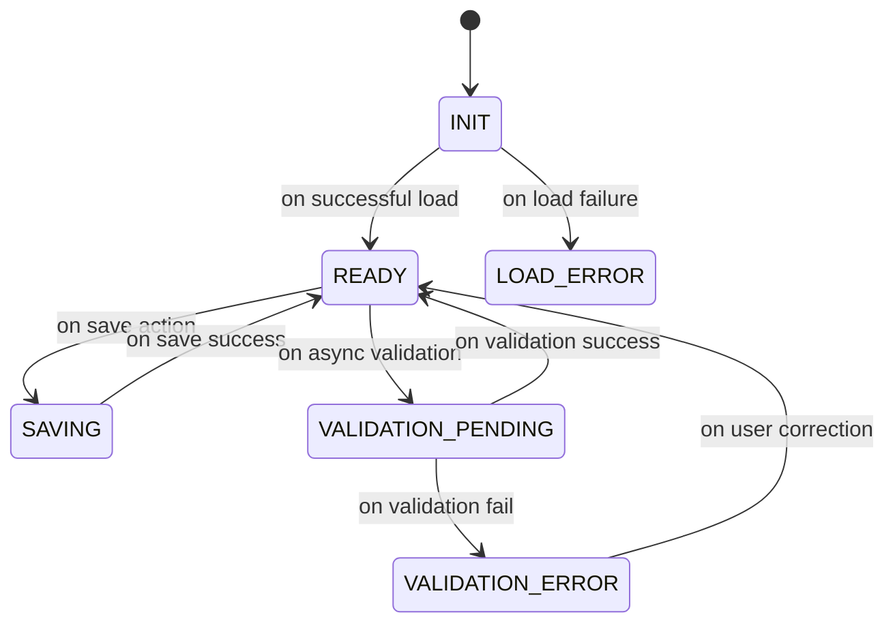
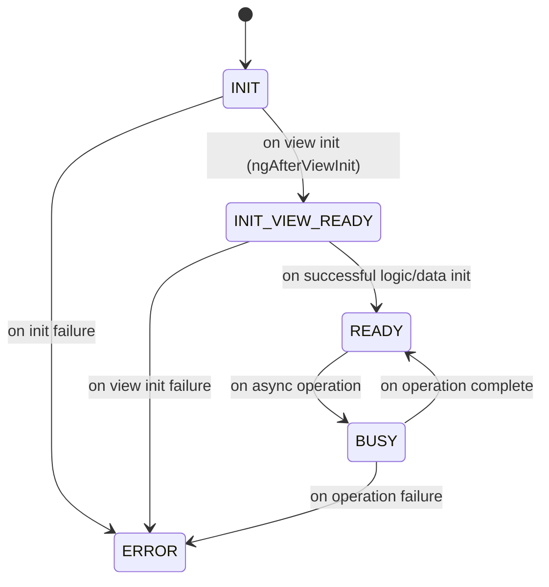

# Form Status Lifecycle Overview

This document describes the status lifecycle for both `FormComponent` and `FormFieldBaseComponent` in the ReDBox Portal Angular application. It covers the meaning, transitions, and usage of each status, providing a reference for developers working with dynamic forms.

---

## 1. FormComponent Status Lifecycle

The `FormComponent` manages the overall form state. Its status is tracked using the `FormStatus` enum:

```typescript
export enum FormStatus {
  INIT = "INIT",
  READY = "READY",
  SAVING = "SAVING",
  VALIDATION_ERROR = "VALIDATION_ERROR",
  LOAD_ERROR = "LOAD_ERROR",
  VALIDATION_PENDING = "VALIDATION_PENDING",
}
```

### Status Meanings & Transitions

- **INIT**: The form is initializing (dependencies, config, or data are loading).
- **READY**: The form is fully loaded, all components are initialized, and user interaction is enabled.
- **SAVING**: The form is in the process of saving data (e.g., after a user submits or autosave triggers).
- **VALIDATION_ERROR**: The form failed validation; errors are present and must be resolved before saving.
- **LOAD_ERROR**: The form failed to load (e.g., due to network or config errors).
- **VALIDATION_PENDING**: The form is waiting for async validation to complete (e.g., server-side checks).

Note that any errors that occur during save will not result in any form-specific error state. Any consumers can listen and react to the 'FormComponent.saveResponse' value to display any errors and/or modify statuses.

#### Typical Lifecycle Flow


---

## 2. FormFieldBaseComponent Status Lifecycle


Each form field or layout component extends `FormFieldBaseComponent`, which tracks its own status using the `FormFieldComponentStatus` enum:

```typescript
export enum FormFieldComponentStatus {
  INIT = "INIT",
  INIT_VIEW_READY = "INIT_VIEW_READY", // Indicates the view has been initialized and ready for DOM manipulations
  READY = "READY",
  BUSY = "BUSY",
  ERROR = "ERROR",
}
```

### Status Meanings & Transitions

- **INIT**: The component is being constructed and initialized (logic, config, and dependencies).
- **INIT_VIEW_READY**: The component's view (template) has been initialized and is ready for DOM manipulations (e.g., `ngAfterViewInit` has run). This is a transitional state before the component is fully ready.
- **READY**: The component is fully initialized and ready for user interaction.
- **BUSY**: The component is performing an async operation (e.g., loading data, validating input).
- **ERROR**: The component failed to initialize or encountered a runtime error.

#### Typical Lifecycle Flow



---

## 3. Status Propagation & Error Handling

- The `FormComponent.status` reflects the form-specific status, and is an aggregate of the child components' `FormFieldBaseComponent.status` as well as any other dependencies, services, etc. required by `FormComponent`
- The `FormComponent.formGroupStatus` reflects the aggregate state of all child components' models. It is a composition of the Angular framework's `AbstractControl` status-related properties.
- If any `FormFieldBaseComponent` enters `ERROR`, the parent form may transition to `LOAD_ERROR` or display error UI.
- Status transitions are managed via Angular signals and are observable for UI updates and debugging.

---

## 4. References

- `FormComponent`: `redbox-portal/angular/projects/researchdatabox/form/src/app/form.component.ts`
- `FormFieldBaseComponent`: `redbox-portal/angular/projects/researchdatabox/portal-ng-common/src/lib/form/form-field-base.component.ts`
- Status enums: `redbox-portal/packages/sails-ng-common/src/status.model.ts`

---

*Last updated: 11 September 2025*
