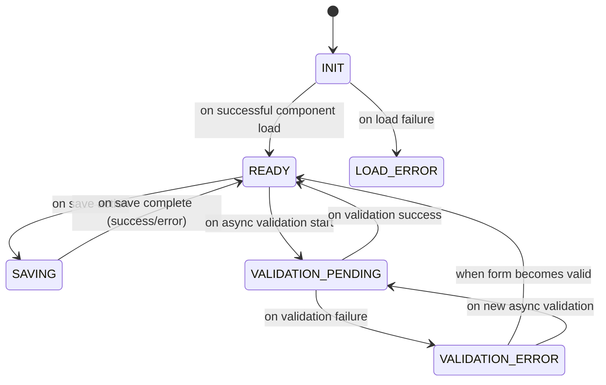
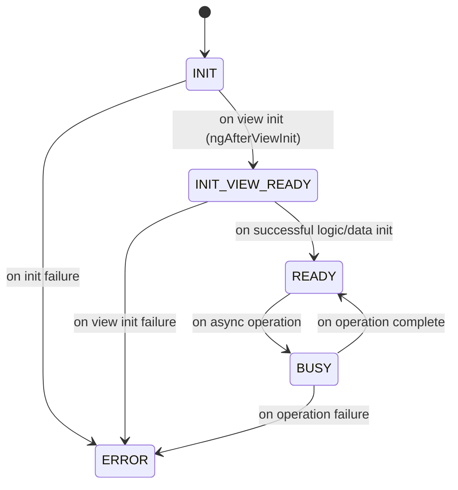

# Form Status Lifecycle Overview

This document describes the status lifecycle for both `FormComponent` and `FormFieldBaseComponent` in the ReDBox Portal Angular application. It covers the meaning, transitions, and usage of each status, providing a reference for developers working with dynamic forms.

---

## 1. FormComponent Status Lifecycle

The `FormComponent` manages the overall form state. Its status is tracked using the `FormStatus` enum:

```typescript
export enum FormStatus {
  INIT = "INIT",
  READY = "READY",
  SAVING = "SAVING",
  VALIDATION_ERROR = "VALIDATION_ERROR",
  LOAD_ERROR = "LOAD_ERROR",
  VALIDATION_PENDING = "VALIDATION_PENDING",
}
```

### Status Meanings & Transitions

- **INIT**: The form is initializing (dependencies, config, or data are loading).
- **READY**: The form is fully loaded, all components are initialized, and user interaction is enabled.
- **SAVING**: The form is in the process of saving data (e.g., after a user submits or autosave triggers).
- **VALIDATION_ERROR**: The form failed validation; errors are present and must be resolved before saving.
- **LOAD_ERROR**: The form failed to load (e.g., due to network or config errors).
- **VALIDATION_PENDING**: The form is waiting for async validation to complete (e.g., server-side checks).

**Important Notes:**
- Save errors do not result in form-specific error states. Consumers should listen to `FormComponent.saveResponse` to handle save errors.
- The form tracks both current and previous FormGroup status to enable sophisticated state transitions.
- Validation state changes are monitored via Angular signals effects for reactive status management.

#### Lifecycle Flow

The actual implementation includes more nuanced validation state handling:


---

## 3. Validation State Management Implementation

The FormComponent implements sophisticated validation state tracking using Angular signals and effects:

### Key Implementation Details

1. **Dual Status Tracking**: The form maintains both `formGroupStatus` and `previousFormGroupStatus` signals to detect state changes.

2. **Reactive State Transitions**: An Angular effect monitors validation state changes:
   ```typescript
   effect(() => {
     const formGroupStatus = this.formGroupStatus();
     const currentPending = formGroupStatus?.pending || false;
     const wasPending = this.previousFormGroupStatus()?.pending || false;
     const isValid = formGroupStatus?.valid || false;
     const wasValid = this.previousFormGroupStatus()?.valid || false;
     
     if (currentPending) {
       this.status.set(FormStatus.VALIDATION_PENDING);
     } else if (wasPending && !currentPending && this.status() === FormStatus.VALIDATION_PENDING) {
       this.status.set(FormStatus.READY);
     } else if (!isValid && !currentPending && wasPending && this.status() !== FormStatus.SAVING) {
       this.status.set(FormStatus.VALIDATION_ERROR);
     } else if (isValid && !wasValid && !currentPending && wasPending) {
       this.status.set(FormStatus.READY);
     }
     
     this.previousFormGroupStatus.set(formGroupStatus);
   });
   ```

3. **State Transition Logic**:
   - **VALIDATION_PENDING**: Set when `currentPending` is true
   - **READY**: Set when validation completes successfully (was pending, now not pending, and currently in VALIDATION_PENDING state)
   - **VALIDATION_ERROR**: Set when validation fails (form becomes invalid after being pending, but not during save)
   - **READY**: Set when form becomes valid after being invalid (recovery from validation error)

### Form vs FormGroup Status

- **FormComponent.status**: High-level form state (INIT, READY, SAVING, etc.)
- **FormComponent.formGroupStatus**: Reactive wrapper around Angular FormGroup status properties
- **FormComponent.previousFormGroupStatus**: Previous state for change detection

---

## 4. FormFieldBaseComponent Status Lifecycle


Each form field or layout component extends `FormFieldBaseComponent`, which tracks its own status using the `FormFieldComponentStatus` enum:

```typescript
export enum FormFieldComponentStatus {
  INIT = "INIT",
  INIT_VIEW_READY = "INIT_VIEW_READY", // Indicates the view has been initialized and ready for DOM manipulations
  READY = "READY",
  BUSY = "BUSY",
  ERROR = "ERROR",
}
```

### Status Meanings & Transitions

- **INIT**: The component is being constructed and initialized (logic, config, and dependencies).
- **INIT_VIEW_READY**: The component's view (template) has been initialized and is ready for DOM manipulations (e.g., `ngAfterViewInit` has run). This is a transitional state before the component is fully ready.
- **READY**: The component is fully initialized and ready for user interaction.
- **BUSY**: The component is performing an async operation (e.g., loading data, validating input).
- **ERROR**: The component failed to initialize or encountered a runtime error.

#### Typical Lifecycle Flow



### Component Initialization Process

The FormFieldBaseComponent follows a structured initialization process:

1. **Construction**: Component is created with `INIT` status
2. **View Initialization**: `ngAfterViewInit` triggers, sets `viewInitialised` signal
3. **Component Setup**: `initComponent()` method called with:
   - `setPropertiesFromComponentMapEntry()` - Set component properties
   - `buildPropertyCache()` - Cache configuration properties
   - `initData()` - Initialize data sources
   - `initLayout()` - Setup layout and CSS
   - `initEventHandlers()` - Setup event handling
   - `setComponentReady()` - Set status to `READY`

4. **Error Handling**: Any failure during initialization sets status to `ERROR`

---

## 5. Status Propagation & Error Handling

- The `FormComponent.status` reflects the form-specific status, and is an aggregate of the child components' `FormFieldBaseComponent.status` as well as any other dependencies, services, etc. required by `FormComponent`
- The `FormComponent.formGroupStatus` reflects the aggregate state of all child components' models. It is a composition of the Angular framework's `AbstractControl` status-related properties.
- If any `FormFieldBaseComponent` enters `ERROR`, the parent form may transition to `LOAD_ERROR` or display error UI.
- Status transitions are managed via Angular signals and are observable for UI updates and debugging.
- The FormComponent subscribes to FormGroup `statusChanges` to update the reactive `formGroupStatus` signal.

### Error Handling Strategy

- **Load Errors**: Component initialization failures result in `LOAD_ERROR` status
- **Validation Errors**: Form validation failures result in `VALIDATION_ERROR` status  
- **Save Errors**: Save operation failures do NOT change form status; instead, errors are available via `FormComponent.saveResponse` signal
- **Component Errors**: During init, individual component errors may propagate to form-level `LOAD_ERROR`


The implementation correctly separates concerns between form-level status and FormGroup validation status, allowing for sophisticated reactive state management.

---

## 6. References

- `FormComponent`: `redbox-portal/angular/projects/researchdatabox/form/src/app/form.component.ts`
- `FormFieldBaseComponent`: `redbox-portal/angular/projects/researchdatabox/portal-ng-common/src/lib/form/form-field-base.component.ts`
- Status enums: `redbox-portal/packages/sails-ng-common/src/status.model.ts`

---

*Last updated: 11 September 2025*
