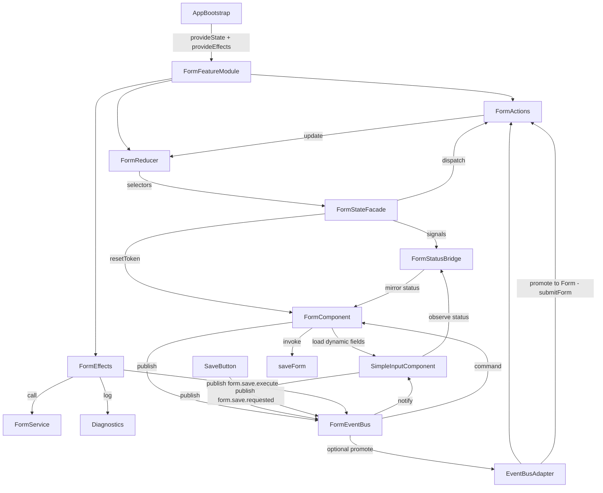

# Form Status & Events Management Design

## 1. Overview
This design introduces a global NgRx-powered form state, a signal-based facade, and a dedicated intra-form event bus that work alongside existing field components. The solution satisfies requirements R1–R16, keeps field internals untouched, and lets the current `FormComponent` delegate orchestration without losing its dynamic component loading or signals-based ergonomics.

Key decisions required to address open questions (future iterations):
- Q1 Save success feedback stays minimal: the facade updates `lastSavedAt` and can trigger an optional toast whose duration is handled in the consuming UI—no extra status value is introduced.
- Q2 Parallel submit calls remain debounced at the effect layer using `exhaustMap`; attempts while `status === SAVING` are ignored after logging a diagnostics trace.
- Q3 Draft persistence stays out of scope for this iteration, but the `meta` bag and `captureModelSnapshot` helper purposely keep the door open for a future `draft.save` effect that writes to local storage.

## 2. Architecture
### 2.1 Runtime flow


### 2.2 Module wiring (R1.1–R1.3, R14.1)
- `FormFeatureModule` exposes `provideFormFeature()` returning `EnvironmentProviders` registering `provideState({ name: 'form', reducer })` and `provideEffects([FormEffects, FormEventBusAdapterEffects])`.
- Consumers (e.g., `FormModule`) call `bootstrapApplication` / `importProvidersFrom` to add the feature without side-effect imports, keeping the bundle tree-shakeable.
- All feature artifacts live under `angular/projects/researchdatabox/form/src/app/form-state/` so the facade, bridge, effects, and event bus stay colocated with the form app (R14.3).

### 2.3 Layering and ownership (R14.3)
1. `form-state/state/` for actions, reducer, selectors.
2. `form-state/effects/` for NgRx effects referencing actions, selectors, and services only.
3. `form-state/facade/` for the facade and signal bridge consuming selectors/effects.
4. `form-state/events/` for the event bus and promotion adapter, isolated from the store except via tokens.
5. `FormComponent` and field components under `src/app/` consume the facade and event bus.

## 3. Components & Interfaces
### 3.1 Actions (R3.1, R4.1)
- `loadInitialData`, `loadInitialDataSuccess`, `loadInitialDataFailure`.
- `submitForm`, `submitFormSuccess`, `submitFormFailure`.
- `resetAllFields`, `resetAllFieldsIgnored`, `ackError`, `markDirty`, `markPristine`.
- Validation lifecycle: `formValidationPending`, `formValidationSuccess`, `formValidationFailure`.
- Diagnostics: `recordModelSnapshot`, `setMetaPatch`, `setPendingAction`, `clearPendingAction`.
- Event promotions: `[Form] Dependency Evaluated`, `[Form] Validation Broadcast` etc. created exclusively by the adapter (R15.23).

### 3.2 Reducer & selectors (R2.1–R2.14, R6.1–R6.2)
- Reducer is pure, generated via `createReducer` and action handlers. It maintains serializable `FormFeatureState`.
- Selectors
  - Primitive: `selectStatus`, `selectInitialDataLoaded`, `selectIsDirty`, `selectError`, `selectPendingActions`, `selectResetToken`, `selectSubmissionAttempt`.
  - Derived/memoized: `selectIsInitializing`, `selectIsSaving`, `selectCanSubmit`, `selectDiagnostics` (packages status, pendingActions length, lastSavedAt delta).
- Computed groups (R10.1) combine frequently accessed slices into `selectBridgeSnapshot` consumed by facade to limit recompute pressure.

### 3.3 Effects (R4.2–R4.7, R5.1–R5.4, R10.3, R11.1–R11.4)
- `loadInitialData$`: `switchMap` to `FormService.downloadFormComponents` honoring INIT guard; success dispatches ready state and writes `modelSnapshot` for diffing.
- `submitForm$`: `exhaustMap` to `RecordService.save` (or `FormService.submit`). Adds action id to `pendingActions`, emits success/failure, updates `lastSavedAt`, and logs via `LoggerService`. Additionally, a non-dispatching command effect publishes `form.save.execute` to instruct `FormComponent` to run `saveForm` when orchestration requires component-driven code paths. No new state fields are introduced by this flow.
- `resetAllFields$`: `filter` to skip when `status === SAVING` (R2.10) else increments `resetToken` and optionally notifies event bus via `form.reset` event for manual listeners.
- Validation effects translate facade dispatches into state transitions while respecting `status === SAVING` guard (R2.14, R4.6).
- Error channel centralizes sanitization and ensures `ackError` resets `error`.
- `FormEventBusAdapterEffects`: listens to promotion-worthy events (criteria a–c) using `auditTime(250ms)` to dedupe (R15.20–R15.28). Logging toggled by `environment.devTools`.

### 3.4 FormStateFacade (Bridge) (R7.1–R7.6, R8.1–R8.7, R16.2–R16.15)
- Provides readonly signals `status()`, `isInitializing()`, `isSaving()`, `isDirty()`, `error()`, `pendingActions()`, `resetToken()` via `toSignal(store.select(selector), { initialValue })`.
- Imperative API: `loadInitialData(opts)`, `submitForm(payload)`, `resetAllFields(reason)`, `ackError()`, `setMetaPatch(updates)`, `markDirty()`, `markPristine()`.
- Snapshot helpers: `captureModelSnapshot(formGroup)` and `diffModel(formGroup)` to support optional dirty diffing (Q1, R8.6).
- Provides `observeStatus()` returning a `Signal<FormStatus>` for child components (R16.14) and `status$` observable for compatibility.
- Handles bridging of `FormComponent.status` by subscribing to `status()` and writing via the adapter (R16.4, R16.15) while ignoring external writes to maintain single source of truth.

### 3.5 Status signal bridge (R7.7, R16.4, R16.17)
- `FormStatusSignalBridge` injects the facade and exposes
  - `readonly status = toSignal(facade.status$)`
  - `readonly isSaving = computed(() => status() === FormStatus.SAVING)` etc.
- Provides `bindTo(component: { status: WritableSignal<FormStatus> })` helper used by `FormComponent` to mirror store status without manual subscription.
- Enforces lint rule for direct mutations by exporting `FORM_STATUS_WRITE_GUARD` token consumed in ESLint rule (R16.17, future implementation).

### 3.6 FormComponentEventBus (R15.1–R15.19)
- Implemented with a map of `ReplaySubject` (size 0 or 1) keyed by event type, lazily created.
- API:
  ```ts
  publish<T extends FormComponentEvent>(event: T): void;
  select$<T extends FormComponentEvent["type"]>(type: T): Observable<FormComponentEventMap[T]>;
  selectSignal<T extends FormComponentEvent["type"]>(type: T, options?): Signal<FormComponentEventMap[T] | null>;
  scoped(channelId: string): ScopedEventBus;
  ```
- Takes `DestroyRef` to auto-clean subscriptions (R15.8) and batches emission with `queueMicrotask` when `eventLoopBatching` flag enabled (R15.19).
- Canonical event naming documented inside README snippet, and helper factories (`createFieldValueChangedEvent`) exported via facade (R15.15–R15.17).
- Promotion adapter subscribes to high-value events (dependency triggers, validation broadcast, save-request) and dispatches actions only when criteria are met (R15.20–R15.29). `form.save.requested` is promoted to `[Form] submitForm`.

### 3.7 `FormComponent` integration (R16.1–R16.16)
- Constructor injects `FormStateFacade`, `FormStatusSignalBridge`, and `FormComponentEventBus` via providers.
- `initComponent` dispatches `loadInitialData` instead of directly mutating `status`; effect success updates `componentsLoaded` signal (maintained locally).
- `saveForm` no longer receives direct invocations from `SaveButton`. Instead, `SaveButton` publishes `form.save.requested`; the adapter promotes it to `submitForm`; an effect publishes `form.save.execute`, which the `FormComponent` subscribes to and then calls `saveForm(force, targetStep, skipValidation)`. This preserves existing component logic without adding state fields.
- Legacy consumers may continue calling `formComponent.saveForm(...)` directly for custom workflows; the method remains public and retains its behaviour for compatibility. UI buttons must publish `form.save.requested` rather than invoking the method to stay aligned with the event-driven flow.
- FormGroup status `effect` now dispatches validation lifecycle actions rather than toggling `status` locally (R16.3).
- Reset button uses `facade.resetAllFields('user-request')`. Field components continue to watch `resetToken()` and remain store-agnostic.
- Existing template bindings keep using `status()` via injected bridge; fallback default value ensures optional components do not throw (R14.4).

### 3.8 Documentation & diagnostics (R11.4, R13.1–R13.3)
- README snippet (to be produced later) documents how to inject facade/event bus.
- `selectDiagnostics` feeds devtools panel with status timeline, pending action ids, and last promoted events.
- Optional `FormStateDebugPanelComponent` (lazy-loaded only in dev) consumes the facade for real-time inspection, aiding time-travel debugging while respecting SSR constraints (no direct DOM access unless `isPlatformBrowser`).

## 4. Data models (R2.1–R2.14)
```ts
export interface FormFeatureState {
  status: FormStatus;
  initialDataLoaded: boolean;
  isDirty: boolean;
  lastSavedAt?: string;
  error?: string | null;
  pendingActions: string[];
  resetToken: number;
  submissionAttempt: number;
  meta?: Record<string, unknown>;
  modelSnapshot?: unknown;
}
```
- `FormStatus` enum reuses existing values (`INIT`, `READY`, `SAVING`, `VALIDATION_PENDING`, `VALIDATION_ERROR`, `LOAD_ERROR`).
- `pendingActions` stores unique ids (e.g., `'submit'`) added/removed by effects to support debugging and gating (R4.2, R4.6).
- `modelSnapshot` holds last persisted form value; facade may trim large blobs via configurable selector before storing.
- `meta` designed for additive future fields (draft metadata, step info) without breaking minified builds (R2.4, R4.5).

## 5. Error handling & recovery (R5.1–R5.4, R11.1–R11.3)
- All effect try/catch blocks sanitize errors via shared `toUserSafeError(error)` helper returning `[message, diagnostics]` tuple.
- Failures populate `error` and emit `FormEventBus` message `form.error.changed` for interested components while keeping reducer pure.
- `ackError` clears `error` and resets `form.error.changed` to `null` (event bus sends completion event).
- Load failures leave form in `LOAD_ERROR`; `FormComponent` shows retry UI calling `facade.loadInitialData()` again (R2.7, R16.2).
- Validation failures respect `status === SAVING` guard, ensuring that background validation cannot overwrite active save state (R2.11, R2.14).

## 6. Testing strategy (R12.1–R12.5, AC24–AC59)
- **Reducer tests**: cover INIT, load, submit, reset, validation, dirty/pristine transitions. Snapshot tests ensure unknown actions return current state (R12.1, AC22).
- **Selector tests**: verify memoization and derived logic (`isInitializing`, `diagnostics`) using repeated calls (R6.2).
- **Effects tests**: use `provideMockActions` with marble testing; mock `FormService`, `RecordService`, and event bus. Include success/failure for load/submit, gating logic, and promotion dedupe (R12.2, AC24, AC42).
- **Facade tests**: run under `fakeAsync`, assert signals reflect store updates, dirty diff helper behavior, and method dispatches (R12.3, AC18–AC21).
- **Event bus tests**: ensure publish/subscribe ordering, scoped channels, Signal API, diagnostics toggle, and O(1) publish cost (R15.11, AC27–AC36).
- **Promotion adapter tests**: simulate each criterion (a–c) ensuring single dispatch with throttling and diagnostic logging (R15.29, AC37–AC41).
- **Integration tests**: boot real `FormComponent` with `TestBed`, stub HTTP/services, assert INIT → READY transition, validation action dispatch, and absence of direct `status.set` calls (R16.12, AC52–AC59).
- **Performance harness**: lightweight benchmark verifies added latency for promoted events remains <1ms median (AC41).

## 7. Non-functional considerations
- **Performance (R10.1–R10.4)**: selectors grouped to reduce recomputation; effects throttle duplicate submissions; reset guard avoids redundant work; event bus batching optional.
- **Security & Safety (R5.4, R11.1)**: effects sanitize server errors, avoid leaking stack traces, and rely on server APIs already authenticated via existing interceptors.
- **SSR compatibility (R14.2)**: facade defers to Angular injectors without touching `window`; diagnostics panel loads only in browser checks.
- **Tree shaking (R14.1)**: feature exports provider factory; unused diagnostics/event bus promotion tree-shaken when not imported.
- **Extensibility (R2.4, R7.6, R15.27)**: meta bag, optional adapter, and scoped event bus allow incrementally adding features like step navigation or collaborative cues.

## 8. Traceability
| Design area | Requirements |
|-------------|--------------|
| Architecture & wiring | R1.*, R14.* |
| Reducer & selectors | R2.*, R6.* |
| Effects | R3.*, R4.*, R5.*, R10.*, R11.* |
| Facade & bridge | R7.*, R8.*, R16.* |
| Event bus & adapter | R15.* |
| Testing strategy | R12.*, AC24–AC59 |
| Documentation & diagnostics | R11.4, R13.*, R15.26 |
