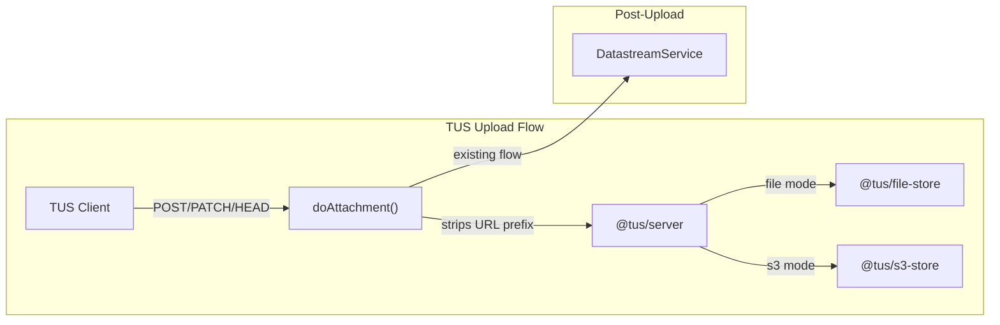

# TUS Server Upgrade: `tus-node-server` → `@tus/server`

Upgrade the server-side TUS resumable upload implementation from the deprecated `tus-node-server` (^0.9.0) to the modular `@tus/server` ecosystem.

> [!NOTE]
> **Scope**: Server-side only. Client-side TUS code, UI, and Flydrive adapter are out of scope for this phase.

---

## Architecture Overview



---

## API Compatibility Assumptions

| Method | Purpose | Expected Status | Key Headers |
|--------|---------|----------------|-------------|
| POST | Create upload | 201 | `Location`, `Tus-Resumable: 1.0.0` |
| PATCH | Send chunk | 204 | `Upload-Offset`, `Tus-Resumable` |
| HEAD | Check offset (resume) | 200 | `Upload-Offset`, `Upload-Length` |
| OPTIONS | Discover extensions | 204 | `Tus-Extension`, `Tus-Version` |

> [!NOTE]
> **DELETE/Termination**: `@tus/server` supports the termination extension by default. We will set `disableTerminationForFinishedUploads: true` since our upload lifecycle is managed by `DatastreamService` post-completion. DELETE is **not** exposed in our routes and is not tested.

> [!NOTE]
> **HEAD for resume**: `@tus/server` handles HEAD requests natively for offset checks. The current `doAttachment()` routes all HTTP methods through `tusServer.handle()`, so HEAD resume flows work without special handling.

---

## Proposed Changes

### Dependencies

#### [MODIFY] [package.json](file:///Users/andrewbrazzatti/source/github/redbox-portal/packages/redbox-core-types/package.json)

```diff
- "tus-node-server": "^0.9.0",
+ "@tus/server": "^2.3.0",
+ "@tus/file-store": "^2.0.0",
+ "@tus/s3-store": "^2.0.1",
```

---

### Configuration

#### [MODIFY] [record.config.ts](file:///Users/andrewbrazzatti/source/github/redbox-portal/packages/redbox-core-types/src/config/record.config.ts)

Restructure `RecordAttachmentsConfig` with storage-specific subobjects:

```diff
 export interface RecordAttachmentsConfig {
-    stageDir: string;
     path: string;
+    store?: 'file' | 's3';
+    file?: {
+        directory: string;         // staging directory (was stageDir)
+    };
+    s3?: {
+        bucket: string;
+        region: string;
+        accessKeyId?: string;      // falls back to AWS SDK defaults
+        secretAccessKey?: string;
+        endpoint?: string;         // for S3-compatible services
+        partSize?: number;         // default: 8MB
+    };
+    /** @deprecated Use file.directory instead. Read as fallback for backward compat. */
+    stageDir?: string;
 }
```

Default values:

```diff
 attachments: {
-    stageDir: '/attachments/staging',
-    path: '/attach'
+    path: '/attach',
+    store: 'file',
+    file: {
+        directory: '/attachments/staging'
+    }
 }
```

#### Config Migration

> [!WARNING]
> The `stageDir` field is deprecated in favor of `file.directory`. To ease migration, the validation code will read `stageDir` as a fallback if `file.directory` is not set:
> ```ts
> const dir = attachConfig.file?.directory ?? attachConfig.stageDir;
> ```
> This provides backward compatibility for any env config files that still use `stageDir`. A deprecation warning will be logged at startup if the fallback is used.

**Known env files to update** (non-exhaustive — grep for `stageDir` in `config/`):
- `config/env/integrationtest.js` (line 98)
- Any deployment-specific overrides

#### Config Validation (at bootstrap)

| `store` | `file.directory` or `stageDir` | `s3` block | Result |
|---------|-------------------------------|-----------|--------|
| `'file'` (default) | present | — | ✅ FileStore |
| `'file'` | **missing** | — | ❌ Fail: `"file.directory required"` |
| `'s3'` | — | bucket + region present | ✅ S3Store |
| `'s3'` | — | **incomplete** | ❌ Fail: `"s3.bucket and s3.region required"` |

> [!IMPORTANT]
> Validation runs in the controller's `bootstrap()` method (called at app lift), **not** lazily on first request. This ensures config errors surface immediately at startup rather than on the first upload attempt.

---

### RecordController TUS Refactoring

#### [MODIFY] [RecordController.ts](file:///Users/andrewbrazzatti/source/github/redbox-portal/packages/redbox-core-types/src/controllers/RecordController.ts)

**1. Imports** (line 39)
```diff
- import * as tus from 'tus-node-server';
+ import { Server as TusServer, EVENTS } from '@tus/server';
+ import type { Upload } from '@tus/server';
+ import { FileStore } from '@tus/file-store';
```

**2. Type-safe request extension** (new, near top of file)

```ts
interface TusRequestExtension {
  _tusBaseUrl?: string;
  _tusOriginalUrl?: string;
}
```

**3. Property type** (line 890)
```diff
- protected tusServer: tus.Server | null = null;
+ protected tusServer: TusServer | null = null;
```

**4. `bootstrap()` — early validation** (line 119)

Move config validation into `bootstrap()` so errors surface at app lift:

```ts
public bootstrap() {
  const attachConfig = sails.config.record.attachments;
  const storeType = attachConfig.store ?? 'file';

  if (storeType === 'file') {
    const dir = attachConfig.file?.directory ?? attachConfig.stageDir;
    if (!dir) {
      throw new Error('record.attachments.file.directory is required when store is "file"');
    }
    if (attachConfig.stageDir && !attachConfig.file?.directory) {
      sails.log.warn('DEPRECATED: record.attachments.stageDir — use record.attachments.file.directory instead');
    }
  } else if (storeType === 's3') {
    if (!attachConfig.s3?.bucket || !attachConfig.s3?.region) {
      throw new Error('record.attachments.s3.bucket and s3.region are required when store is "s3"');
    }
  }
}
```

**5. `initTusServer()` refactoring** (lines 892–916)

```ts
protected initTusServer() {
  if (this.tusServer) return;

  const attachConfig = sails.config.record.attachments;
  const storeType = attachConfig.store ?? 'file';

  let datastore;
  if (storeType === 's3') {
    const { S3Store } = require('@tus/s3-store');
    datastore = new S3Store({
      partSize: attachConfig.s3!.partSize || 8 * 1024 * 1024,
      s3ClientConfig: {
        bucket: attachConfig.s3!.bucket,
        region: attachConfig.s3!.region,
        credentials: attachConfig.s3!.accessKeyId ? {
          accessKeyId: attachConfig.s3!.accessKeyId,
          secretAccessKey: attachConfig.s3!.secretAccessKey!,
        } : undefined,
        endpoint: attachConfig.s3!.endpoint,
      },
    });
  } else {
    const dir = attachConfig.file?.directory ?? attachConfig.stageDir!;
    if (!fs.existsSync(dir)) {
      fs.mkdirSync(dir, { recursive: true });
    }
    datastore = new FileStore({ directory: dir });
  }

  this.tusServer = new TusServer({
    path: attachConfig.path,
    datastore,
    respectForwardedHeaders: true,
    disableTerminationForFinishedUploads: true,
    generateUrl(req, { proto, host, path, id }) {
      const tusReq = req as unknown as TusRequestExtension;
      const baseUrl = (tusReq._tusBaseUrl ?? '').replace(/\/+$/, '');
      const cleanPath = path.startsWith('/') ? path : `/${path}`;
      return `${proto}://${host}${baseUrl}${cleanPath}/${id}`;
      // Example: https://example.com/default/rdmp/record/abc123/attach/deadbeef
    },
  });

  this.tusServer.on(EVENTS.POST_FINISH, (_req, _res, upload: Upload) => {
    sails.log.verbose(`::: TUS upload completed: id=${upload.id}, size=${upload.size}`);
  });
  this.tusServer.on(EVENTS.POST_CREATE, (_req, _res, upload: Upload) => {
    sails.log.verbose(`::: TUS upload created: id=${upload.id}`);
  });
}
```

**6. `doAttachment()` URL stripping** (lines 927–1032)

Safe URL stripping using `startsWith` + `slice`:

```ts
// URL stripping contract:
// 1. Compute prefix (e.g. "/default/rdmp/record/abc123")
// 2. Guard with startsWith — only strip if prefix matches
// 3. Store original URL and base for generateUrl
// 4. tusServer.handle() owns the response — no post-handle restoration needed

const brand = BrandingService.getBrandAndPortalPath(req);
const oid = req.param('oid');
const prefix = `${brand}/record/${oid}`;

const tusReq = req as unknown as TusRequestExtension;
tusReq._tusOriginalUrl = req.url;
tusReq._tusBaseUrl = prefix;

if (req.url.startsWith(prefix)) {
  req.url = req.url.slice(prefix.length);  // '/attach' or '/attach/:id'
}

this.tusServer!.handle(req, res);
```

**Disk-space threshold**: When `store === 's3'`, the disk-space check is skipped — S3 manages its own capacity.

**S3 local buffering**: `@tus/s3-store` streams multipart parts directly to S3 without local disk buffering. It holds at most `maxConcurrentPartUploads` (default 60) × `partSize` (default 8 MiB) ≈ 480 MiB of in-flight data in memory. No local temp files are created by the S3 store.

**7. `getTusMetadata()`** (lines 918–925) — No change.

---

### Environment Config Updates

#### [MODIFY] [integrationtest.js](file:///Users/andrewbrazzatti/source/github/redbox-portal/config/env/integrationtest.js)

```diff
 record: {
     attachments: {
-        stageDir: "/opt/redbox-portal/attachments"
+        file: {
+            directory: "/opt/redbox-portal/attachments"
+        }
     }
 }
```

---

## Error Handling & Observability

| Event | Logged | Sensitive data |
|-------|--------|----------------|
| `POST_CREATE` | Upload ID | None |
| `POST_FINISH` | Upload ID, size | None |
| Config validation failure | Missing field name | No credentials |
| Permission denied | OID, username | None |
| Disk space exceeded | Threshold, free, file size | None |
| Deprecated `stageDir` used | Warning message | None |

`@tus/server` returns standard TUS error responses (400, 404, 409, 413) for protocol violations. These flow directly to the client. `onResponseError` hook available for custom mapping if needed later.

---

## Summary of Changes

| File | Change | Risk |
|------|--------|------|
| `package.json` | Replace `tus-node-server` with `@tus/server` ^2.3.0 + stores | Low |
| `record.config.ts` | Restructure config, `stageDir` deprecated with fallback | Low |
| `RecordController.ts` | Imports, `bootstrap()` validation, `initTusServer()`, `doAttachment()` | **Medium** |
| `integrationtest.js` | `stageDir` → `file.directory` | Low |
| Bruno tests | May need tweaks for header/response differences | Low |

---

## Verification Plan

```bash
npm run test:mocha
```

### Happy-Path Checklist

- [ ] TUS POST → 201 with correct `Location` (full `/:branding/:portal/record/:oid/attach/:id`)
- [ ] TUS PATCH → 204, file uploaded
- [ ] TUS HEAD → 200 with correct `Upload-Offset` (resume)
- [ ] `Location` URL usable for subsequent PATCH
- [ ] Attachment metadata saves on record
- [ ] File download returns correct content + mime type
- [ ] `pending-oid` upload works (no permission check)
- [ ] Disk space check works for `store: 'file'`

### Non-Happy-Path Checklist

- [ ] Missing `Tus-Resumable` header → 412 Precondition Failed
- [ ] Mismatched `Upload-Offset` → 409 Conflict
- [ ] Non-existent upload ID → 404 Not Found
- [ ] Unauthorized user → permission denied before TUS handles
- [ ] Malformed `Upload-Metadata` (invalid base64) → 400 Bad Request
- [ ] OPTIONS request → 204 with `Tus-Version`, `Tus-Extension` headers

---

## Rollback Procedure

1. Revert `package.json` to `"tus-node-server": "^0.9.0"`
2. Revert `RecordController.ts` (imports, `initTusServer()`, `doAttachment()`)
3. Revert `record.config.ts` to `stageDir`/`path` shape
4. Revert env config files
5. `npm install` → `npm run test:mocha`

The staging directory is the same physical location, so in-progress uploads from the old server will be orphaned but harmless. `DatastreamService` (final storage) is unaffected.
