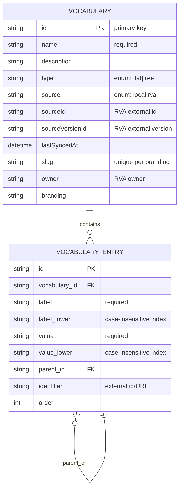

# Vocabulary Management Design

## 1. rva-registry Package
- **Purpose**: Provide a TypeScript client library for Research Vocabularies Australia (RVA) APIs used by the `RvaImportService`.
- **Shape**: A standalone package (like `raido`) generating a typed client from RVA's OpenAPI JSON. Place under `packages/rva-registry` with generated code in `src/generated` and a small wrapper in `src/index.ts`.
- **Generation & CI**:
  - Use `openapi-generator` or `swagger-typescript-api` to generate a TypeScript client from RVA's OpenAPI JSON.
  - Add npm scripts: `generate`, `build`, `test` and CI steps to regenerate when the OpenAPI spec updates.
- **Public surface (examples)**:
  - `searchVocabularies(query: string): Promise<RvaVocabularySummary[]>`
  - `getVocabularyById(id: string): Promise<RvaVocabularyDetail>`
  - `getVersionArtefactConceptTree(versionId: string): Promise<RvaConceptTree>`
- **Integration**: Import/use the wrapper in `RvaImportService`; prefer dependency injection where possible.
- **File locations**: `packages/rva-registry/`

## 2. Data Model (Waterline Models)
- **Purpose and scope**: Store vocabularies and their entries to support both local management and RVA imports.
- **New/changed models and attributes**:
    - **`Vocabulary`** (`packages/redbox-core-types/src/waterline-models/Vocabulary.ts`):
        - `name`: string (required)
        - `description`: string
        - `type`: string (enum: 'flat', 'tree', default 'flat')
        - `source`: string (enum: 'local', 'rva', default 'local')
        - `sourceId`: string (external ID for RVA)
        - `sourceVersionId`: string (optional, last imported RVA version)
        - `lastSyncedAt`: datetime (optional)
        - `slug`: string (auto-generated from name, unique per branding)
        - `owner`: string (optional, for RVA owner)
        - `branding`: string (link to branding)
    - **`VocabularyEntry`** (`packages/redbox-core-types/src/waterline-models/VocabularyEntry.ts`):
        - `vocabulary`: association to `Vocabulary` (required)
        - `label`: string (required)
        - `labelLower`: string (normalized lowercase for case-insensitive uniqueness)
        - `value`: string (required, the actual value/URI)
        - `valueLower`: string (normalized lowercase for case-insensitive uniqueness)
        - `parent`: association to `VocabularyEntry` (optional, for hierarchy)
        - `identifier`: string (optional, external URI/ID)
        - `order`: number (for sorting)
- **Relationships and indexes**: 
    - `Vocabulary` has many `VocabularyEntry`.
    - `VocabularyEntry` belongs to `Vocabulary`.
    - Self-referencing `VocabularyEntry` (parent/children).
    - Unique `(source, sourceId)` when `source = rva` to prevent duplicate imports.
    - Unique `(branding, slug)` to scope slug uniqueness per branding.
    - Case-insensitive uniqueness enforced per vocabulary:
        - Unique `(vocabulary, labelLower)`
        - Unique `(vocabulary, valueLower)`
- **Validation**:
    - `name` required for Vocabulary.
    - `label`, `value` required for Entry.
    - `type` required; allowed values: `flat`, `tree`. If `type = flat`, entries must not have `parent`.
    - `label` and `value` must be unique per vocabulary (case-insensitive).
    - `sourceId` required when `source = rva`.
    - `parent` (if provided) must belong to the same vocabulary.
    - Prevent cycles and self-parenting in `VocabularyEntry` hierarchy.
    - `slug` auto-generated from `name` if not provided; must be unique per branding.
- **Access control**: Admin only for all endpoints in MVP. Read access for non-admin users will be designed later with record-form integration (no public read API yet).
- **Branding scope**: Admin is not multi-brand; vocabularies are managed within a single branding context.
- **File locations**: `packages/redbox-core-types/src/waterline-models/`



Notes:
- Unique constraints (enforced at application/db level): `(branding, slug)`, `(vocabulary, label_lower)`, `(vocabulary, value_lower)`.
- RVA uniqueness: `(source, sourceId)` when `source = rva`.

## 3. Services Layer (Business Logic)
- **Service responsibilities**:
    - **`VocabularyManagementService`**: CRUD for vocabularies and entries. Handling hierarchy (tree retrieval), normalization, validation (same-vocab parent, cycle detection), and delete cascade for entries.
    - **`RvaImportService`**: Fetch vocabularies from RVA, map to local models, create/update (idempotent sync).
- **Public methods**:
    - `VocabularyManagementService.create(data)`, `update(id, data)`, `delete(id)`, `getTree(vocabId)`.
    - `VocabularyManagementService.normalizeEntry(entry)` (lowercases `label/value` for uniqueness checks).
    - `VocabularyManagementService.validateParent(entry)` (same vocab, no cycles).
    - `RvaImportService.searchRva(query)`, `importRvaVocabulary(rvaId, versionId)`, `syncRvaVocabulary(rvaId, versionId)`.
- **Dependencies**: 
    - `RvaImportService` depends on `rva-registry` client and `VocabularyManagementService`.
- **File locations**: 
    - `packages/redbox-core-types/src/services/VocabularyManagementService.ts`
    - `packages/redbox-core-types/src/services/RvaImportService.ts`
- **Service conventions**: Extend `Services.Core.Service`, use `_exportedMethods`, `init()`, RxJS, model globals.

## 4. Webservice Controllers (REST API)
- **Endpoint list**:
    - `GET /api/vocabulary` (list, with pagination/filtering)
    - `GET /api/vocabulary/:id` (get details + tree)
    - `POST /api/vocabulary` (create)
    - `PUT /api/vocabulary/:id` (update)
    - `DELETE /api/vocabulary/:id` (delete, cascades entries)
    - `POST /api/vocabulary/import/rva` (trigger RVA import)
    - `POST /api/vocabulary/:id/sync` (trigger update/sync for an imported vocab)
- **Autonomy**: Admin only (`Auth.isAuthenticated`, `Auth.isAdmin`).
- **List behavior**:
    - Query params: `q` (search by name/slug), `type`, `source`, `limit`, `offset`, `sort`.
    - Response shape: `{ data: Vocabulary[], meta: { total, limit, offset } }`.
- **Get details behavior**:
    - Response shape: `{ vocabulary: Vocabulary, entries: VocabularyEntryTree[] }`.
- **Sync behavior**:
    - `POST /api/vocabulary/:id/sync` accepts optional `versionId`; defaults to latest if omitted.
    - Returns `{ updated, created, skipped }` counts and updates `lastSyncedAt`.
- **Response examples**:
    - `GET /api/vocabulary?limit=2&offset=0&type=tree`
      ```json
      {
        "data": [
          {
            "id": "vocab-1",
            "name": "Subjects",
            "slug": "subjects",
            "type": "tree",
            "source": "local"
          },
          {
            "id": "vocab-2",
            "name": "Languages",
            "slug": "languages",
            "type": "flat",
            "source": "rva",
            "sourceId": "rva-123",
            "sourceVersionId": "rva-123-v2",
            "lastSyncedAt": "2026-01-26T10:15:00.000Z"
          }
        ],
        "meta": { "total": 12, "limit": 2, "offset": 0 }
      }
      ```
    - `GET /api/vocabulary/vocab-1`
      ```json
      {
        "vocabulary": {
          "id": "vocab-1",
          "name": "Subjects",
          "slug": "subjects",
          "type": "tree",
          "source": "local"
        },
        "entries": [
          {
            "id": "entry-1",
            "label": "Science",
            "value": "science",
            "children": [
              {
                "id": "entry-2",
                "label": "Physics",
                "value": "physics",
                "children": []
              }
            ]
          }
        ]
      }
      ```
    - `POST /api/vocabulary/vocab-2/sync`
      ```json
      {
        "updated": 5,
        "created": 2,
        "skipped": 1,
        "lastSyncedAt": "2026-01-26T10:20:00.000Z"
      }
      ```
    - Validation error (example)
      ```json
      {
        "error": "ValidationError",
        "message": "Duplicate label/value within vocabulary (case-insensitive)."
      }
      ```
- **File locations**: `packages/redbox-core-types/src/controllers/webservice/VocabularyManagementController.ts`
- **Controller conventions**: Extend `Controllers.Core.Controller`.

## 5. Ajax Controllers (Controllers)
- **Endpoint list**:
    - `GET /admin/vocabulary/manager` (Renders the admin UI view)
    - Mirror endpoints for Angular app CRUD and import/sync (admin-only):
        - `GET /admin/vocabulary` (list, with pagination/filtering)
        - `GET /admin/vocabulary/:id` (get details + tree)
        - `POST /admin/vocabulary` (create)
        - `PUT /admin/vocabulary/:id` (update)
        - `DELETE /admin/vocabulary/:id` (delete, cascades entries)
        - `POST /admin/vocabulary/import` (trigger RVA import)
        - `POST /admin/vocabulary/:id/sync` (trigger RVA update/sync for an imported vocab)
- **File locations**: 
    - `packages/redbox-core-types/src/controllers/VocabularyManagementController.ts`
- **Conventions**: Render the container view for the Angular app.

## 6. Angular App(s)
- **Apps/modules**: `admin-vocabulary` module in `packages/redbox-portal/src/app/admin-vocabulary`.
- **Routes**: No Angular routing. Single view with internal state for List/Detail/Import.
- **Components**:
    - `VocabListComponent`: Table of existing vocabs.
    - `VocabDetailComponent`: Form for Vocab metadata + Tree view for entries when `type = tree`.
    - `VocabFlatComponent` (or conditional in detail view): Flat list editor when `type = flat`.
    - Tree/flat ordering: manual drag/drop updates `VocabularyEntry.order`.
    - `RvaImportComponent`: Search/List RVA vocabs + Import button.
- **Data flow**: Uses `HttpClientService` (or new `VocabularyApiService`) to talk to `/api/vocabulary`.
- **File locations**: `packages/redbox-portal/src/app/admin-vocabulary/`

[View mockup of the app](https://htmlpreview.github.io/?https://github.com/redbox-mint/redbox-portal/blob/feature/vocabulary-management/support/specs/vocabulary-management/wireframe.html)

## 7. Additional Views
- **View templates**: `packages/redbox-portal/views/admin/vocabulary.ejs`
- **Wiring**: `VocabularyAjaxController` returns this view.

## 8. Navigation Configuration
- **Menu**: Add "Vocabularies" under Admin menu.
- **File locations**: `packages/redbox-core-types/src/config/brandingConfigurationDefaults.config.ts`.

# Consistency Analysis
- **Flow**: User clicks Admin > Vocabularies -> `VocabularyManagementController` (Ajax) -> renders `admin/vocabulary.ejs` -> loads `admin-vocabulary` Angular app -> App fetches list from `VocabularyManagementController` (REST) -> Service loads from DB.
- **Checks**: 
    - RVA Client is ready (`rva-registry` package).
    - Models need to support arbitrary hierarchy -> `parent` field is sufficient, plus cycle checks in service.
    - `type = flat` should block parents and render flat controls only.
    - Import/sync should be idempotent and avoid duplicates via case-insensitive matching and RVA identifiers.
    - Sync strategy: match entries by `identifier` (preferred) or `valueLower` fallback; update label/value, add missing entries, and do not delete local-only entries in MVP.
    - RVA mapping:
        - Metadata comes from `ResourcesApi.getVocabularyById(...)` with include flags.
        - Concepts come from `ResourcesApi.getVersionArtefactConceptTree(versionId)`.
        - Prefer `version.status = current`, else latest by `release-date`.
        - Kebab-case fields map to local: `title` → `name`, `creation-date` ignored in MVP, `primary-language` ignored in MVP.
        - Concept identifiers map to `VocabularyEntry.identifier`; labels/notations map to `label`/`value`.
    - Import might be slow -> `RvaImportService` should likely use `QueueService` or returning a job ID if it takes too long. For now, we assume synchronous or basic promise-based for MVP.
