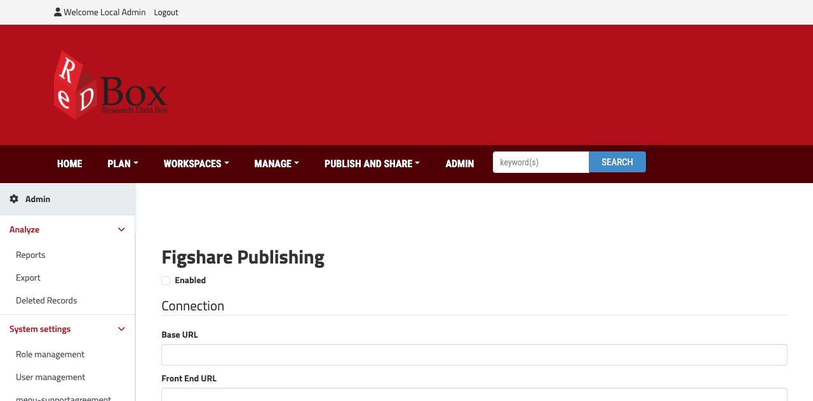
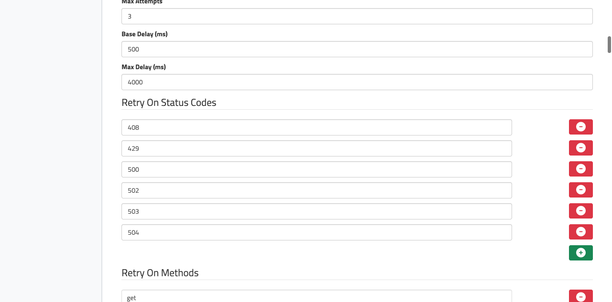
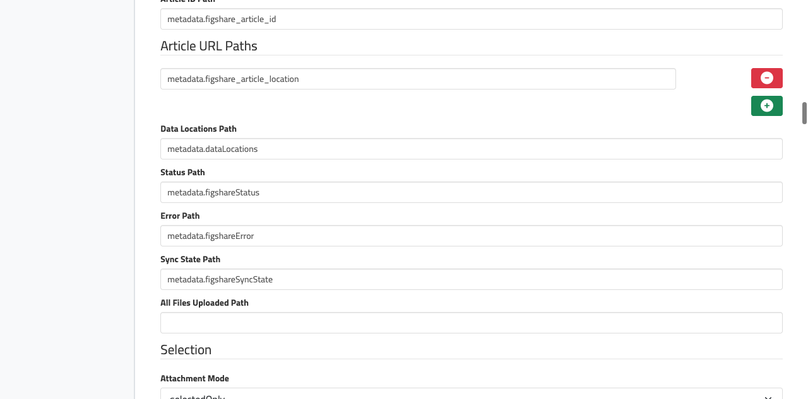

# Configuring Figshare Publishing

This guide explains the Figshare publishing AppConfig screen at:

`http://localhost:1500/default/rdmp/admin/appconfig/edit/figsharePublishing`

It is written for administrators and implementers who need to configure how Redbox publishes records to Figshare.

## Before You Start

- You need an admin login for the portal.
- The screen is available under `Admin -> menu-figsharepublishingconfiguration`.
- Changes are stored as brand AppConfig and only take effect when `Enabled` is turned on.
- Do not store raw production API tokens in git. The service supports environment variable references such as `$FIGSHARE_TOKEN`.

## What The Screen Looks Like

Top of the page:

Middle of the page:

Lower section of the page:

## How To Read This Form

The page is a schema-driven admin form. A few UI patterns repeat throughout:

- Checkboxes turn features on or off.
- Text boxes usually expect either a URL, a record path, or a queue delay string.
- Number fields are used for ids, timeouts, and retry values.
- Dropdowns choose a mode or strategy.
- `+` buttons add rows to list fields.
- `x` buttons remove a row from a list field.
- Binding editors show three inputs:
  - a binding type: `path`, `handlebars`, or `jsonata`
  - a main value: record path, template, or expression
  - an optional default value

## Section-by-Section Reference

### Enabled

| Option | What it means |
|---|---|
| `Enabled` | Master switch for the entire Figshare integration for the current brand. When this is off, the service resolves to `null` and publishing logic is skipped. |

### Connection

Use this section to tell Redbox how to talk to Figshare.

| Option | What it means | Typical value |
|---|---|---|
| `Base URL` | The Figshare API base URL used for account/article API calls. | Your Figshare API endpoint |
| `Front End URL` | The public Figshare site URL used to build user-facing article links written back into the record. | Your Figshare UI base URL |
| `API Token` | Token used in the `Authorization: token ...` header. Supports raw values or environment variable references like `$FIGSHARE_TOKEN`. | `$FIGSHARE_TOKEN` |
| `Request Timeout (ms)` | Default timeout for requests when no operation-specific timeout is used. | `30000` |

#### Operation Timeouts

| Option | What it means |
|---|---|
| `Metadata Timeout (ms)` | Timeout for create/update/get article and license lookup requests. |
| `Upload Init Timeout (ms)` | Timeout for upload initialization, upload descriptor, and upload completion calls. |
| `Upload Part Timeout (ms)` | Timeout for each binary upload chunk. |
| `Publish Timeout (ms)` | Timeout for the publish API call. |

#### Retry Policy

| Option | What it means |
|---|---|
| `Max Attempts` | Maximum attempts for retryable requests. |
| `Base Delay (ms)` | Initial retry delay before backoff is applied. |
| `Max Delay (ms)` | Maximum delay once exponential backoff grows. |
| `Retry On Status Codes` | HTTP status codes that should be retried. The default list is suitable for transient failures such as rate limits and upstream outages. |
| `Retry On Methods` | HTTP verbs that are safe to retry. The current default is `get`, `put`, and `delete`. |

Recommendation:

- Keep `POST` out of retry methods unless you are certain the target endpoint is idempotent in your deployment.

### Article

This section controls how Redbox creates and publishes the Figshare article itself.

| Option | What it means |
|---|---|
| `Item Type` | Figshare item type to create, such as `dataset`, `figure`, `paper`, or `code`. |
| `Group ID` | Optional Figshare group id. Leave blank if not needed. |
| `Publish Mode` | Controls when the article is published. `immediate` publishes during the main sync, `afterUploadsComplete` uses a queue follow-up for attachment-heavy records, and `manual` never auto-publishes. |
| `Republish On Metadata Change` | Allows already-published records to republish when metadata changes. |
| `Republish On Asset Change` | Allows already-published records to republish when assets change. |

#### Curation Lock

| Option | What it means |
|---|---|
| `Enabled` | Turns curation-lock protection on. |
| `Status Field` | Name of the Figshare article field to inspect, for example `status`. |
| `Target Value` | Value that blocks further metadata changes when curation lock is enabled, for example `public`. |

Use curation lock when you want Redbox to stop updating an article once it reaches a curated/public state in Figshare.

### Record

These settings tell Redbox where to store figshare-related state inside a record.

| Option | What it means |
|---|---|
| `Article ID Path` | Record path where the Figshare article id is stored. |
| `Article URL Paths` | One or more record paths where public article URLs are written. |
| `Data Locations Path` | Path to the record's file/link array used for asset sync. |
| `Status Path` | Path where sync status such as `syncing`, `published`, or `failed` is written. |
| `Error Path` | Path where the last error message is stored. |
| `Sync State Path` | Path where detailed sync-state JSON is stored. |
| `All Files Uploaded Path` | Optional path that is set to `yes` after uploaded Redbox attachments have been replaced with Figshare URLs. |

Defaults shown in the current screen:

- `metadata.figshare_article_id`
- `metadata.figshare_article_location`
- `metadata.dataLocations`
- `metadata.figshareStatus`
- `metadata.figshareError`
- `metadata.figshareSyncState`

### Selection

This section decides which `dataLocations` entries are sent to Figshare.

| Option | What it means |
|---|---|
| `Attachment Mode` | `selectedOnly` publishes only attachment entries marked as selected. `all` publishes every attachment entry. |
| `URL Mode` | `selectedOnly` publishes only selected URL entries. `all` publishes every URL entry. |
| `Selected Flag Path` | Property name on each `dataLocations` row that is treated as the selection flag. The default is `selected`. |

Recommendation:

- Use `selectedOnly` unless every `dataLocations` entry should always be published.

### Authors

This section controls how record contributors are turned into Figshare authors.

| Option | What it means |
|---|---|
| `Source Strategy` | Current supported strategy is `defaultRedboxContributors`. |
| `Unique By` | De-duplicates contributors by `email`, `orcid`, `username`, or not at all. |
| `External Name Field` | Fallback contributor field used when a Figshare institution account match is not found. |
| `Max Inline Authors` | Maximum number of authors to send in the payload. |
| `Lookup Rules` | Ordered rules used to search Figshare institution accounts. The first successful match wins. |
| `Contributor Paths` | Record paths that are scanned for contributor-like objects. |
| `Email Transform -> Prefix` | Optional prefix added to the local part before lookup. |
| `Email Transform -> Domain Override` | Optional domain rewrite used before email-based lookup. |

Practical behavior:

- Redbox scans all configured contributor paths.
- It de-duplicates contributors based on `Unique By`.
- It tries each lookup rule against Figshare institution accounts.
- If no institution account is found, it falls back to an inline author name.

### Metadata

This section maps record metadata into the Figshare article payload.

| Option | What it means |
|---|---|
| `Title` | Binding for the Figshare article title. Must resolve to a non-empty value. |
| `Description` | Binding for the article description. Must resolve to a non-empty value. |
| `Keywords` | Binding for the keywords payload. |
| `Funding` | Optional funding text or structured value. |
| `License` | Binding and matching strategy used to resolve a Figshare license value. |
| `Categories Binding` | Binding that pulls local category codes from the record. |
| `Related Resource` | Optional title and DOI written to `related_materials`. |
| `Custom Fields` | Extra Figshare custom fields with optional validation. |

#### Binding Types

| Type | Best used for |
|---|---|
| `path` | Straight record-path reads such as `metadata.title` |
| `handlebars` | String templating from multiple source values |
| `jsonata` | More complex expression-based mapping and transformation |

#### License Matching

| Option | What it means |
|---|---|
| `urlContains` | Matches the configured value against license URL, name, or value by substring |
| `nameExact` | Requires an exact case-insensitive license name match |
| `valueExact` | Requires an exact match to the Figshare license value or id |
| `Required` | Prevents sync when no matching license can be resolved |

#### Custom Field Validations

| Validation | Effect |
|---|---|
| `required` | Value must not be empty |
| `maxLength` | String must be shorter than the configured maximum |
| `url` | Value must look like `http://` or `https://` |
| `doi` | Value must look like a DOI starting with `10.` |

### Categories

This section converts local category codes into Figshare category ids.

| Option | What it means |
|---|---|
| `Strategy` | Current supported strategy is `for2020Mapping`. |
| `Mapping Table` | Each row maps a local source code to a Figshare category id. |
| `Allow Unmapped Categories` | If off, a record with categories but no valid mapping will fail validation. If on, unmapped categories are ignored. |

Use `Add Row` to create mappings such as:

- source code: `0299`
- Figshare category id: `12345`

### Assets

This section controls file and URL handling.

| Option | What it means |
|---|---|
| `Enable Hosted Files` | Upload attachment-type `dataLocations` entries as hosted Figshare files. |
| `Enable Link Files` | Create link-only Figshare files from URL-type `dataLocations` entries. |
| `Dedupe Strategy` | Intended strategy for avoiding duplicate assets. Present in the UI and config contract, but current service behavior still mostly de-dupes attachments by file name. |

#### Staging

| Option | What it means |
|---|---|
| `Temp Directory` | Local staging directory used while streaming attachments to disk before multipart upload. Empty falls back to `/tmp`. |
| `Cleanup Policy` | `deleteAfterSuccess` removes staged files after upload; `retainForRetry` keeps them on disk. |
| `Disk Space Threshold Bytes` | Minimum free space buffer required before staging uploads. |

Recommendation:

- Leave `Temp Directory` blank unless you need a dedicated volume.
- Keep a generous disk threshold on systems with large attachment uploads.

### Embargo

This section maps record access-rights data onto Figshare embargo settings.

| Option | What it means |
|---|---|
| `Mode` | `none` disables embargo sync; `recordDriven` evaluates the bindings below. |
| `Force Sync` | Forces an embargo update even when the current article appears to match the desired state. |
| `Access Rights Binding` | Binding that resolves the Figshare `access_type` value. |
| `Full Embargo Until` | Binding for the embargo end date. |
| `File Embargo Until` | Present in config and UI for future or broader use; current embargo sync uses the article-level embargo date. |
| `Reason` | Binding for the embargo reason. |

### Queue

These values control delayed Agenda jobs.

| Option | What it means |
|---|---|
| `Publish After Upload Delay` | Delay string used before the `Figshare-PublishAfterUpload-Service` job is scheduled. |
| `Uploaded Files Cleanup Delay` | Delay string used before the `Figshare-UploadedFilesCleanup-Service` job is scheduled. |

Examples:

- `immediate`
- `in 2 minutes`
- `in 5 minutes`

### Workflow

This section is for optional follow-up workflow transitions once Figshare reaches a certain state.

| Option | What it means |
|---|---|
| `Transition Rules` | Declarative transition rows reserved for rule-driven workflow behavior. |
| `Transition Job -> Enabled` | Turns the scheduled workflow transition job on or off. |
| `Named Query` | Named query used to find candidate records. |
| `Target Step` | Workflow step that matching records should move to. |
| `Parameter Map` | Parameters passed to the named query. |
| `Figshare Target Field Key` | Figshare article field that must reach the target value. |
| `Figshare Target Field Value` | Expected value for the target field. |
| `Username` | User account that will perform the transition. |
| `User Type` | Required user type for the configured account. |

This is an advanced feature. Only enable it when:

- the named query is already tested
- the workflow step exists
- the configured user has edit permission on the matching records

### Write Back

This section controls what data is copied from Figshare back into the Redbox record.

| Option | What it means |
|---|---|
| `Article ID Target Path` | Destination path for the canonical Figshare article id. |
| `Article URL Target Paths` | Destination path or paths for public article URLs. |
| `Extra Fields` | Additional values copied from the Figshare article, publish result, or asset sync result into record fields. |

Typical defaults:

- `metadata.figshare_article_id`
- `metadata.figshare_article_location`

## Common Configuration Patterns

### Minimal working setup

Use this when you only need basic metadata publishing:

- turn `Enabled` on
- set `Base URL`
- set `Front End URL`
- set `API Token`
- confirm `Title`, `Description`, and `License` bindings resolve correctly
- leave `Publish Mode` as `afterUploadsComplete` or switch to `manual`

### Publish selected attachments only

Use:

- `Selection -> Attachment Mode = selectedOnly`
- `Selection -> URL Mode = selectedOnly`
- `Assets -> Enable Hosted Files = on`
- `Assets -> Enable Link Files = off` if you do not want URL entries mirrored to Figshare

### Record-driven embargo sync

Use:

- `Embargo -> Mode = recordDriven`
- bind `Access Rights`, `Full Embargo Until`, and `Reason`
- keep `Force Sync = off` unless you need to push changes even when they look identical

### Safe token handling

Instead of pasting a real token into AppConfig, prefer:

- `API Token = $FIGSHARE_TOKEN`

Then provide the real token through environment management in the deployment platform.

## Troubleshooting

| Symptom | Likely cause | What to check |
|---|---|---|
| Nothing happens when records are saved | `Enabled` is off | Turn on the master checkbox and submit |
| Sync fails with a license error | License binding does not match a Figshare license | Check the license source binding and `Match By` strategy |
| Categories fail validation | No mapping exists for the record's category codes | Add rows in `Mapping Table` or turn on `Allow Unmapped Categories` |
| Attachments do not upload | Selection settings exclude them, or hosted files are disabled | Check `Attachment Mode`, `Selected Flag Path`, and `Enable Hosted Files` |
| Uploads fail on large files | Local staging volume lacks space or timeout is too small | Review `Temp Directory`, `Disk Space Threshold Bytes`, and upload timeouts |
| Article is not published automatically | `Publish Mode` is `manual`, or delayed publish has not run yet | Check `Publish Mode` and queue delay values |
| Record never transitions workflow | Transition job is disabled or target article state is never reached | Check `Workflow -> Transition Job` settings and the article field/value pair |

## Save Process

After editing:

1. Review the changed values carefully.
2. Click `SUBMIT`.
3. Test with a non-production record first.
4. Confirm the record receives:
   - a Figshare article id
   - a Figshare article URL
   - updated sync status fields

## Related Pages

- [Figshare Service Technical Guide](Figshare-Service-Technical-Guide)
- [Configuration Guide](Configuration-Guide)
- [User Guide](User-Guide)
