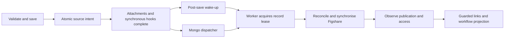

# Queued Figshare synchronisation

Eligible record saves now commit a protected `figshareSyncIntent` with the record. The save performs local validation; it does not create, update, upload or publish remotely. A Mongo dispatcher imports ready intents into `FigshareSync`, acknowledges only the imported generation, and sends ordinary `Figshare-SyncRecord` jobs containing only OID and brand ID. Missing or duplicate deliveries are recoverable from durable state.



## Enablement and source hooks

Both `figsharePublishing.enabled` and `figsharePublishing.processing.enabled` must be true. Processing defaults to false to support controlled migration. Update existing brand AppConfig as well as hook defaults: stored AppConfig overrides package defaults.

Configure `validateFigshareRecord` as the pre-save hook and `wakeFigshareRecord` as the post-save hook. Use `requestFigshareCleanup` where only local reference cleanup is authorised. Keep the same business trigger conditions as the previous deployment. Old `createUpdateFigshareArticle`, `uploadFilesToFigshareArticle`, and `deleteFilesFromRedboxTrigger` names are compatibility aliases; they no longer mutate Figshare inline. Old job adapters discard record snapshots and wake existing durable obligations.

A hook with a requester-dependent `triggerCondition` needs a separate, user-independent `executionCondition`. For example:

```javascript
{
  function: 'sails.services.figshareservice.validateFigshareRecord',
  options: {
    policyId: 'publication-sync',
    triggerCondition: '<%= user.username !== "migration" && record.workflow.stage === "queued" %>',
    executionCondition: '<%= record.workflow.stage === "queued" %>'
  }
}
```

Without an explicit `policyId`, a hook's default ID is its event, phase and function name (for example `onUpdate.pre.validateFigshareRecord`), so rearranging other hooks keeps queued work eligible. Assign explicit `policyId` values when the same Figshare hook function appears more than once in a phase; a warning is logged until you do. Source authorisation is recorded at save time; workers resolve that policy against the current hook configuration and current record. The service identity is not used to reauthorise the original requester. Explicit maintenance writes preserve pending intent without originating new requests.

## Processing settings

| Setting | Default | Meaning |
| --- | --- | --- |
| `processing.enabled` | false | Cutover/pause switch |
| `coalesceMs` | 5000 | Delay for the post-save acceleration job |
| `leaseMs` / `heartbeatMs` | 120000 / 20000 | Lease duration and full-phase renewal; lease must cover at least three heartbeats |
| `maxAttempts` / `retryBaseMs` | 5 / 60000 | Bounded exponential retry for real failures |
| `observationMs` | 120000 | Quiet readiness/publication polling |
| `cleanupMs` | 300000 | Initial cleanup deadline |
| `serviceUsername` / `serviceUserType` | empty | Per-brand local service identity with edit access; falls back to the configured workflow-transition identity |

When a millisecond observation/cleanup setting is absent, the existing `queue.publishAfterUploadDelay` / `uploadedFilesCleanupDelay` supplies it. Relative numeric millisecond, second, minute, hour, day and week strings are supported. Convert other legacy phrases to explicit millisecond settings before enabling processing.

The dispatcher recurs every 30 seconds on Mongo even when ordinary workers use SQS. Delays live in state, so they are not limited by SQS's delivery-delay ceiling. A short dispatch cooldown controls duplicate deliveries without consuming the obligation. Agenda history archival excludes active, unfinished and recurring jobs and rechecks that condition when deleting.

## Identity and impersonation

`impersonation.enabled` controls optional impersonation. Configure the CI identifier/email paths and the operation map (`create`, `recovery`, `read`, `metadata`, `assets`, `embargo`, `publish`) to `owner` or `token`. Owner lookup uses institutional ID first; exact email fallback is allowed only when that identifier is absent and `allowEmailFallback` is true. Ambiguous, conflicting or unmatched supplied identifiers fail closed. Figshare account `id` is used for impersonation; author `user_id` remains an author identity.

Creation first persists a unique provisional-title token and original API/account/owner context. It POSTs a minimal draft, verifies its identity, and saves the ID before replacing the provisional title with the customer's actual metadata. Recovery pages through the original owner's account and accepts only one exact verified token match. A hidden article created despite HTTP 400 retains the failed outcome and recovered identity. A corrected save updates that article. Missing visibility, a 404, or lease expiry never authorises a second create.

Bindings are exclusive by API namespace and article ID, independent of owner. CI changes do not transfer an article. Changing the API environment or token account requires reconciliation. JSON mutations carry impersonation in the body; GET/DELETE use query parameters. Account discovery uses the token identity. Binary uploader traffic receives neither API credentials nor impersonation parameters.

## Worker, files and publication

Every mutation checks lease ownership, current source generation, current configuration, current policy eligibility and the remote curation lock. Heartbeats run through slow HTTP calls and multipart parts. Losing ownership aborts transport where possible and prevents further checkpoints or mutations. Since a remote call can finish despite cancellation, the successor reconciles persisted operation evidence.

The actual customised metadata payload is hashed, including customer overrides. Relevant remote fields are compared before sending updates; unmanaged custom fields are retained. Curation locks freeze metadata, files, embargo and publication together. Both automatic publish modes wait for confirmed upload completion; `manual` never submits publication.

Managed files have durable staged-content SHA256/MD5, size and ownership receipts. Receipts also record the datastream fingerprint (storage ETag, size and modification time), so later syncs skip staging and hashing an unchanged attachment; datastream services without fingerprints re-hash each time. Changed bytes under the same filename create a replacement; deliberate deselection deletes only receipt-owned remote files. Foreign files and uncertain upload initialisations are retained. A worker that still holds its lease may resume its own failed upload on retry. Uploads interrupted by a stopped process or lost lease are reported as needing repair, and need an explicit verified operator decision before resumption; age is not deletion authority.

Cleanup requires observed publication, no embargo, a matching public downloadable file and matching current local bytes. It conditionally replaces attachment references with URLs and keeps receipt references so the next sync retains the hosted files. **Local attachment bytes are retained. Cleanup does not reclaim storage.**

Publication submission, acceptance and confirmed publication are separate. A request whose outcome is uncertain is never resubmitted automatically; it is reported as needing repair. A newer eligible source save supersedes an unconfirmed request once a read shows it did not publish and no curation lock is held, so changes made after a curator returns an article are synchronised and resubmitted. Review/manual-publication/upload waits do not consume failure budgets or open audits on every poll. A logical sync has one audit context; terminal failures and confirmed publication have bounded events. The access-checked Integration Status endpoint overlays current queued/waiting/retrying state, including an unimported ready intent. Researchers can see pending Figshare status after reload, with publication and embargo details.

A successful account read returning a private article is an expected readiness wait, including while university staff process it manually. The legacy workflow-transition job delegates to the durable dispatcher; it does not write a failed audit for each unmet public-state check. Repeated checks leave the record queued and retain local attachment bytes. A recovered polling error is cleared when readiness is checked successfully, resetting that retry episode; a terminal failure of unfinished source synchronisation remains visible. Historical audits are retained, and neither a readiness check nor a waiting status approves or publishes an article.

Workflow transitions require confirmed publication, no unresolved upload or newer pending sync, current eligibility and current service permissions. Background snapshot writes carry an expected record version through every synchronous persistence step; attachment-changing background transitions are rejected before datastream effects. **Master still allows a later stale ordinary save to overwrite a workflow transition.** This change does not introduce general optimistic concurrency.

## Operator commands

Run from the deployed portal using its normal environment, config and dependencies:

```sh
node support/figshare/admin.js inspect --username ADMIN --oid OID
node support/figshare/admin.js reconcile --username ADMIN --oid OID
node support/figshare/admin.js migrate --username ADMIN
node support/figshare/admin.js link --username ADMIN --oid OID --article-id ID [--owner-id ACCOUNT_ID]
node support/figshare/admin.js resume --username ADMIN --oid OID
node support/figshare/admin.js abandon-create --username ADMIN --oid OID
node support/figshare/admin.js reset-publish --username ADMIN --oid OID
```

Commands are dry-run by default; add `--apply` to a reviewed correction. `inspect` and `reconcile` remain read-only. They require a current administrator; per-record operations also check edit access. The CLI loads the normal application with queue startup disabled in that process. Pause workers across all deployed processes before migration/repair; leases additionally reject repairs against active workers. No command publishes or transfers ownership.

- `link` verifies accessible identity and exclusive binding. With owner-based reads, supply `--owner-id` for an unbound article or a different relink target. Use the Figshare owner account ID, not the author user ID. The command reads as that owner and checks the returned article owner before saving the binding. An existing verified binding supplies the owner for the same article; changing the current CI never changes that owner. A supplied owner conflicting with a verified binding is rejected. `relink` is the explicit alternative for an existing different article; unresolved publication or managed receipts block an unsafe change.
- `resume` requests another sync under an existing authorised source policy. It preserves create/publish/upload uncertainty and previous failure history.
- `abandon-create` discards an unresolved create only when `reconcile` finds no article carrying its token in the owning account. A visible match must be linked instead. Run `resume` (or save the record) afterwards to create a fresh article.
- `reset-publish` discards an unconfirmed publication request after a read shows it did not publish and no curation lock is held. Run `resume` (or save the record) afterwards to request publication again. A newer eligible source save does this automatically.
- `bind-file --receipt KEY --file-id ID` verifies a completed file's size and computed MD5 against the persisted receipt.
- `resume-upload --receipt KEY --file-id ID` verifies size and supplied MD5 and explicitly permits resuming that upload. Stop the previous uploader first. Completed parts are skipped; no second file is initialised.
- `migrate` scans legacy IDs/states, reports duplicate bindings and uncertain creates, verifies accessible article identity and imports observed publication. Repeated runs preserve receipts and identities. It schedules observation without inferring file ownership from filenames or publishing legacy records. Records without an authorised source policy need an eligible save before sync or automatic workflow transition. Uncertain creates and duplicate bindings are quarantined for operator reconciliation.

## Cutover and rollback

1. Back up record and core databases. Record the deployed core, Mongo storage hook, CQU hook and stored per-brand AppConfig versions.
2. Pause old workers, schedules and source traffic as appropriate. Drain in-flight mutations; do not run old and new consumers concurrently against the same records.
3. Deploy core, matching Mongo storage package, model shims and customer hook together with processing disabled. Verify service identity and account context. Ensure new Mongo indexes can be created.
4. Run and review migration dry-run. Resolve duplicate legacy article IDs and uncertain creates; apply verified backfill. Legacy files without receipts remain unmanaged.
5. Enable one staging brand. Verify create-as-owner/update-as-token with distinct account/author IDs, hidden-create recovery, slow uploads, curation, review, manual publication, embargo access and workflow permissions against the institution's real Figshare environment.
6. Enable production processing only after staging acceptance. Observe queue/source lag, lease renewals, waiting reasons, retry episodes and repair-required records. Save latency should no longer include remote mutation time.

To pause or roll back, disable processing and stop consumers, wait for in-flight leases/calls to settle, and preserve all intents, bindings, checkpoints and receipts. Do not restore the old inline publisher over unresolved new operations. Inspect/reconcile them before resuming a compatible worker. Never delete sync state to force a retry.

See [implementation verification](../figshare/VERIFICATION.md) for automated evidence and the remaining environment-specific release gates.
