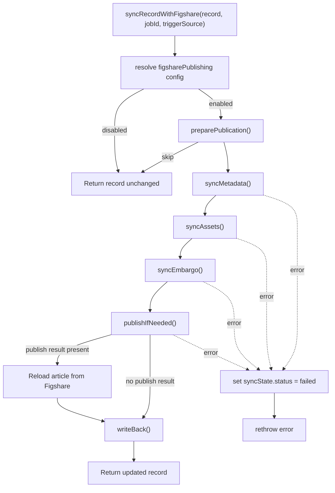
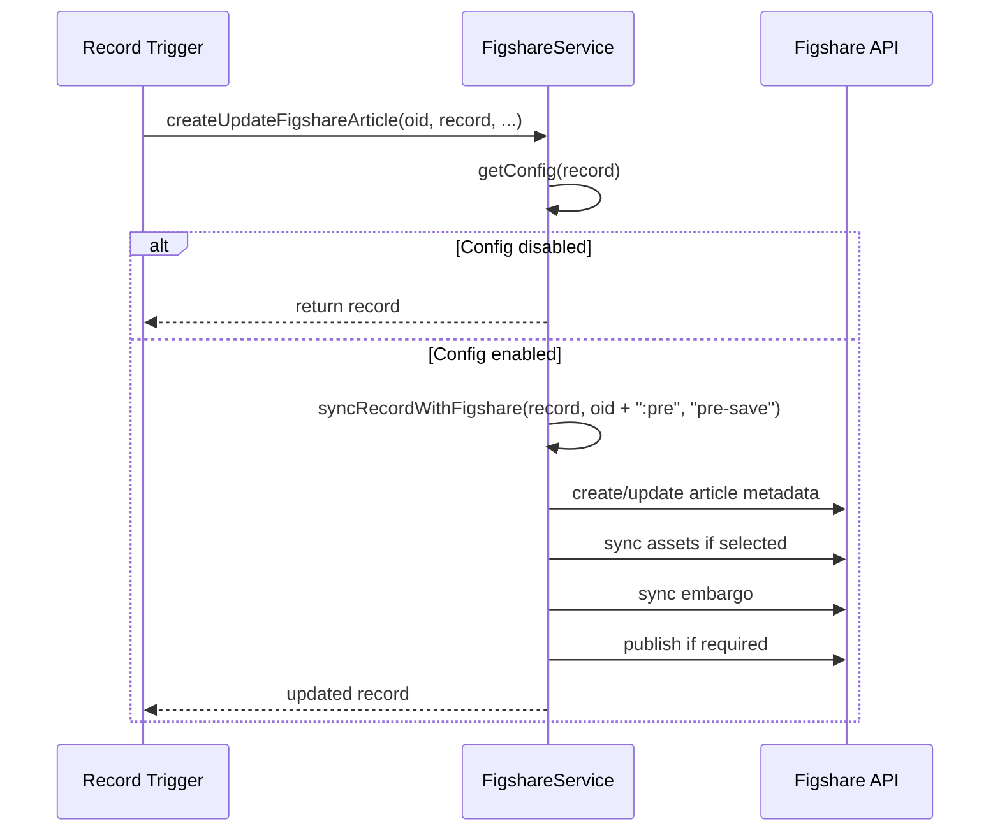
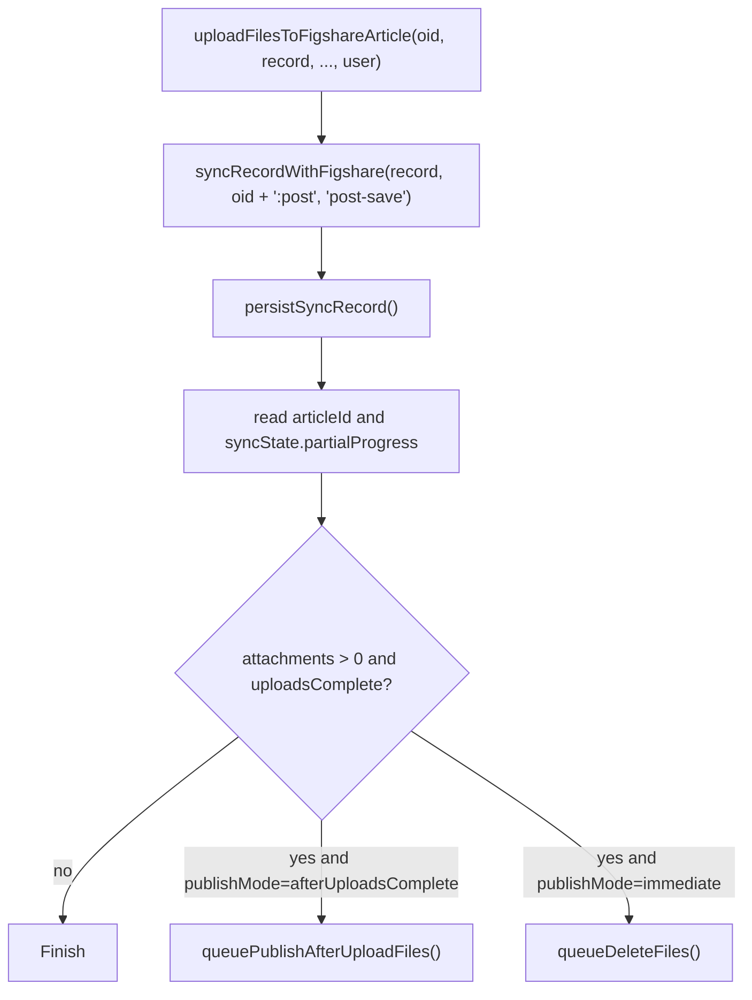
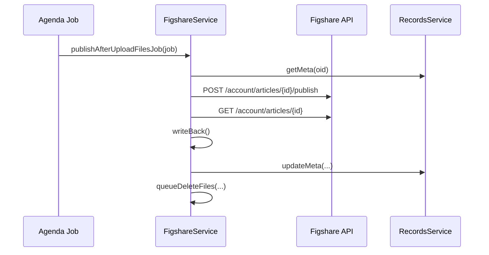
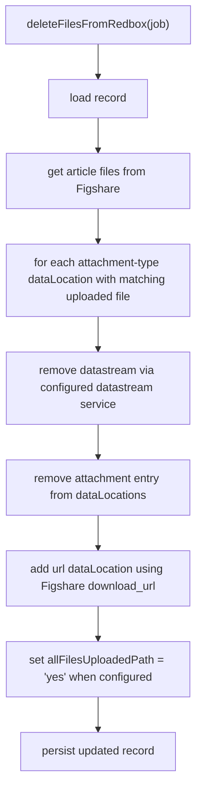
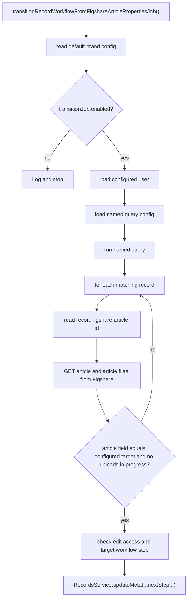

# Figshare Service Technical Guide

This page documents the current Figshare publishing implementation for developers working in the `figshare-v2` refactor area.

## Scope

The Figshare integration is split across:

- `packages/redbox-core/src/services/FigshareService.ts`
- `packages/redbox-core/src/services/figshare-v2/`
- `packages/redbox-core/src/configmodels/FigsharePublishing.ts`
- `packages/redbox-core/test/services/FigshareService.test.ts`

At runtime the service resolves the brand's `figsharePublishing` AppConfig, chooses either the live or fixture client, and then executes a phased sync pipeline:

1. `preparePublication`
2. `syncMetadata`
3. `syncAssets`
4. `syncEmbargo`
5. `publishIfNeeded`
6. `writeBack`

## Exported Service Surface

These methods are exported through `_exportedMethods` and are the supported Sails-facing lifecycle surface.

| Method | Purpose | Typical caller |
|---|---|---|
| `createUpdateFigshareArticle(oid, record, options, user)` | Pre-save lifecycle hook. Creates or updates the Figshare article metadata before the record save completes. | Record trigger / workflow hook |
| `uploadFilesToFigshareArticle(oid, record, options, user)` | Post-save lifecycle hook. Syncs metadata again if needed, uploads selected assets, persists sync state, then queues publish or cleanup follow-up jobs. | Record trigger / workflow hook |
| `deleteFilesFromRedbox(job)` | Agenda job worker that replaces uploaded local attachments with Figshare URLs in the record and optionally marks all files as uploaded. | `Figshare-UploadedFilesCleanup-Service` |
| `deleteFilesFromRedboxTrigger(oid, record, options, user)` | Immediate trigger-based cleanup path used when a trigger condition has already been met. | Trigger configuration |
| `publishAfterUploadFilesJob(job)` | Agenda job worker that publishes an article after uploads complete and then queues Redbox cleanup. | `Figshare-PublishAfterUpload-Service` |
| `queueDeleteFiles(oid, user, brandId, articleId)` | Schedules or immediately enqueues the cleanup job using `figsharePublishing.queue.uploadedFilesCleanupDelay`. | Figshare follow-up orchestration |
| `queuePublishAfterUploadFiles(oid, articleId, user, brandId)` | Schedules or immediately enqueues the deferred publish job using `figsharePublishing.queue.publishAfterUploadDelay`. | Figshare follow-up orchestration |
| `transitionRecordWorkflowFromFigshareArticlePropertiesJob(job)` | Batch job that looks up records through a named query and transitions workflow stages once the linked article reaches the required Figshare state. | Scheduled workflow transition job |
| `preparePublication(record, jobId?)` | Computes whether the service should create, update, republish, or skip, and acquires the sync lock in record state. | Internal orchestration, tests |
| `syncMetadata(record, plan?)` | Builds the article payload and creates or updates the Figshare article. | Internal orchestration, tests |
| `syncAssets(record, article)` | Uploads selected attachments and/or link-only URLs to the article and updates partial sync progress. | Internal orchestration, tests |
| `syncEmbargo(record, articleId)` | Syncs record-driven embargo state onto the article. | Internal orchestration, tests |
| `publishIfNeeded(record, articleId)` | Publishes immediately, defers, or skips based on publish mode and attachment state. | Internal orchestration, tests |
| `writeBack(record, article, publishResult?, assetSyncResult?)` | Writes article identifiers, URLs, extra fields, and sync status back into the record. | Internal orchestration, tests |
| `syncRecordWithFigshare(record, jobId?, triggerSource?)` | Full end-to-end orchestration pipeline for one record. | Core orchestration entry point |
| `init()` | Resolves the queue service on Sails ready so scheduling methods can enqueue Agenda jobs. | Sails service lifecycle |

The service also exposes several non-exported-but-public helpers used internally and in tests:

- `getConfig(record?)`
- `getSyncState(config, record)`
- `setSyncState(config, record, syncState)`
- `validateHandlebarsTemplate(template)`
- `buildMetadataPayload(config, record)`
- `makeClient(config, record, jobId?, triggerSource?)`
- `persistSyncRecord(oid, record, user)`

## Runtime Configuration Resolution

Config resolution lives in `packages/redbox-core/src/services/figshare-v2/config.ts`.

Resolution rules:

1. Read brand AppConfig from `AppConfigService.getAppConfigurationForBrand(brandName)`.
2. Look for `figsharePublishing`.
3. Merge stored config over `new FigsharePublishing()` defaults.
4. Resolve fixture mode from `sails.config.figshareDev` when not in production.
5. Resolve `connection.token`, including `$ENV_VAR_NAME` references.
6. Return `null` when `figsharePublishing.enabled !== true`.

Important runtime consequences:

- Production always forces live mode, even if `figshareDev.mode = 'fixture'`.
- Fixture mode removes the need for a real Figshare token.
- Sync status, last error, and last sync time are mirrored into record fields via `record.syncStatePath`, `record.statusPath`, and `record.errorPath`.

## End-to-End Orchestration

### `syncRecordWithFigshare`

This is the canonical end-to-end path used by both pre-save and post-save entry points.

API sequence in live mode:

| Phase | Live API calls |
|---|---|
| `preparePublication` | No HTTP calls. Updates in-record sync state only. |
| `syncMetadata` create | `POST /account/articles` |
| `syncMetadata` update or republish | `GET /account/articles/{id}` when curation lock or in-progress upload checks are needed, then `PUT /account/articles/{id}` |
| `syncAssets` | `GET /account/articles/{id}/files?page_size=20&page=N`, then for each attachment `POST /account/articles/{id}/files`, `GET {location}`, `GET {upload_url}`, repeated `PUT {upload_url}/{partNo}`, `POST /account/articles/{id}/files/{fileId}`; for each URL `POST /account/articles/{id}/files` then `GET {location}`; old link-only files are deleted with `DELETE /account/articles/{id}/files/{fileId}` |
| `syncEmbargo` | `GET /account/articles/{id}`, then either `PUT /account/articles/{id}/embargo`, `DELETE /account/articles/{id}/embargo`, or no-op |
| `publishIfNeeded` | `POST /account/articles/{id}/publish` for immediate publish paths; no-op for manual mode or deferred upload completion |
| post-publish reload | `GET /account/articles/{id}` |

### `createUpdateFigshareArticle`

This is the pre-save metadata entry point.

Notes:

- Despite the method name, it now runs the full sync pipeline, not just metadata creation/update.
- Because this is the pre-save path, downstream code should expect record metadata fields such as article id, URL, and sync state to already be present on the in-memory record.

### `uploadFilesToFigshareArticle`

This is the post-save path that persists sync state and queues follow-up jobs.

Follow-up behavior:

- `publishMode = afterUploadsComplete`
  The article is left in `awaiting_upload_completion`, then a delayed job publishes it and finally queues file cleanup.
- `publishMode = immediate`
  The article is published during the main pipeline and only cleanup is queued afterward.
- `publishMode = manual`
  No publish job is queued. The record remains synced but unpublished until an external/manual publish step occurs.

### `publishAfterUploadFilesJob`

### `deleteFilesFromRedbox`

This job rewrites selected `dataLocations` after successful upload.

Live API calls:

- `GET /account/articles/{id}/files?page_size=20&page=N`

### `transitionRecordWorkflowFromFigshareArticlePropertiesJob`

This job is controlled by `workflow.transitionJob`.

Live API calls for each candidate record:

- `GET /account/articles/{id}`
- `GET /account/articles/{id}/files?page_size=20&page=N`

## Phase Details

### `preparePublication`

Implemented in `figshare-v2/plan.ts`.

Responsibilities:

- Reject duplicate concurrent runs unless the same correlation id already owns the sync lock.
- Read the existing article id from `record.articleIdPath`.
- Decide the action:
  - `create` when no article id exists
  - `republish` when the record was already published and republish flags allow it
  - `update` for normal metadata or asset updates
  - `skip` when another sync is already in progress
- Write sync state back into the record immediately.

### `syncMetadata`

Implemented across `figshare-v2/metadata.ts` and `FigshareService.syncMetadata()`.

Responsibilities:

- Evaluate configurable bindings for title, description, keywords, funding, license, categories, related resource, and custom fields.
- Resolve authors by contributor paths, de-duplication policy, and optional institution-account lookup.
- Resolve the license against Figshare's available license list.
- Enforce payload validation, including required values and custom field validators.
- Create or update the article.
- Prevent updates when:
  - curation lock is enabled and the article already has the target status
  - a file upload is still in progress (`status = created`)

### `syncAssets`

Implemented in `figshare-v2/assets.ts`.

Responsibilities:

- Read selected data locations from `record.dataLocationsPath`.
- Decide which attachments and URLs are in scope using `selection.attachmentMode`, `selection.urlMode`, and `selection.selectedFlagPath`.
- For hosted attachments:
  - stream the attachment from the configured datastream service
  - stage it in `assets.staging.tempDir` or `/tmp`
  - check disk space threshold
  - initialize the Figshare file upload
  - upload each part
  - complete the upload
- For URL entries:
  - create link-only files in Figshare
  - remove previous link-only files after successful replacement
- Update `syncState.partialProgress`.

Current implementation note:

- `assets.dedupeStrategy` is part of the config contract and the UI, but the current asset implementation still effectively de-dupes attachments by file name and link files by replacement behavior. The configured strategy is not yet applied in `syncAssetsPhase`.

### `syncEmbargo`

Implemented in `figshare-v2/embargo.ts`.

Responsibilities:

- Evaluate `access_type`, embargo date, and reason from configured bindings.
- Compare the desired embargo payload against the current article.
- Skip when there is nothing to change and `forceSync` is false.
- Clear the embargo when the config resolves to an empty payload for an already embargoed article.

### `publishIfNeeded`

Implemented in `figshare-v2/publish.ts`.

Responsibilities:

- Skip all publishing in `manual` mode.
- For `afterUploadsComplete` with attachments:
  - mark sync state as `awaiting_upload_completion`
  - do not publish until uploads are complete
- Otherwise publish immediately with `POST /publish`.

### `writeBack`

Implemented in `figshare-v2/writeback.ts`.

Responsibilities:

- Write the canonical article id to `writeBack.articleId`.
- Build public article URLs from `connection.frontEndUrl` and write them to each path in `writeBack.articleUrls`.
- Copy any configured `writeBack.extraFields`.
- Update sync status to `published`, `awaiting_upload_completion`, or `syncing`.

## Live Figshare API Surface

`figshare-v2/http.ts` wraps the live API and adds retry/backoff behavior.

| Client method | HTTP method and path | Purpose |
|---|---|---|
| `createArticle(payload)` | `POST /account/articles` | Create a new article |
| `updateArticle(articleId, payload)` | `PUT /account/articles/{articleId}` | Update article metadata |
| `getArticle(articleId)` | `GET /account/articles/{articleId}` | Read article state |
| `listArticleFiles(articleId, page, pageSize)` | `GET /account/articles/{articleId}/files?page_size={pageSize}&page={page}` | List article files |
| `createArticleFile(articleId, payload)` | `POST /account/articles/{articleId}/files` | Start attachment or link-file creation |
| `getLocation(locationUrl)` | `GET {locationUrl}` | Follow Figshare-provided upload or file-location URLs |
| `uploadFilePart(uploadUrl, partNo, data)` | `PUT {uploadUrl}/{partNo}` | Upload one multipart chunk |
| `completeFileUpload(articleId, fileId, payload)` | `POST /account/articles/{articleId}/files/{fileId}` | Finalize file upload |
| `deleteArticleFile(articleId, fileId)` | `DELETE /account/articles/{articleId}/files/{fileId}` | Delete old link-only files |
| `setEmbargo(articleId, payload)` | `PUT /account/articles/{articleId}/embargo` | Set embargo metadata |
| `clearEmbargo(articleId)` | `DELETE /account/articles/{articleId}/embargo` | Remove embargo |
| `publishArticle(articleId, payload)` | `POST /account/articles/{articleId}/publish` | Publish article |
| `listLicenses()` | `GET /account/licenses` | Resolve license options |
| `searchInstitutionAccounts(payload)` | `POST /account/institution/accounts/search` | Resolve authors to institution accounts |

Retry behavior is controlled by:

- `connection.retry.maxAttempts`
- `connection.retry.baseDelayMs`
- `connection.retry.maxDelayMs`
- `connection.retry.retryOnStatusCodes`
- `connection.retry.retryOnMethods`

## Type Reference

The most important Figshare config and runtime types live in:

- `packages/redbox-core/src/configmodels/FigsharePublishing.ts`
- `packages/redbox-core/src/services/figshare-v2/types.ts`

### Binding Types

Bindings drive most configurable value extraction.

| Type | Properties | Meaning |
|---|---|---|
| `PathBinding` | `kind`, `path`, `defaultValue?` | Read a dot-path from the record or source object |
| `HandlebarsBinding` | `kind`, `template`, `defaultValue?` | Render a Handlebars template against the source object |
| `JsonataBinding` | `kind`, `expression`, `defaultValue?` | Evaluate a JSONata expression against the source object |
| `ValueBinding` | union of the three above | Shared config contract for metadata, embargo, author lookup, and related resources |

### Top-Level Config Object: `FigsharePublishingConfigData`

| Property | Meaning |
|---|---|
| `enabled` | Master on/off switch for the entire integration |
| `connection` | Figshare API base URLs, token, timeout, and retry policy |
| `article` | Article-level publishing behavior such as item type, group, publish mode, and curation lock |
| `record` | Paths in the Redbox record where article ids, URLs, status, errors, sync state, and upload markers are stored |
| `selection` | Rules that decide which `dataLocations` entries participate in sync |
| `authors` | Contributor extraction, de-duplication, name fallback, and institution-account lookup rules |
| `metadata` | Bindings for article metadata and custom fields |
| `categories` | Category mapping rules from local category codes to Figshare category ids |
| `assets` | Hosted file/link-file behavior and staging settings |
| `embargo` | Record-driven embargo sync rules |
| `queue` | Delay strings used for deferred publish and cleanup jobs |
| `workflow` | Optional workflow transition rules and the scheduled transition job config |
| `writeBack` | Where article ids, URLs, and extra copied fields are written into the record |

### Key Nested Config Types

| Type | Properties | Meaning |
|---|---|---|
| `FigshareConnectionConfig` | `baseUrl`, `frontEndUrl`, `token`, `timeoutMs`, `operationTimeouts`, `retry` | Connection and transport policy |
| `LicenseBinding` | `source`, `matchBy`, `required` | How a record value resolves to a Figshare license |
| `CategoryBinding` | `source`, `mappingStrategy` | How local categories are pulled from the record |
| `RelatedResourceBinding` | `title`, `doi` | Related material payload mapping |
| `CustomFieldBinding` | `figshareField`, `value`, `validations?` | Configures one Figshare custom field |
| `CustomFieldValidation` | `type`, `value?` | Validation such as `required`, `maxLength`, `url`, or `doi` |
| `AuthorLookupRule` | `matchBy`, `value` | How a contributor is matched to a Figshare institution account |
| `EmbargoBinding` | `accessRights`, `fullEmbargoUntil?`, `fileEmbargoUntil?`, `reason?` | Mapping rules for embargo data |
| `WorkflowTransitionRule` | `when`, `targetWorkflowStageName`, `targetWorkflowStageLabel?`, `targetForm?`, `ifArticleField?`, `equals?` | Declarative transition rule data, reserved for broader workflow use |
| `WriteBackBinding` | `from`, `sourcePath`, `targetPath` | Copies data from `article`, `publishResult`, or `assetSyncResult` into the record |

### Runtime and Record Types

| Type | Properties | Meaning |
|---|---|---|
| `FigshareArticle` | `id`, `title?`, `description?`, `status?`, `doi?`, `url?`, `url_public_html?`, `url_private_html?`, `url_public_api?`, `url_private_api?`, `is_embargoed?`, `access_type?`, `embargo_date?`, `embargo_reason?`, index signature | Normalized article response from Figshare |
| `FigshareFile` | `id`, `name`, `size?`, `status?`, `download_url?`, `is_link_only?`, index signature | Normalized article file response |
| `FigshareUploadInit` | `location`, index signature | Initial upload response containing a follow-up location URL |
| `FigshareUploadDescriptor` | `id`, `upload_url`, `download_url?`, `status?`, `parts?`, index signature | Upload descriptor returned from Figshare location URLs |
| `FigshareUploadPart` | `partNo`, `startOffset`, `endOffset` | One multipart upload range |
| `FigshareLicense` | `value`, `name`, `url?`, `id?`, index signature | License option returned by Figshare |
| `FigshareInstitutionAccount` | `id`, `email?`, `first_name?`, `last_name?`, index signature | Institution account lookup result used for author resolution |
| `FigsharePublishResult` | `id?`, `status?`, index signature | Result returned by publish endpoint |
| `DataLocationEntry` | `type`, `fileId?`, `name?`, `location?`, `selected?`, `ignore?`, `notes?`, `originalFileName?`, `download_url?`, index signature | Redbox file/url entry used during asset sync and cleanup |
| `RecordContributor` | `email?`, `text_full_name?`, `name?`, `orcid?`, `username?`, index signature | Contributor-like object read from record metadata |
| `FigshareSyncState` | `status`, `lockOwner?`, `lastError?`, `lastSyncAt?`, `correlationId?`, `partialProgress?` | In-record state used to guard concurrency and report progress |
| `FigsharePublicationPlan` | `action`, `articleId?`, `sameJob`, `syncState` | Output of `preparePublication` |
| `AssetSyncResult` | `articleId`, `attachmentCount`, `urlCount`, `uploadsComplete`, `uploadedAttachments`, `uploadedUrls`, `dataLocations`, index signature | Result of asset sync, used for write-back and follow-up decisions |
| `FigshareRunContext` | `recordOid`, `brandName`, `articleId?`, `jobId?`, `correlationId`, `triggerSource` | Correlation and observability context for one run |
| `FigshareErrorInfo` | `category`, `message`, `retryable`, `cause?` | Standardized error shape for future use |
| `WorkflowTransitionJobConfig` | `enabled?`, `namedQuery?`, `targetStep?`, `paramMap?`, `figshareTargetFieldKey?`, `figshareTargetFieldValue?`, `username?`, `userType?` | Scheduled workflow transition job settings |
| `FigshareJobData` | `oid?`, `articleId?`, `brandId?`, `user?` | Agenda payload body |
| `FigshareJob` | `attrs?.data?` | Agenda wrapper shape consumed by job methods |

## Testing

Coverage for the refactored surface currently lives in `packages/redbox-core/test/services/FigshareService.test.ts`.

Useful assertions already in place:

- exported lifecycle methods exist
- fixture/live mode resolution behaves correctly
- queue names and delay config are honored
- write-back targets can be overridden by config
- workflow transition job reads config and user settings
- AppConfig defaults include queue and transition job fields

Recommended follow-up tests while refactoring:

- explicit coverage for `assets.dedupeStrategy` once implemented
- category mapping edge cases with mixed mapped/unmapped values
- curation-lock update suppression
- live-client request retries and timeout mapping
- write-back `extraFields` coverage for `publishResult` and `assetSyncResult`

## Related Pages

- [Configuration Guide](Configuration-Guide)
- [Services Architecture](Services-Architecture)
- [Configuring Figshare Publishing](Configuring-Figshare-Publishing)
