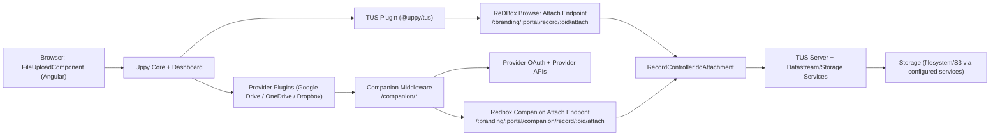
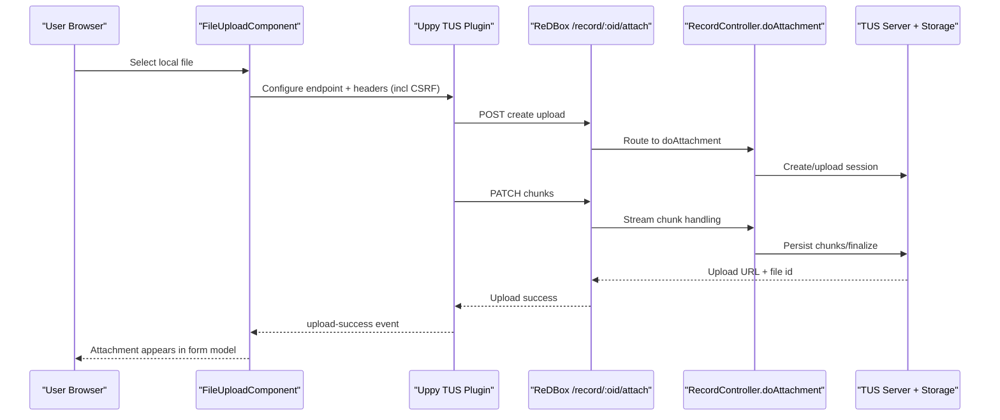
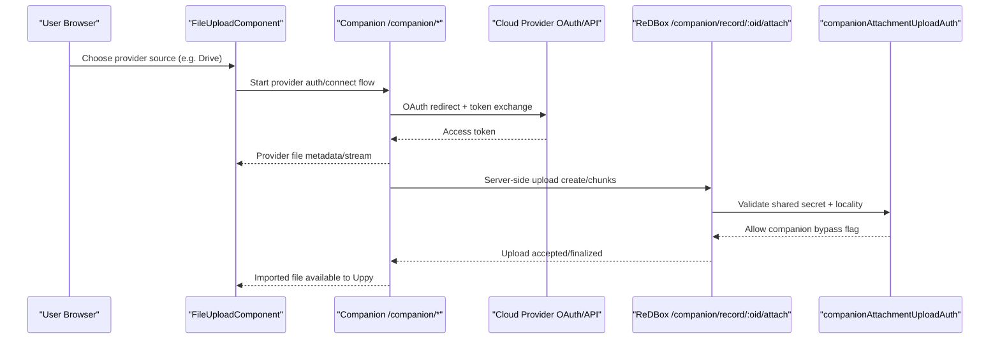
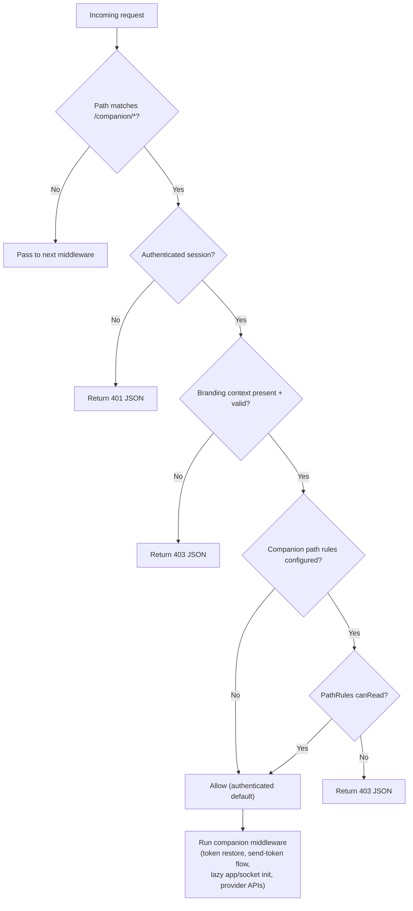

# Uppy and TUS Architecture

This page documents how ReDBox orchestrates uploads using:

- Uppy frontend plugins (`@uppy/tus`, provider plugins)
- ReDBox attachment endpoints (`/record/:oid/attach` for browser TUS uploads, plus `/companion/record/:oid/attach` companion route)
- Optional Uppy Companion middleware (`/companion/*`)

## Component Architecture

## Local File Upload Flow (TUS)

## Companion Provider Upload Flow

Route notes:

- `/:branding/:portal/record/:oid/attach` and `/:branding/:portal/record/:oid/attach/:attachId` are used by browser/local uploads and are CSRF-protected.
- `/:branding/:portal/companion/record/:oid/attach` and `/:branding/:portal/companion/record/:oid/attach/:attachId` are used by companion/remote provider uploads.
- Companion auth bypass is route-scoped to `/:branding/:portal/companion/record/:oid/attach*`.

## Companion Authorization Orchestration

Companion requests are authorized before handing over to Uppy Companion app logic.

## Key Code Paths

- Companion middleware orchestration:
  - `packages/redbox-core-types/src/config/http.config.ts`
- Companion config defaults:
  - `packages/redbox-core-types/src/config/companion.config.ts`
- Attach endpoints:
  - `packages/redbox-core-types/src/config/routes.config.ts`
- Attach endpoint policies:
  - `packages/redbox-core-types/src/config/policies.config.ts`
  - `packages/redbox-core-types/src/policies/companionAttachmentUploadAuth.ts`
- Uppy frontend integration:
  - `angular/projects/researchdatabox/form/src/app/component/file-upload.component.ts`
